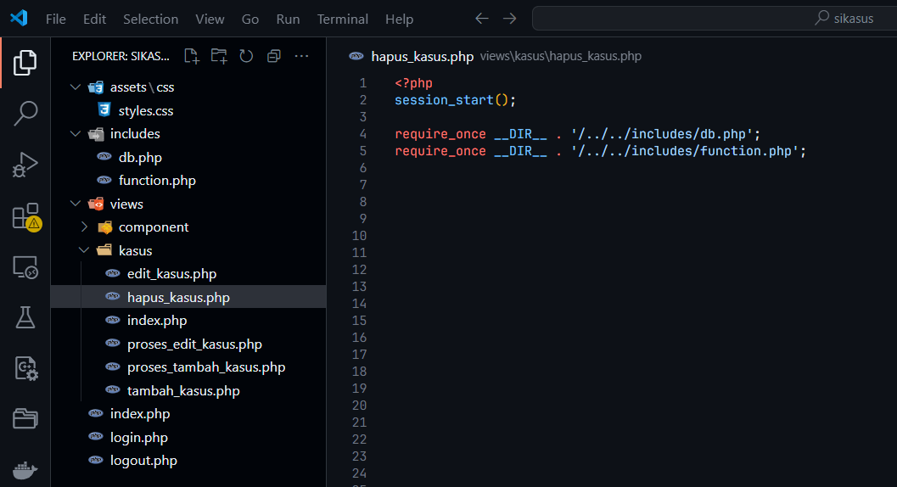

# Pembuatan Database dan Tabel

## Pembuatan Database 
- **Struktur Query**:
```sql
CREATE DATABASE db_sekolah;
```
Pertama-tama, buatlah database baru dengan nama yang sesuai, misalnya `db_sekolah`.

 Buka phpMyAdmin dan pilih new pada menu sidebar
 

Setelah muncul tampilan seperti ini, masukkan nama database "db_sekolah" pada fitur create database lalu tekan tombol create


Pada menu sidebar, akan muncul database yang telah dibuat yaitu dengan nama "**db_sekolah**"


**Penjelasan**:  
digunakan untuk membuat sebuah database baru dengan nama **`db_sekolah`**. Setelah query ini dieksekusi, sistem database akan mengalokasikan ruang untuk menyimpan data yang nantinya akan dimasukkan ke dalam database **`db_sekolah`**.

---
## Pembuatan Tabel `tb_siswa`

- **Struktur Query**:
``` mysql
CREATE TABLE tb_siswa (
    id INT AUTO_INCREMENT PRIMARY KEY, -- ID unik untuk setiap siswa
    nama_lengkap VARCHAR(100) NOT NULL, -- Nama lengkap siswa
    nisn VARCHAR(20) NOT NULL UNIQUE, -- (NISN) siswa
    jenis_kelamin ENUM('Laki-Laki', 'Perempuan') NOT NULL, -- Jenis kelamin
    tanggal_lahir DATE NOT NULL, -- Tanggal lahir siswa
    alamat TEXT NOT NULL, -- Alamat lengkap siswa
    kelas_id INT NOT NULL, -- ID kelas siswa (relasi dengan tabel kelas)
    tanggal_dibuat TIMESTAMP DEFAULT CURRENT_TIMESTAMP, -- Waktu pembuatan data
    tanggal_diperbarui TIMESTAMP DEFAULT CURRENT_TIMESTAMP ON UPDATE CURRENT_TIMESTAMP -- Waktu pembaruan data terakhir
);
```

Pertama masuk ke dalam database yang sudah dibuat sebelumnya, setelah itu pilih menu **Create new table**, disini kita membuat tabel `tb_siswa` dengan `9` kolom. selanjutnya klik tombol **create**.!


Setelah itu, masukkan rincian kolom seperti nama kolom, tipe data, panjang data. Pada tabel `tb_siswa` terdapat 9 kolom yaitu `id`, `nama_lengkap`, `nisn`, `jenis_kelamin`, `tanggal_lahir`, `alamat`, `kelas_id`, `tanggal_dibuat`, dan `tanggal_diperbarui`. Pastikan untuk menandai kolom `id` sebagai atribut `Primary Key`. Jangan lupa untuk menekan tombol **Save** setelah selesai mengkonfigurasi tabel.


**Penjelasan**:  
ini digunakan untuk membuat tabel baru bernama **`tb_siswa`** dengan struktur kolom berikut:
- **`id`**: Kolom integer yang berfungsi sebagai **primary key** dan akan diisi secara otomatis dengan ID unik untuk setiap siswa (**AUTO_INCREMENT**).
- **`nama_lengkap`**: Kolom **VARCHAR(100)** yang wajib diisi (**NOT NULL**) untuk menyimpan nama lengkap siswa.
- **`nisn`**: Kolom **VARCHAR(20)** yang wajib diisi (**NOT NULL**) dan memiliki nilai unik (**UNIQUE**) untuk Nomor Induk Siswa Nasional (NISN) siswa.
- **`jenis_kelamin`**: Kolom **ENUM** yang membatasi nilai untuk jenis kelamin siswa antara **'Laki-Laki'** dan **'Perempuan'**, dan harus diisi (**NOT NULL**).
- **`tanggal_lahir`**: Kolom **DATE** untuk mencatat tanggal lahir siswa yang harus diisi (**NOT NULL**).
- **`alamat`**: Kolom **TEXT** untuk menyimpan alamat lengkap siswa yang wajib diisi (**NOT NULL**).
- **`kelas_id`**: Kolom integer yang digunakan untuk menyimpan ID kelas siswa yang terkait. Kolom ini wajib diisi (**NOT NULL**) dan akan menjadi **foreign key** yang merujuk ke tabel kelas.
- **`tanggal_dibuat`**: Kolom **TIMESTAMP** untuk mencatat waktu pembuatan data secara otomatis (**DEFAULT CURRENT_TIMESTAMP**).
- **`tanggal_diperbarui`**: Kolom **TIMESTAMP** untuk mencatat waktu terakhir data diperbarui. Kolom ini akan diupdate otomatis setiap kali data diubah (**ON UPDATE CURRENT_TIMESTAMP**).
---
## Pembuatan Tabel `tb_kelas`

- **Struktur**: 
```mysql
CREATE TABLE tb_kelas (
    id_kelas INT AUTO_INCREMENT PRIMARY KEY, -- ID unik untuk setiap kelas
    nama_kelas VARCHAR(50) NOT NULL, -- Nama kelas (contoh: X-A, XI-B)
    walikelas_id INT, -- ID wali kelas yang terhubung
);
```
- **Langkah - langkah**:
Pilih menu **Create new table**, disini kita membuat tabel `tb_kelas` dengan `3` kolom. selanjutnya klik tombol **create**.


Setelah itu, masukkan rincian kolom seperti nama kolom, tipe data, panjang data. pada tabel `tb_kelas` terdapat 3 kolom yaitu `id_kelas ,nama_kelas dan walikelas_id`, Pastikan untuk menandai kolom `id_kelas` sebagai atribut `Primary key`. dan jangan lupa untuk menekan tombol Save setelah selesai mengkonfigurasi tabel.


**Penjelasan**:  
digunakan untuk membuat tabel baru bernama **`tb_kelas`** dengan struktur kolom berikut:
- **`id_kelas`**: Kolom integer yang otomatis bertambah nilainya (**AUTO_INCREMENT**) dan berfungsi sebagai **primary key** atau pengidentifikasi unik untuk setiap kelas.
- **`nama_kelas`**: Kolom string (VARCHAR) dengan panjang maksimum 50 karakter untuk menyimpan nama kelas, misalnya **X-A**, **XI-B**, dll. Kolom ini wajib diisi (**NOT NULL**).
- **`walikelas_id`**: Kolom integer yang akan menyimpan **ID wali kelas**. Kolom ini dapat digunakan untuk membuat relasi dengan tabel lain, misalnya tabel **wali kelas**.

---
## Pembuatan Tabel `tb_walikelas`

- **Struktur**:
```mysql 
CREATE TABLE tb_walikelas (
    id_walikelas INT AUTO_INCREMENT PRIMARY KEY,kelas
    nama_walikelas VARCHAR(100) NOT NULL,
    nip VARCHAR(20) UNIQUE NULL UNIQUE,
    jenis_kelamin ENUM('Laki-laki', 'Perempuan') NOT NULL,
    alamat TEXT,
    tanggal_dibuat TIMESTAMP DEFAULT CURRENT_TIMESTAMP,
    tanggal_diperbarui TIMESTAMP DEFAULT CURRENT_TIMESTAMP ON UPDATE CURRENT_TIMESTAMP
);
```

- **Langkah - langkah**:
Pilih menu **Create new table**, disini kita membuat tabel `tb_walikelas` dengan `2` kolom. selanjutnya klik tombol **create**. 


Setelah itu, masukkan rincian kolom seperti nama kolom, tipe data, panjang data. pada tabel `tb_kelas` terdapat 2 kolom yaitu `id_walikelas dan nama_walikelas`, Pastikan untuk menandai kolom `id_walikelas` sebagai atribut `Primary key`. dan jangan lupa untuk menekan tombol Save setelah selesai mengkonfigurasi tabel.


**Penjelasan**:  
ini membuat tabel baru bernama **`tb_walikelas`** dengan struktur kolom berikut:
- **`id_walikelas`**: Kolom integer sebagai **primary key**, berfungsi untuk memberikan ID unik bagi setiap wali kelas. Nilai akan bertambah otomatis (**AUTO_INCREMENT**).
- **`nama_walikelas`**: Kolom **VARCHAR(100)** yang wajib diisi (**NOT NULL**) untuk menyimpan nama lengkap wali kelas.
- **`nip`**: Kolom **VARCHAR(20)** untuk menyimpan NIP (Nomor Induk Pegawai) wali kelas. Bersifat unik (**UNIQUE**) dan opsional (**NULL**).
- **`jenis_kelamin`**: Kolom **ENUM** dengan nilai terbatas antara **'Laki-laki'** atau **'Perempuan'**, digunakan untuk mencatat jenis kelamin wali kelas.
- **`alamat`**: Kolom **TEXT** untuk menyimpan alamat lengkap wali kelas.
- **`tanggal_dibuat`**: Kolom **TIMESTAMP** untuk mencatat waktu pembuatan data. Default-nya adalah waktu saat data dibuat (**DEFAULT CURRENT_TIMESTAMP**).
- **`tanggal_diperbarui`**: Kolom **TIMESTAMP** untuk mencatat waktu terakhir data diperbarui. Secara otomatis diperbarui saat ada perubahan pada data (**ON UPDATE CURRENT_TIMESTAMP**).

---
## Pembuatan Tabel `tb_kasus`

- **Struktur**:
```mysql
CREATE TABLE tb_kasus (   
    id_kasus INT AUTO_INCREMENT PRIMARY KEY,   
    siswa_id INT,   
    deskripsi_kasus TEXT,   
    tanggal_kasus DATE
);
```
- **Langkah - langkah**:
Pilih menu **Create new table**, disini kita membuat tabel `tb_kasus` dengan `4` kolom. selanjutnya klik tombol **create**.


Setelah itu, masukkan rincian kolom seperti nama kolom, tipe data, panjang data. pada tabel `tb_kelas` terdapat 4 kolom yaitu `id_kasus, siswa_id, deskripsi_kasus dan tanggal_kasus`, Pastikan untuk menandai kolom `id_kasus` sebagai atribut `Primary key`. dan jangan lupa untuk menekan tombol Save setelah selesai mengkonfigurasi tabel.

   

**Penjelasan**:  
ini akan membuat tabel **`tb_kasus`** dengan struktur sebagai berikut:
- **`id_kasus`**: Kolom integer yang berfungsi sebagai **primary key** dengan nilai unik untuk setiap kasus. Nilainya akan bertambah otomatis (**AUTO_INCREMENT**).
- **`siswa_id`**: Kolom integer untuk menyimpan ID siswa yang terkait dengan kasus tersebut.
- **`deskripsi_kasus`**: Kolom teks (**TEXT**) untuk menyimpan deskripsi atau penjelasan mengenai kasus.
- **`tanggal_kasus`**: Kolom **DATE** untuk menyimpan tanggal kejadian kasus.

---
# Relasi Tabel 

## Relasi Tabel Siswa-Kelas
Seperti yang kita ketahui, kita telah membuat tabel siswa yang mempunyai 3 kolom. Sekarang, kita ingin menghubungkan atau meng-relasikan kolom-kolom dari tabel siswa dengan ketiga tabel lainnya.
- **Langkah - langkah :**
Pertama, kita masuk ke halaman tabel `siswa`


Setelah itu, klik pada menu bar yaitu `Structure`. Selanjutnya, pada halaman `Structure` di tabel `tb_Siswa` terdapat tombol `Relation view`/`Tampilan Hubungan`.


Setelah di klik kita akan diarahkan ke halaman untuk membuat constraint. Pada constraint pertama yang akan kita buat adalah constraint antara kolom `kelas_id` dari tabel `siswa` ke kolom `id_kelas` dari tabel `tb_kelas`. Kita akan menamakan constraint ini “fk_kelas_siswa” dan mengubah `ON DELETE` dan `UPDATE` constraint ini menjadi `CASCADE` _(yang berarti, jika data dari salah satu kolom yang terhubung di constraint ini terubah/terhapus maka datanya di kolom lain yang terhubung dengannya akan terubah/terhapus juga)_.


Pastikan untuk menekan tombol 'Save' setelah selesai mengkonfigurasi tabel.

---
## Relasi Tabel Kelas-Walikelas

Pertama, kita masuk ke halaman tabel `tb_kelas`


Setelah itu, klik pada menu bar yaitu `Structure`.Selanjutnya, pada halaman `Structure` di tabel `tb_Kelas` terdapat tombol `Relation view`.


Setelah di klik kita akan diarahkan ke halaman untuk membuat constraint .

Pada constraint pertama yang akan kita buat adalah constraint antara kolom `walikelas_id` dari tabel `tb_kelas` ke kolom `id_walikelas` dari tabel `tb_walikelas`. Kita akan menamakan constraint ini “fk_walikelas_kelas” dan mengubah `ON DELETE` dan `UPDATE` constraint ini menjadi `CASCADE` _(yang berarti, jika data dari salah satu kolom yang terhubung di constraint ini terubah/terhapus maka datanya di kolom lain yang terhubung dengannya akan terubah/terhapus juga)_.
	

Pastikan untuk menekan tombol 'Save' setelah selesai mengkonfigurasi tabel.


---

## Relasi Tabel Kasus-Siswa
Pertama, kita masuk ke halaman tabel `tb_kasus`


Setelah itu, klik pada menu bar yaitu `Structure`. Selanjutnya, pada halaman `Structure` di tabel `tb_kasus` terdapat tombol `Relation view`.


Setelah di klik kita akan diarahkan ke halaman untuk membuat constraint .

Pada constraint pertama yang akan kita buat adalah constraint antara kolom `siswa_id` dari tabel `tb_kasus` ke kolom `id_siswa` dari tabel `tb_siswa`. Kita akan menamakan constraint ini “fk_siswa_kasus” dan mengubah `ON DELETE` dan `UPDATE` constraint ini menjadi `CASCADE` _(yang berarti, jika data dari salah satu kolom yang terhubung di constraint ini terubah/terhapus maka datanya di kolom lain yang terhubung dengannya akan terubah/terhapus juga)_.


Pastikan untuk menekan tombol 'Save' setelah selesai mengkonfigurasi tabel.
## Hasil Relasi


Anda dapat menggunakan data dummy untuk setiap tabel yang tersedia melalui tautan berikut:  
[Data Dummy](https://drive.google.com/drive/folders/1t5ZscyjldMd5zmA3QGUEh69a49xvWvYL?usp=sharing).

## Kesimpulan
Dengan membuat keempat tabel ini, kita telah membangun fondasi struktur database yang dapat menampung data siswa, kelas, wali kelas, dan catatan kasus. Struktur ini memungkinkan relasi antar-tabel sehingga data dapat dikelola secara lebih terorganisir dan relevan untuk kebutuhan aplikasi berbasis web.

# Pembuatan Aplikasi Web
Pada bagian ini, kita akan membuat fitur-fitur utama untuk aplikasi web yang meliputi:

1. Melihat daftar kasus
2. Menambahkan kasus
3. Mengedit kasus
## Struktur Folder


---
## Menjalankan Server Lokal
Setelah struktur folder berhasil disiapkan, langkah selanjutnya adalah menjalankan server lokal untuk menguji aplikasi Anda. Proses ini dapat dilakukan menggunakan aplikasi **XAMPP**

Pertama, **Buka _Control Panel_ XAMPP di komputer Anda.**


Cari modul **Apache** dan **MySQL** pada daftar layanan. Lalu klik tombol **Start** di sebelah masing-masing modul.


Jika berhasil, status akan berubah menjadi "Running" dengan warna hijau. Jika ada konflik port, pastikan port Apache tidak digunakan oleh aplikasi lain atau ubah portnya melalui konfigurasi.

Selanjutnya, salin folder proyek Anda ke direktori `C:/xampp/htdocs`. disini folder projek yang saya buat bernama `sikasus`


Kemudian, buka browser dan akses aplikasi Anda menggunakan URL seperti berikut:

```bash
http://localhost/sikasus/
```

---
## Membuat Koneksi Database
Fitur pertama yang akan kita buat adalah menampilkan daftar kasus.

Sebelum kita mulai mengambil dan menampilkan data, kita perlu menghubungkan aplikasi dengan database. Buat file `db.php` dan masukkan kode berikut untuk menghubungkan aplikasi dengan MySQL. Buat file nya didalam folder `includes` sesuai dengan struktur folder yang saya berikan sebelumnya.

**`includes/db.php`**
```php
<?php
// Koneksi ke database
$host = "localhost";  
$username = "root";   
$password = "";       
$database = "db_sekolah"; 

// Membuat koneksi
$conn = mysqli_connect($host, $username, $password, $database);

// Mengecek apakah koneksi berhasil
if (!$conn) {
    die("Koneksi gagal: " . mysqli_connect_error());
}
```


**Penjelasan :**
- Baris `mysqli_connect()` digunakan untuk menghubungkan aplikasi ke database.
- Variabel `$host`, `$username`, `$password`, dan `$database` adalah konfigurasi koneksi database.
- Fungsi `die()` akan menghentikan eksekusi dan menampilkan pesan jika koneksi gagal.
---
## Menampilkan Daftar Kasus
Pertama-tama, buat fungsi yang akan digunakan untuk mengambil data dari database. Simpan fungsi ini di dalam file `function.php`.

```php
<?php
require_once 'db.php';

function fetchData($conn, $query) {
    $result = mysqli_query($conn, $query);

    if (!$result) {
        die("Query gagal: " . mysqli_error($conn));
    }

    $data = [];
    while ($row = mysqli_fetch_assoc($result)) {
        $data[] = $row;
    }
    return $data;
}
```


**Penjelasan :**
- **`fetchData($conn, $query)`:** Fungsi untuk mengeksekusi query dan mengembalikan hasil dalam bentuk array.
- **`mysqli_query()`:** Menjalankan query pada database.
- **`mysqli_fetch_assoc()`:** Mengambil setiap baris data hasil query sebagai array asosiatif.

**Kemudian**, buat file bernama `sidebar.php` di dalam folder `views/component`. Sidebar ini akan memudahkan navigasi dalam aplikasi, menampilkan menu yang berbeda berdasarkan peran pengguna.

**`view/scomponent/sidebar.php`**
```php
<nav class="sidebar">
    <h2>Menu</h2>
    <ul>
        <?php if (isset($role) && $role === 'admin'): ?>
            <li><a href="/sikasus/views/dashboard.php">Dashboard</a></li>
            <li><a href="/sikasus/views/walikelas/">Wali Kelas</a></li>
            <li><a href="/sikasus/views/kelas/">Kelas</a></li>
            <li><a href="/sikasus/views/siswa/">Siswa</a></li>
            <li><a href="/sikasus/views/kasus/">Kasus</a></li>
        <?php elseif (isset($role) && $role === 'walikelas'): ?>
            <li><a href="/sikasus/views/dashboard.php">Dashboard</a></li>
            <li><a href="/sikasus/views/siswa/">Siswa</a></li>
            <li><a href="/sikasus/views/kasus/">Kasus</a></li>
        <?php endif; ?>
        <li><a href="/sikasus/logout.php">Logout</a></li>
    </ul>
</nav>
```


**Penjelasan:**
- **`$role`**: Variabel ini berisi peran pengguna (admin atau walikelas). Berdasarkan peran ini, menu yang berbeda akan ditampilkan.
- **`isset()`**: Fungsi ini memeriksa apakah variabel `$role` telah didefinisikan.

**Selanjutnya**, buat file `index.php` di folder `views/kasus`. Di dalam file ini, kita akan menampilkan daftar kasus yang diambil dari database.

**`views/kasus/index.php`**
```php
<?php
session_start();

require_once __DIR__ . '/../../includes/db.php';
require_once __DIR__ . '/../../includes/function.php'; 

$user = $_SESSION['user'];
$role = $user['role'];

$kasus_query = "SELECT k.id_kasus, k.siswa_id, k.deskripsi_kasus, k.tanggal_kasus, s.nama_lengkap
                FROM tb_kasus k
                LEFT JOIN tb_siswa s ON k.siswa_id = s.id
                ORDER BY k.tanggal_kasus DESC";


$kasus_result = fetchData($conn, $kasus_query);
?>
```


##### Query yang digunakan
```sql
SELECT k.id_kasus, k.siswa_id, k.deskripsi_kasus, k.tanggal_kasus, s.nama_lengkap
FROM tb_kasus k
LEFT JOIN tb_siswa s ON k.siswa_id = s.id
ORDER BY k.tanggal_kasus DESC;
```
**Penjelasan Query :**
Query ini menampilkan data kasus siswa, termasuk deskripsi kasus dan nama siswa, dengan menggabungkan informasi dari tabel **`tb_kasus`** dan **`tb_siswa`**. Hasilnya diurutkan berdasarkan tanggal kasus yang terbaru.

**Penjelasan Kode:**
- **`$kasus_query`**: Ini adalah query SQL yang mengambil semua data kasus dari tabel `tb_kasus` dan menghubungkannya dengan data siswa dari tabel `tb_siswa` menggunakan `LEFT JOIN`. Data diurutkan berdasarkan tanggal kasus.
- **`fetchData()`**: Fungsi ini digunakan untuk menjalankan query dan mengambil hasilnya. Fungsi ini didefinisikan dalam file `function.php` (yang akan dibahas di langkah berikutnya).

**Setelah itu**, kita akan menampilkan data kasus dalam bentuk tabel di halaman `index.php`
```html
<!DOCTYPE html>
<html lang="id">
<head>
    <meta charset="UTF-8">
    <meta name="viewport" content="width=device-width, initial-scale=1.0">
    <title>Daftar Kasus</title>
</head>
<body>
    <div class="wrapper">
        <!-- Sidebar -->
        <?php include($_SERVER['DOCUMENT_ROOT'] . '/sikasus/views/component/sidebar.php'); ?>

        <!-- Main Content -->
        <div class="main-content">
            <header>
                <h1>Daftar Kasus</h1>
            </header>
            <div class="container">
                <a href="tambah_kasus.php" class="button">Tambah Kasus</a>
                <table>
                    <thead>
                        <tr>
                            <th width="10">#</th>
                            <th width="10">Nama Siswa</th>
                            <th width="10">Deskripsi Kasus</th>
                            <th width="10">Tanggal Kasus</th>
                            <th width="10">Aksi</th>
                        </tr>
                    </thead>
                    <tbody>
                        <?php foreach ($kasus_result as $number => $kasus): ?>
                            <tr>
                                <td><?= $number += 1 ?></td>
                                <td><?= $kasus['nama_lengkap'] ?></td>
                                <td><?= $kasus['deskripsi_kasus'] ?></td>
                                <td><?= $kasus['tanggal_kasus'] ?></td>
                                <td>
                                    <a href="edit_kasus.php?id=<?= $kasus['id_kasus'] ?>" class="button">Edit</a>
                                    <a href="hapus_kasus.php?id=<?= $kasus['id_kasus'] ?>" class="button"
                                        onclick="return confirm('Apakah Anda yakin ingin menghapus siswa ini?');">Hapus</a>
                                </td>
                            </tr>
                        <?php endforeach; ?>
                    </tbody>
                </table>
            </div>
        </div>
    </div>
</body>
</html>
```


**Penjelasan:**
- **`foreach`**: Digunakan untuk mengulangi setiap data kasus yang didapatkan dari hasil query dan menampilkannya dalam tabel HTML.
- **`$number += 1`**: Variabel ini digunakan untuk menampilkan nomor urut pada setiap baris data kasus.
- **Tautan Edit dan Hapus**: Menampilkan tombol untuk mengedit atau menghapus kasus tertentu.

**Selanjutnya**, kita akan menautkan file CSS untuk mempercantik tampilan web dengan CSS.
```html
<link rel="stylesheet" href="assets/css/styles.css">
```


**Penjelasan**: 
- Di tahap ini, kita memastikan file CSS yang ada di folder `assets/css/` sudah terhubung dengan benar ke file HTML. Tanpa ini, CSS tidak akan diterapkan pada halaman

**Setelah itu**, kita akan membuat style CSS. berikut kodenya

**`assets/css/styles.css`**
```css
/* Global Styles */
* {
    font-family: Arial, sans-serif;
    margin: 0;
    padding: 0;
    box-sizing: border-box;
}

body {
    background-color: #f4f4f9;
}

/* Wrapper for layout */
.wrapper {
    display: flex;
}

/* Sidebar */
.sidebar {
    width: 250px;
    background-color: #343a40;
    color: white;
    height: 100vh;
    padding: 1rem;
    position: fixed;
}

.sidebar h2 {
    text-align: center;
    margin-bottom: 2rem;
}

.sidebar ul {
    list-style: none;
    padding: 0;
}

.sidebar ul li {
    margin: 0.8rem 0;
}

.sidebar ul li a {
    display: block;
    padding: 0.5rem;
    color: white;
    text-decoration: none;
    border-radius: 5px;
    transition: background-color 0.3s;
}

.sidebar ul li a:hover {
    background-color: #495057;
}

/* Main Content */
.main-content {
    margin-left: 250px;
    width: calc(100% - 250px);
    padding: 1rem;
}

/* Header */
header {
    padding: 1rem;
    text-align: center;
    text-decoration: underline;
    margin-bottom: 1rem;
}

/* Grid Layout for Content */
.content {
    display: grid;
    grid-template-columns: repeat(3, 1fr);
    gap: 1rem;
    padding: 1rem;
}

/* Cards */
.card, .container, .profile-card, .cases-card {
    padding: 1rem;
    background-color: white;
    border-radius: 5px;
    box-shadow: 0 2px 4px rgba(0, 0, 0, 0.1);
    margin-bottom: 1rem;
}

.card {
    text-align: center;
}

.container {
    max-width: 100%;
    margin: 1rem;
}

h2 {
    text-align: center;
}

/* Table Styles */
table {
    width: 100%;
    border-collapse: collapse;
    margin-top: 1rem;
}

table th, table td {
    padding: 0.5rem;
    text-align: left;
    border: 1px solid #ddd;
}

/* Buttons */
.button {
    display: inline-block;
    padding: 0.5rem 1rem;
    margin: 0.5rem 0;
    background-color: #007bff;
    color: white;
    text-align: center;
    border: none;
    border-radius: 5px;
    cursor: pointer;
    text-decoration: none;
}

.button:hover {
    background-color: #0056b3;
}

/* Profile Section */
.content-siswa {
    padding: 1rem;
    background: #fff;
    border-radius: 5px;
    min-height: 100vh;
}

.profile-header {
    text-align: center;
}

.profile-avatar {
    font-size: 3rem;
    margin: 1rem 0;
    color: #007bff;
}

.profile-info {
    margin-bottom: 1rem;
}

.profile-info h1 {
    margin: 0.5rem 0;
}

/* Case Items */
.case-item {
    padding: 1rem;
    border-bottom: 1px solid #ddd;
}

.case-item:last-child {
    border-bottom: none;
}

/* Empty State */
.empty-state {
    text-align: center;
    padding: 2rem;
    color: #666;
}

.empty-state p {
    margin: 0.5rem 0;
}
```


**Penjelasan :**
- **Global Styles**:
    - `*`: Menetapkan aturan untuk semua elemen HTML, termasuk font, margin, padding, dan model box.
    - `body`: Mengatur warna latar belakang halaman menjadi abu-abu terang (`#f4f4f9`).
- **Layout Wrapper**:
    - `.wrapper`: Menggunakan `flexbox` untuk tata letak fleksibel, memungkinkan elemen di dalamnya diatur dengan mudah.
- **Sidebar**:
    - `.sidebar`: Sidebar dengan lebar tetap (`250px`), latar belakang gelap, tinggi penuh (`100vh`), dan diposisikan tetap di layar.
- **Sidebar Menu**:
    - `.sidebar ul`: Menghilangkan gaya daftar standar dan padding.
    - `.sidebar ul li`: Menambahkan jarak antar item menu.
    - `.sidebar ul li a`: Mengatur tampilan link menu, termasuk padding, warna, dan efek transisi.
- **Main Content**:
    - `.main-content`: Area konten utama yang mengatur margin kiri untuk memberi ruang pada sidebar dan menghitung lebar yang tersisa.
- **Header**:
    - `header`: Menambahkan padding, menyelaraskan teks ke tengah, menambahkan garis bawah pada teks header, dan memberi jarak bawah.
- **Content Grid**:
    - `.content`: Menggunakan layout grid untuk membagi konten menjadi 3 kolom dengan jarak antar item.
- **Card**:
    - `.card`, `.container`, `.profile-card`, `.cases-card`: Kartu dengan padding, latar belakang putih, sudut melengkung, bayangan lembut, dan jarak bawah.
- **Table**:
    - `table`: Menetapkan tabel dengan lebar penuh dan pengaturan untuk menggabungkan border sel.
    - `table th`, `table td`: Menambahkan padding, penyelarasan kiri, dan batas tipis pada setiap sel tabel.
- **Button**:
    - `.button`: Tombol dengan padding, warna latar belakang biru, teks putih, dan efek hover untuk perubahan warna latar belakang.
- **Profile and Case Section**:
    - `.profile-header`: Menyelaraskan header profil ke tengah.
    - `.profile-avatar`: Menentukan ukuran font besar untuk avatar profil.
    - `.case-item`: Mengatur item kasus dengan padding dan garis pemisah bawah.
    - `.empty-state`: Menyusun tampilan status kosong dengan teks berwarna abu-abu dan padding besar.

**Sebelum :**

**Sesudah :**


## Membuat Halaman Tambah Data Kasus
Pertama-tama, buat file baru dengan nama `tambah_kasus.php` di dalam folder `views/kasus/`. File ini akan digunakan untuk menampilkan formulir yang memungkinkan pengguna memilih siswa, memasukkan deskripsi kasus, dan memilih tanggal kasus.

**`views/kasus/tambah_kasus.php`**
```php
<?php
session_start();

// Menghubungkan ke database
require_once __DIR__ . '/../../includes/db.php';
```


**Penjelasan**:
- **`session_start()`** digunakan untuk memulai sesi yang memungkinkan Anda menyimpan dan mengakses data sesi, seperti status login pengguna.
- **`require_once`** digunakan untuk mengimpor file `db.php` yang berfungsi untuk menghubungkan aplikasi ke database, sehingga Anda bisa berinteraksi dengan data.

---

**Berikutnya**, mendapatkan daftar siswa dari database
```php
// Mendapatkan daftar siswa dari database
$query = "SELECT id, nama_lengkap FROM tb_siswa";
$result = mysqli_query($conn, $query);
```


**Penjelasan**:
- **Query SQL** digunakan untuk mengambil data siswa (id dan nama lengkap) dari tabel **`tb_siswa`**.
- **`mysqli_query($conn, $query)`** mengeksekusi query tersebut dan menyimpannya dalam variabel **`$result`**, yang kemudian digunakan untuk menampilkan daftar siswa pada dropdown menu di formulir.

---

**Berikutnya**, buat struktur HTML untuk formulir input data kasus
```html
<!DOCTYPE html>
<html lang="id">

<head>
    <meta charset="UTF-8">
    <meta name="viewport" content="width=device-width, initial-scale=1.0">
    <title>Tambah Kasus</title>
    <link rel="stylesheet" href="/sikasus/assets/css/styles.css">
</head>

<body>
    <div class="wrapper">
        <!-- Sidebar -->
        <?php include($_SERVER['DOCUMENT_ROOT'] . '/sikasus/views/component/sidebar.php'); ?>

        <!-- Main Content -->
        <div class="main-content">
            <header>
                <h1>Tambah Kasus</h1>
            </header>
            <div class="container">
                <form action="proses_tambah_kasus.php" method="POST">
                    <div>
                        <label for="siswa_id">Pilih Siswa:</label>
                        <select name="siswa_id" id="siswa_id" required>
                            <option value="">-- Pilih Siswa --</option>
                            <?php while ($row = mysqli_fetch_assoc($result)): ?>
                                <option value="<?= htmlspecialchars($row['id']) ?>"><?= htmlspecialchars($row['nama_lengkap']) ?></option>
                            <?php endwhile; ?>
                        </select>
                    </div>

                    <div>
                        <label for="deskripsi">Deskripsi Kasus:</label>
                        <textarea name="deskripsi" id="deskripsi" required></textarea>
                    </div>

                    <div>
                        <label for="tanggal">Tanggal Kasus:</label>
                        <input type="date" name="tanggal" id="tanggal" required>
                    </div>

                    <button type="submit">Tambah Kasus</button>
                    <a href="../index.php" class="button">Kembali</a>
                </form>
            </div>
        </div>
    </div>
</body>

</html>
```


**Penjelasan**:
- **`<form action="proses_tambah_kasus.php" method="POST">`**: Menentukan bahwa data dari formulir ini akan dikirim menggunakan metode POST ke file `proses_tambah_kasus.php`.
- **`<select>` dan `<option>`**: Digunakan untuk membuat dropdown menu untuk memilih siswa. Data yang ditampilkan berasal dari hasil query yang sebelumnya telah diambil.
- **`<textarea>`**: Untuk input deskripsi kasus, yang mengharuskan pengguna menulis penjelasan mengenai kasus.
- **`<input type="date">`**: Untuk memilih tanggal kasus.
- **`<input type="submit">`**: Tombol untuk mengirim formulir.

---

**Kemudian**, mengirim Data ke `proses_tambah_kasus.php`. Formulir ini akan mengirimkan data menggunakan metode POST ke file **`proses_tambah_kasus.php`**, yang akan menangani penyimpanan data ke dalam database.

**`views/kasus/proses_tambah_kasus.php`**
```php
<?php

// Menghubungkan ke database
require_once __DIR__ . '/../../includes/db.php';

if ($_SERVER['REQUEST_METHOD'] === 'POST') {
    // Mengambil data dari formulir
    $siswa_id = $_POST['siswa_id'];
    $deskripsi = $_POST['deskripsi'];
    $tanggal = $_POST['tanggal'];

    // Validasi input
    if (empty($siswa_id)) {
        header("Location: tambah_kasus.php");
        exit();
    }

    // Query menggunakan prepared statement untuk mencegah SQL injection
    $query = "INSERT INTO tb_kasus (siswa_id, deskripsi_kasus, tanggal_kasus) VALUES (?, ?, ?)";
    $stmt = $conn->prepare($query);
    $stmt->bind_param("iss", $siswa_id, $deskripsi, $tanggal);

    // Mengeksekusi query dan memberikan feedback kepada pengguna
    if ($stmt->execute()) {
	    header("Location: ./index.php");
    }

    // Menutup statement
    $stmt->close();
}
header("Location: ./index.php");
// Menutup koneksi
$conn->close();
```


**Penjelasan :**
- **`require_once __DIR__ . '/../../includes/db.php';`**: Menghubungkan file untuk konfigurasi database agar dapat digunakan dalam file ini.
- **`if ($_SERVER['REQUEST_METHOD'] === 'POST') {`**: Memastikan bahwa proses ini hanya dijalankan jika metode request adalah POST.
- **`$query = "INSERT INTO tb_kasus (siswa_id, deskripsi_kasus, tanggal_kasus) VALUES (?, ?, ?)";`**: Menyusun query SQL untuk memasukkan data kasus baru.

---

## Membuat Halaman Edit Data Kasus  
Pertama-tama, buat file baru bernama **`edit_kasus.php`** di dalam folder **`views/kasus`**. File ini digunakan untuk menampilkan formulir pengeditan kasus berdasarkan data yang sudah adadi database.


Selanjutnya, tambahkan kode berikut pada awal file untuk **menghubungkan ke database** dan **mengambil data kasus berdasarkan ID**.
**`views/kasus/edit_kasus.php`**
```php
<?php
session_start();

// Menghubungkan ke database
require_once __DIR__ . '/../../includes/db.php';
require_once __DIR__ . '/../../includes/function.php';
```


**Penjelasan** :
- **`session_start()`**: Fungsi ini digunakan untuk memulai sesi PHP agar bisa menyimpan data sesi seperti login di masa depan.
- **`require_once`**: Memastikan file database hanya dipanggil sekali untuk menghindari konflik atau duplikasi.

---

Kemudian, ambil data kasus dari database menggunakan parameter `id` yang dikirim melalui URL. Ini penting agar data yang akan diedit sudah muncul di formulir.
**`views/kasus/edit_kasus.php`**
```php
if (isset($_GET['id'])) {
	$id_kasus = $_GET['id'];
	$query = "SELECT * FROM tb_kasus WHERE id_kasus = $id_kasus";
	$result = $conn->query($query);
	$kasus = $result->fetch_assoc();
	
	// Jika data tidak ditemukan
	if (!$kasus) {
		jsAlert('data tidak ditemukan', './index.php');
	exit;
	}
}
```


**Penjelasan :**
- **`if (isset($_GET['id'])) {`**: Mengecek apakah parameter `id` ada dalam URL.
- **`$query = "SELECT * FROM tb_kasus WHERE id_kasus = $id_kasus";`**: Membuat query untuk mengambil data kasus berdasarkan `id_kasus`.
- **`$kasus = $result->fetch_assoc();`**: Mengambil hasil query dan menyimpannya dalam variabel `$kasus`.
- **`if (!$kasus) { jsAlert('data tidak ditemukan', './index.php'); exit; }`**: Jika data tidak ditemukan, menampilkan alert dan menghentikan eksekusi.

---

Selanjutnya, tambahkan query untuk **menampilkan daftar siswa** dari tabel **`tb_siswa`** yang akan ditampilkan di dropdown.
**`views/kasus/edit_kasus.php`**
```php
$query_siswa = "SELECT id, nama_lengkap FROM tb_siswa";
$result_siswa = mysqli_query($conn, $query_siswa);
```


**Penjelasan :**
- **`mysqli_query($conn, $query_siswa)`**: Menjalankan query SQL untuk mengambil semua data siswa.
- Data ini akan digunakan untuk menampilkan pilihan siswa di formulir edit kasus.

---

Setelah data berhasil diambil, tambahkan struktur HTML untuk menampilkan formulir pengeditan.
**`views/kasus/edit_kasus.php`**
```php
<form action="proses_edit_kasus.php" method="POST">
    <input type="hidden" name="id" value="<?= htmlspecialchars($kasus['id_kasus']) ?>">

    <div>
        <label for="siswa_id">Pilih Siswa:</label>
        <select name="siswa_id" id="siswa_id" required>
            <option value="">-- Pilih Siswa --</option>
            <?php while ($row = mysqli_fetch_assoc($result_siswa)): ?>
                <option value="<?= htmlspecialchars($row['id']) ?>" <?= $row['id'] == $kasus['siswa_id'] ? 'selected' : '' ?>>
                    <?= htmlspecialchars($row['nama_lengkap']) ?>
                </option>
            <?php endwhile; ?>
        </select>
    </div>

    <div>
        <label for="deskripsi">Deskripsi Kasus:</label>
        <textarea name="deskripsi" id="deskripsi"
            required><?= htmlspecialchars($kasus['deskripsi_kasus']) ?></textarea>
    </div>

    <div>
        <label for="tanggal">Tanggal Kasus:</label>
        <input type="date" name="tanggal" id="tanggal"
            value="<?= htmlspecialchars($kasus['tanggal_kasus']) ?>" required>
    </div>

    <button type="submit">Simpan Perubahan</button>
    <a href="../index.php" class="button">Kembali</a>
</form>
```


**Penjelasan :**
- **Field Tersembunyi (`hidden`)**: Menyimpan ID kasus agar dapat digunakan untuk query update.
- **Dropdown Siswa**: Menampilkan daftar siswa dari database. Jika siswa sudah dipilih sebelumnya, maka opsi akan otomatis terpilih.
- **Textarea Deskripsi**: Menampilkan deskripsi kasus yang sudah ada.
- **Input Tanggal**: Menampilkan tanggal kasus.

---

Setelah formulir dibuat, buat file **`proses_edit_kasus.php`** di folder yang sama untuk memproses data yang dikirim dari formulir.
**`views/kasus/proses_edit_kasus.php`**
```php
<?php
session_start();
require_once __DIR__ . '/../../includes/db.php';
require_once __DIR__ . '/../../includes/function.php';

if ($_SERVER['REQUEST_METHOD'] === 'POST') {
    $id = $_POST['id'];
    $siswa_id = $_POST['siswa_id'];
    $deskripsi = $_POST['deskripsi'];
    $tanggal = $_POST['tanggal'];

    // Validasi data input
    if (empty($id) || empty($siswa_id) || empty($deskripsi) || empty($tanggal)) {
        header("Location: edit_kasus.php?id=$id&error=Semua field harus diisi");
        exit;
    }

    // Update data kasus
    $query = "UPDATE tb_kasus SET siswa_id = ?, deskripsi_kasus = ?, tanggal_kasus = ? WHERE id_kasus = ?";
    $stmt = $conn->prepare($query);
    $stmt->bind_param("issi", $siswa_id, $deskripsi, $tanggal, $id);

    if ($stmt->execute()) {
		jsAlert("Data berhasil diubah", './index.php');
    }
}

header("Location: ./index.php");
```


**Penjelasan :**
- **`$_SERVER['REQUEST_METHOD']`**: Mengecek apakah request menggunakan metode POST.
- **Validasi**: Memastikan semua input diisi.
- **Query Update**: Menggunakan `prepare` dan `bind_param` untuk memperbarui data kasus.
## Membuat Halaman Hapus Data Kasus
Pertama-tama, buat file bernama **`hapus_kasus.php`** di dalam folder **`views/kasus`**. File ini bertugas untuk menghapus data kasus berdasarkan ID yang diterima melalui parameter URL.

Selanjutnya, tambahkan kode berikut untuk memulai sesi PHP dan menghubungkan file database serta fungsi tambahan:

```php
<?php
session_start();

require_once __DIR__ . '/../../includes/db.php';
require_once __DIR__ . '/../../includes/function.php';
```



**Penjelasan**:
- **`session_start()`**: Memulai sesi untuk memastikan semua fitur berbasis sesi dapat digunakan, seperti autentikasi pengguna.
- **`require_once`**: Mengimpor file **`db.php`** untuk koneksi database dan **`function.php`** untuk menggunakan fungsi tambahan seperti alert.

---

Berikutnya, tambahkan validasi untuk memeriksa keberadaan dan validitas parameter **`id`** yang diterima melalui URL. Jika parameter tidak ada atau tidak valid, maka pengguna akan diberi notifikasi.

```php
// Validasi parameter ID
if (!isset($_GET['id']) || !is_numeric($_GET['id'])) {
    jsAlert('ID kasus tidak ditemukan.', 'index.php');
    exit();
}
```


**Penjelasan**:
- **`isset($_GET['id'])`**: Memastikan bahwa parameter **`id`** dikirim melalui URL.
- **`is_numeric($_GET['id'])`**: Mengecek apakah nilai **`id`** adalah angka.
- **`jsAlert()`**: Menampilkan pesan kesalahan dan mengarahkan pengguna kembali ke halaman utama jika validasi gagal.

---

Setelah validasi, konversi parameter **`id`** menjadi integer untuk keamanan tambahan dan kemudahan penggunaan.

```php
$id_kasus = intval($_GET['id']);
```


**Penjelasan**:
- **`intval()`**: Mengubah nilai parameter **`id`** menjadi tipe data integer untuk menghindari kemungkinan serangan injeksi.

---
Lakukan query untuk menghapus data kasus dari tabel **`tb_kasus`** berdasarkan **`id_kasus`** yang diterima.

```php
// Query untuk menghapus kasus
$delete_query = "DELETE FROM tb_kasus WHERE id_kasus = $id_kasus";
```


**Penjelasan**:
- **Query SQL**: Perintah **`DELETE`** digunakan untuk menghapus data pada tabel **`tb_kasus`** yang memiliki nilai **`id_kasus`** tertentu.

---
Setelah query dibuat, eksekusi query tersebut. Jika berhasil, tampilkan pesan berhasil, jika tidak, tampilkan pesan kesalahan.

```php
// Eksekusi query dan redirect dengan notifikasi
if (mysqli_query($conn, $delete_query)) {
    jsAlert('Kasus berhasil dihapus.', 'index.php');
} else {
    jsAlert('Kesalahan saat menghapus kasus.', 'index.php');
}
exit();
```

**Penjelasan**:
- **`mysqli_query()`**: Menjalankan query SQL untuk menghapus data.
- **`jsAlert()`**: Menampilkan notifikasi kepada pengguna, baik ketika penghapusan berhasil maupun gagal.

---
Fungsi ini telah didefinisikan di file **`function.php`** dan digunakan untuk menampilkan alert JavaScript sekaligus melakukan pengalihan (redirect).

Berikut adalah implementasi dari fungsi **`jsAlert`**:

```php
function jsAlert($message, $redirectUrl = null) {
    echo "<script>";
    echo "alert('" . addslashes($message) . "');";
    if ($redirectUrl) {
        echo "window.location.href = '" . addslashes($redirectUrl) . "';";
    }
    echo "</script>";
    exit();
}
```


**Penjelasan**:
- **`addslashes()`**: Mengamankan teks pesan agar tidak terjadi error pada JavaScript.
- **Redirect**: Jika parameter **`$redirectUrl`** diberikan, pengguna akan diarahkan ke URL yang ditentukan setelah menutup alert.

## Kesimpulan
Pada tahap awal pengembangan aplikasi web, fitur-fitur yang diintegrasikan meliputi kemampuan untuk melihat daftar kasus di halaman beranda yang dapat diakses oleh semua pengguna, menambahkan kasus yang hanya dapat diakses oleh wali kelas, serta mengedit kasus yang juga terbatas untuk wali kelas. Karena sistem login belum diterapkan, seluruh pengguna dapat mengakses fitur wali kelas, meskipun nantinya fitur tersebut akan dibatasi hanya untuk wali kelas setelah login diterapkan.
