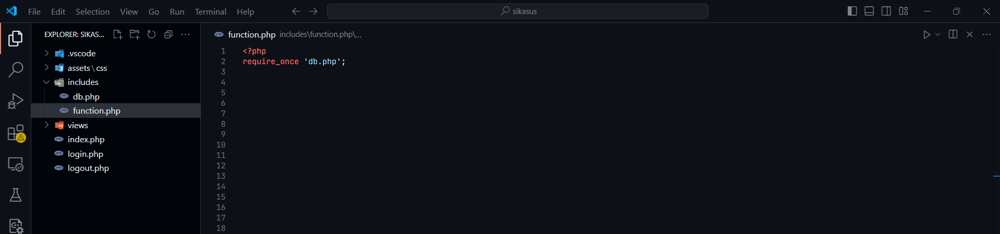
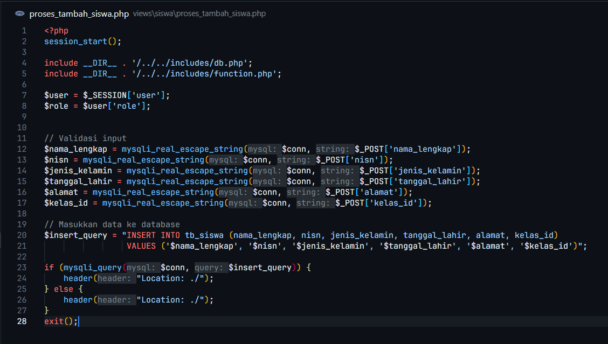

# Implementasi Fitur Lanjutan
Pada tahap ini, kita akan melanjutkan pengembangan aplikasi dari **Tahap I**, menambahkan fitur login dan pengaturan hak akses.
# Struktur Folder

# Membuat Halaman Login
**Pertama-tama**, buat file bernama `login.php` di root proyek Anda jika belum ada. File ini akan menjadi halaman login utama untuk siswa, wali kelas, dan admin.

**Selanjutnya**, tambahkan sesi pengguna di bagian paling atas file untuk mengelola login. Gunakan kode berikut:

```php
session_start();
if (isset($_SESSION['user'])) {
	header("Location: index.php");
	exit;
}
```


**Penjelasan:**
- Fungsi `session_start()` akan memulai sesi PHP.
- `isset($_SESSION['user'])` akan mengecek apakah pengguna sudah login. Jika iya, pengguna akan diarahkan ke halaman utama (`index.php`).
  
**Kemudian**, tentukan jenis login berdasarkan parameter `type` di URL. Tambahkan kode berikut:
```php
    $type_login = isset($_GET['type']) ? strtolower($_GET['type']) : '';
$error = '';
```


**Penjelasan:**
- Variabel `$type_login` menangkap jenis login (`siswa`, `walikelas`, atau `admin`).
- Variabel `$error` akan menyimpan pesan kesalahan jika login gagal.
  
Berikutnya**, tambahkan logika untuk menangani form login jika metode request adalah POST. Gunakan kode:

```php
if ($_SERVER['REQUEST_METHOD'] === 'POST') {
	require_once 'includes/function.php';

	$type = filter_input(INPUT_POST, 'type', FILTER_SANITIZE_STRING);
	$username = filter_input(INPUT_POST, 'username', FILTER_SANITIZE_STRING);
	$password = $_POST['password'];

	try {
		if (login($username, $password, $type)) {
			header("Location: views/dashboard.php");
			exit;
		}
		$username = $type == 'siswa' ? 'NISN' : ($type == 'walikelas' ? 'NIP' : 'Username');
		$error = "$username atau kata sandi salah. Silakan coba lagi.";
	} catch (\Exception $e) {
		$error = $e->getMessage();
	}
}
```


**Penjelasan:**
- Fungsi `filter_input()` membantu memfilter data input dari form untuk mencegah data yang tidak valid masuk ke sistem
- Variabel `$type` menentukan jenis pengguna (misalnya siswa atau walikelas) untuk memastikan login sesuai dengan peran pengguna
- Kata sandi diambil langsung dari input tanpa filter khusus karena akan diverifikasi oleh fungsi `login()`.
- Fungsi `login($username, $password, $type)` memvalidasi kredensial berdasarkan tipe pengguna (siswa, walikelas, atau admin).
- Blok `try-catch` digunakan untuk menangkap kesalahan tak terduga selama proses login, misalnya jika koneksi database gagal.
  
**Selanjutnya**, buat array `$titles` untuk menentukan tampilan form login berdasarkan tipe pengguna:

```php
$titles = [
	'siswa' => ['title' => 'Login Siswa', 'placeholder' => 'Masukkan NISN'],
	'walikelas' => ['title' => 'Login Walikelas', 'placeholder' => 'Masukkan NIP'],
	'admin' => ['title' => 'Login Admin', 'placeholder' => 'Masukkan Nama Pengguna']
];
```


**Setelah itu**, buat file `function.php` di folder `includes/` jika belum ada. File ini akan berfungsi untuk menangani logika login dan validasi pengguna.

```php
<?php
require_once 'db.php';
```



**Penjelasan :**
- **`require_once 'db.php';`**: Baris ini digunakan untuk memuat file `db.php` yang berisi koneksi ke database. File ini diperlukan untuk melakukan query ke database dan memverifikasi kredensial login.

Buat fungsi `login` dengan 3 parameter yang diperlukan.
```php
function login($username, $password, $type): bool
{
    global $conn;
```


**Penjelasan :**
- Fungsi `login()` menerima tiga parameter: `$username`, `$password`, dan `$type` untuk mengidentifikasi kredensial pengguna dan jenis pengguna yang login.
- Variabel `$conn` adalah koneksi database yang diimpor dari `db.php`.

**Selanjutnya**, tambahkan logika untuk menangani login tipe `admin`.
```php
if ($type === "admin") {
    $stmt = $conn->prepare("SELECT * FROM tb_users WHERE username = ?");
    $stmt->bind_param("s", $username);
    $stmt->execute();
    $result = $stmt->get_result();
    $user = $result->fetch_assoc();
}
```


**Penjelasan:**
- Kondisi `if ($type === "admin")` memastikan hanya pengguna dengan tipe `admin` yang menjalani blok kode ini.
- Query SQL mencari pengguna berdasarkan `username`.
- `prepare()` dan `bind_param()` digunakan untuk menghindari SQL injection.
- `get_result()` mengambil hasil query, dan `fetch_assoc()` mengonversi hasil menjadi array asosiatif.

Periksa apakah password yang dimasukkan cocok dengan yang ada di database untuk tipe `admin`.
```php
if ($user && password_verify($password, $user['password'])) {
    $_SESSION['user'] = $user;
    $_SESSION['user']['role'] = 'admin';
    return true;
```


**Penjelasan:**
- Fungsi `password_verify()` memeriksa apakah password yang dimasukkan cocok dengan password yang terenkripsi di database.

**Kemudian**, tambahkan logika untuk menangani login tipe `siswa`.
```php
if ($type === "siswa") {
    $stmt = $conn->prepare("SELECT * FROM tb_siswa WHERE nisn = ? AND nisn = ?");
    $stmt->bind_param("ss", $username, $password);
    $stmt->execute();
    $result = $stmt->get_result();
}
```


Periksa apakah ada hasil yang ditemukan untuk tipe `siswa` dan simpan informasi pengguna dalam session.

```php
if ($result->num_rows > 0) {
    $user = $result->fetch_assoc();
    $_SESSION['user'] = $user;
    $_SESSION['user']['role'] = 'siswa';
    return true;
}
```


**Penjelasan:**
- Kondisi `if ($type === "siswa")` memastikan blok kode ini hanya dijalankan untuk pengguna bertipe `siswa`.
- Query SQL mencari siswa berdasarkan `nisn` dan `password`.
- `num_rows` memeriksa apakah ada baris hasil query yang ditemukan.

**Selanjutnya**, tambahkan logika untuk menangani login tipe `walikelas`.
```php
if ($type === "walikelas") {
    $stmt = $conn->prepare("SELECT * FROM tb_walikelas WHERE nip = ? AND nip = ?");
    $stmt->bind_param("ss", $username, $password);
    $stmt->execute();
    $result = $stmt->get_result();
}
```


Periksa apakah ada hasil untuk tipe `walikelas` dan simpan informasi pengguna dalam session.

```php
if ($result->num_rows > 0) {
    $user = $result->fetch_assoc();
    $_SESSION['user'] = $user;
    $_SESSION['user']['role'] = 'walikelas';
    return true;
}
```


**Penjelasan:**
- Kondisi `if ($type === "walikelas")` memastikan hanya pengguna dengan tipe `walikelas` yang menjalani blok kode ini.
- Query SQL mencari wali kelas berdasarkan `nip` dan `password`.
- `num_rows` memeriksa apakah ada baris yang ditemukan.

**Selanjutnya**, kembalikan `false` jika tidak ada kecocokan.

```php
return false;
```


**Penjelasan:**
- Jika tidak ada pengguna yang cocok dengan kredensial yang dimasukkan, fungsi mengembalikan `false` untuk menunjukkan bahwa login gagal.

**Kemudian**, kembali lagi ke halaman `login.php` setelah itu, tambahkan HTML untuk menampilkan form login. Pastikan form ditampilkan sesuai dengan tipe login. Contoh kode:

```php
<div class="container">
	<?php if (isset($titles[$type_login])): ?>
		<h2><?= $titles[$type_login]['title'] ?></h2>
		<form method="POST" autocomplete="on">
			<input type="hidden" name="type" value="<?= $type_login ?>">
			<div class="input-group">
				<input type="text" name="username" autofocus placeholder="<?= $titles[$type_login]['placeholder'] ?>" required>
			</div>
			<div class="input-group">
				<input type="password" name="password" placeholder="Password" required>
			</div>
			<button type="submit">Login</button>
			<?php if ($error): ?>
				<p class="error-message"><?= $error ?></p>
			<?php endif; ?>
			<a href="login.php">Kembali</a>
		</form>
	<?php else: ?>
		<h2>Silakan Pilih Jenis Login</h2>
		<div class="btn-group">
			<a href="?type=siswa">Siswa</a>
			<a href="?type=walikelas">Walikelas</a>
			<a href="?type=admin">Admin</a>
		</div>
	<?php endif; ?>
</div>
```


**Selanjutnya**, kita akan mempercantik tampilan login menggunakan CSS dengan metode *internal style*. Tambahkan elemen `<style>` di bagian `<head>` dalam file HTML Anda.

```css
<style>
	*, html {
		box-sizing: border-box;
		margin: 0;
		padding: 0;
	}

	/* Gaya body untuk tata letak tengah */
	body {
		font-family: Arial, sans-serif;
		display: flex;
		justify-content: center;
		align-items: center;
		height: 100vh;
		background-color: #f9f9f9;
	}

	/* Kontainer login */
	.container {
		max-width: 400px;
		width: 100%;
		padding: 20px;
		background-color: white;
		border: 1px solid #ccc;
		border-radius: 8px;
		box-shadow: 0 4px 6px rgba(0, 0, 0, 0.1);
		text-align: center;
	}

	/* Grup input */
	.input-group {
		margin-bottom: 15px;
	}

	input,
	button,
	a {
		width: 100%;
		padding: 10px;
		margin: 5px 0;
		font-size: 16px;
		border: 1px solid #ccc;
		border-radius: 4px;
	}

	input:focus {
		border-color: #007bff;
		outline: none;
	}

	button {
		background-color: #007bff;
		color: white;
		border: none;
		cursor: pointer;
	}

	button:hover {
		background-color: #0056b3;
	}

	.error-message {
		color: red;
		font-size: 14px;
		margin-top: -10px;
		margin-bottom: 10px;
	}

	/* Grup tombol atau tautan */
	.btn-group a {
		display: inline-block;
		margin: 5px;
		padding: 10px 20px;
		border: 1px solid #ccc;
		text-decoration: none;
		border-radius: 4px;
		color: #007bff;
	}

	.btn-group a:hover {
		background-color: #f0f0f0;
	}

	h2 {
		margin-bottom: 1rem;
		color: #333;
	}
</style>
```


**Sebelum :**

**Sesudah :**


**Kemudian**, buat file `logout.php` untuk menghentikan sesi pengguna. Gunakan kode berikut:

```php
session_start();
session_unset();
session_destroy();
header("Location: index.php");
```


Kemudian, buat file `dashboard.php` dalam folder views untuk menampilkan tampilan setelah berhasil login
```php
<?php
session_start();

// Cek apakah user sudah login
if (!isset($_SESSION['user'])) {
    header("Location: login.php");
    exit;
}
```

**Penjelasan :**
- `session_start()` digunakan untuk memulai sesi PHP, yang memungkinkan kita mengakses data sesi, seperti informasi login.
- `if (!isset($_SESSION['user']))` adalah kondisi untuk memeriksa apakah sesi user tidak tersedia. Jika iya, pengguna akan diarahkan ke halaman **login.php** dengan fungsi `header()`, lalu skrip dihentikan menggunakan `exit`.

---

Selanjutnya, kita perlu menyertakan file **db.php** untuk terhubung ke database. File ini berisi konfigurasi koneksi yang akan digunakan dalam aplikasi.

```php
require_once __DIR__ . '/../includes/db.php';
```

**Penjelasan**
- `require_once` memastikan file hanya dimuat sekali dalam satu eksekusi skrip.
- `__DIR__` mengacu pada direktori tempat file PHP saat ini berada. Dengan menambahkan `../`, kita berpindah ke folder sebelumnya untuk menemukan file **db.php**.

---

Lalu, mengambil data pengguna yang telah login dan menyimpan informasi penting seperti **role** mereka ke dalam variabel.

```php
// Ambil data user dari session
$user = $_SESSION['user'];
$role = $user['role']; // role: 'admin', 'walikelas', atau 'siswa'
```

**Penjelasan**
- `$_SESSION['user']` adalah data pengguna yang disimpan saat login. Kita menyimpannya ke variabel `$user`.
- `$role = $user['role']` mengambil informasi **role** pengguna, seperti apakah mereka seorang **admin**, **walikelas**, atau **siswa**.

---

Kemudian, mengarahkan pengguna berdasarkan peran. Jika pengguna memiliki peran **siswa**, mereka tidak diizinkan mengakses halaman walikelas dan akan diarahkan ke dashboard siswa.

```php
if ($role === "siswa") {
    header("Location: siswa/dashboard.php");
    exit;
}
```

**Penjelasan :**
- `if ($role === "siswa")` memeriksa apakah peran pengguna adalah **siswa**.
- Jika iya, pengguna diarahkan ke halaman **siswa/dashboard.php** menggunakan fungsi `header()`.

---

Setelah validasi dan logika selesai, kita mulai membuat struktur halaman HTML. Hal ini mencakup elemen-elemen dasar seperti `<head>` untuk metadata dan `<body>` untuk konten utama.

```html
<!DOCTYPE html>
<html lang="id">

<head>
    <meta charset="UTF-8">
    <meta name="viewport" content="width=device-width, initial-scale=1.0">
    <title>Admin Panel</title>
    <link rel="stylesheet" href="/sikasus/assets/css/styles.css">
</head>

<body>
    <div class="wrapper">
    </div>
</body>

</html>
```

**Penjelasan :**
- `<meta charset="UTF-8">` menentukan encoding karakter sebagai UTF-8.
- `<meta name="viewport" content="width=device-width, initial-scale=1.0">` memastikan halaman terlihat responsif di perangkat mobile.
- `<link rel="stylesheet">` menyertakan file CSS untuk tampilan halaman.

---

Sidebar digunakan untuk navigasi. Sidebar ini akan dimuat dari file terpisah menggunakan fungsi **include** agar mudah dikelola.

```php
<!-- Sidebar -->
<?php include($_SERVER['DOCUMENT_ROOT'] . '/sikasus/views/component/sidebar.php'); ?>
```

**Penjelasan :**
- `include()` memuat file **sidebar.php** ke dalam halaman.
- `$_SERVER['DOCUMENT_ROOT']` mengacu pada direktori root server, memastikan jalur file **sidebar.php** benar.

---

**Terakhir,** membuat kode untuk sambutan pengguna.

```html
<!-- Main Content -->
<div class="main-content">
    <header>
        <h1>Dashboard</h1>
    </header>
    <section>
        <h1>Selamat Datang, <?= $role; ?>!</h1>
        <br>
        <div>Di dashboard ini, Anda dapat mengelola data kasus yang terkait melalui menu
            yang tersedia di sidebar.</div>
        <p>Pastikan Anda menggunakan fitur-fitur dengan bijak. Jika membutuhkan bantuan, silakan hubungi
            administrator melalui menu <em>Bantuan</em>.</p>
    </section>
</div>
```

**Penjelasan :**
- `<?= $role; ?>` menampilkan peran pengguna di dashboard, misalnya **admin** atau **walikelas**.
- Elemen `<section>` digunakan untuk mendefinisikan blok konten utama, seperti deskripsi fitur yang tersedia.


---

### Mengecek Hasil Halaman Login
Setelah implementasi halaman login, berikut adalah langkah-langkah untuk mengecek apakah fitur sudah berfungsi dengan benar:

---

1. **Pertama-tama**, buka browser dan akses halaman `login.php`.
	- URL: `http://localhost/sikasus/login.php`.
  
2. **Selanjutnya**, coba klik salah satu tipe login, misalnya **Siswa**.
    - Perhatikan bahwa judul halaman berubah menjadi "Login Siswa".
    - Placeholder input harus sesuai dengan tipe login (contoh: "Masukkan NISN").
  
3. **Kemudian**, masukkan kredensial yang salah, misalnya:
    - **NISN:** 12345678
    - **Password:** salahpassword
    - Klik tombol **Login**.
    - **Hasil yang diharapkan:** Pesan kesalahan ditampilkan: _"NISN atau kata sandi salah. Silakan coba lagi."_
  
4. **Selanjutnya**, masukkan kredensial yang benar sesuai data di database.
    - Jika login berhasil, Anda akan diarahkan ke `views/dashboard.php`.
    - **Hasil yang diharapkan:** Dashboard tampil sesuai hak akses pengguna.

5. **Berikutnya**, ulangi langkah yang sama untuk tipe login **Wali Kelas** dan **Admin**:
    - Periksa apakah placeholder input berubah menjadi "Masukkan NIP" untuk wali kelas dan "Masukkan Nama Pengguna" untuk admin.
    - Pastikan hanya pengguna dengan tipe login yang sesuai dapat mengakses dashboard mereka.

6. **Selanjutnya**, masukkan kredensial yang benar sesuai data di database.
	- Jika login berhasil, Anda akan diarahkan ke `views/dashboard.php`.

7. **Selanjutnya**, uji fitur **Logout**.
    - Klik tombol **Logout** (atau kunjungi url `http://localhost/sikasus/logout.php`).
    - **Hasil yang diharapkan:** Sesi terhapus, dan pengguna diarahkan kembali ke halaman utama (`index.php`).
---

## Kesimpulan
Fitur login dalam aplikasi ini memisahkan akses antara siswa dan wali kelas. Hal ini bertujuan untuk memastikan bahwa hanya pengguna dengan peran yang sesuai yang dapat mengakses data dan fitur yang relevan dengan tugas mereka, seperti siswa yang hanya dapat melihat data pribadi dan wali kelas yang memiliki akses untuk mengelola data kelas dan siswa.
# Siswa Hanya Melihat Kasusnya Sendiri
## Struktur Folder


**Pertama-tama**, buat file baru bernama `dashboard.php` di dalam folder `siswa` sesuai struktur proyek yang diberikan.

**Selanjutnya**, Hubungkan ke Koneksi Database
```php
<?php
session_start();

// Cek apakah user sudah login sebagai siswa
if (!isset($_SESSION['user']) || $_SESSION['user']['role'] !== 'siswa') {
    header("Location: ../../login.php");
    exit;
}

$user = $_SESSION['user'];
$role = $user['role']; // role: 'admin', 'walikelas', atau 'siswa'
```


**Penjelasan**:
- **`session_start()`**: Menginisialisasi sesi PHP.
- **`isset($_SESSION['user'])`**: Mengecek apakah sesi pengguna sudah diatur.
- **`header("Location: ...")`**: Mengarahkan pengguna yang tidak memenuhi syarat login ke halaman login.

**Kemudian**, Tambahkan logika untuk memastikan halaman hanya dapat diakses oleh siswa yang telah login.
Tambahkan koneksi ke database agar data siswa dapat diambil.
```php
require_once __DIR__ . '/../../includes/db.php';
```


**Penjelasan**:
- **`require_once`**: Memastikan file koneksi hanya dimuat satu kali untuk menghindari duplikasi.
- **`__DIR__`**: Mengambil lokasi direktori file saat ini agar path tetap valid meski proyek dipindahkan.

**Berikutnya**, Ambil Data Siswa Berdasarkan ID
Gunakan ID dari sesi untuk mengambil informasi siswa dan relasi kelas mereka.
```php
$siswa_id = $_SESSION['user']['id'];
$siswa_query = "
    SELECT 
        s.id,
        s.nama_lengkap,
        s.nisn,
        k.nama_kelas
    FROM tb_siswa s
    LEFT JOIN tb_kelas k ON s.kelas_id = k.id_kelas
    WHERE s.id = ?";

$stmt = mysqli_prepare($conn, $siswa_query);
mysqli_stmt_bind_param($stmt, "i", $siswa_id);
mysqli_stmt_execute($stmt);
$siswa_result = mysqli_stmt_get_result($stmt);
$siswa_data = mysqli_fetch_assoc($siswa_result);
```


**Penjelasan**:
- **Relasi Database**:
    - Tabel `tb_siswa` di-**LEFT JOIN** dengan `tb_kelas` menggunakan kolom `kelas_id`.
    - Data yang diambil mencakup ID siswa, nama lengkap, NISN, dan nama kelas.
- **`mysqli_prepare`**: Membuat query yang aman dari SQL Injection.

**Selanjutnya**, Hitung Total Kasus Siswa
Ambil jumlah total kasus yang terkait dengan siswa untuk ditampilkan di dashboard.
```php
$total_query = "SELECT COUNT(*) as total FROM tb_kasus WHERE siswa_id = ?";
$stmt = mysqli_prepare($conn, $total_query);
mysqli_stmt_bind_param($stmt, "i", $siswa_id);
mysqli_stmt_execute($stmt);
$total_result = mysqli_stmt_get_result($stmt);
$total_cases = mysqli_fetch_assoc($total_result)['total'];
```


**Penjelasan**:
- **`COUNT(*)`**: Menghitung jumlah baris kasus dalam tabel `tb_kasus` untuk siswa tertentu.
- **`WHERE siswa_id = ?`**: Memastikan hanya kasus siswa yang sedang login yang dihitung.

**Selanjutnya**, Ambil Daftar Kasus Berdasarkan Siswa
```php
$kasus_query = "
    SELECT 
        k.id_kasus,
        k.deskripsi_kasus,
        k.tanggal_kasus
    FROM tb_kasus k
    WHERE k.siswa_id = ?
    ORDER BY k.tanggal_kasus DESC";

$stmt = mysqli_prepare($conn, $kasus_query);
mysqli_stmt_bind_param($stmt, "i", $siswa_id);
mysqli_stmt_execute($stmt);
$kasus_result = mysqli_stmt_get_result($stmt);
```


**Penjelasan**:
- **`ORDER BY k.tanggal_kasus DESC`**: Mengurutkan hasil berdasarkan tanggal kasus terbaru.

**Terakhir**, Tampilkan Data di Halaman `dashboard.php`
```php
<!DOCTYPE html>
<html lang="id">

<head>
    <meta charset="UTF-8">
    <meta name="viewport" content="width=device-width, initial-scale=1.0">
    <title>Riwayat Kasus - <?= htmlspecialchars($siswa_data['nama_lengkap']) ?></title>

    <link rel="stylesheet" href="/sikasus/assets/css/styles.css">

</head>

<body>
    <div class="wrapper">
        <!-- Sidebar -->
        <?php include($_SERVER['DOCUMENT_ROOT'] . '/sikasus/views/component/sidebar.php'); ?>

        <div class="main-content content-siswa">
            <!-- Profil Siswa -->
            <div class="profile-card">
                <div class="profile-header">
                    <div class="profile-avatar">👤</div>
                    <div class="profile-info">
                        <h1><?= htmlspecialchars($siswa_data['nama_lengkap']) ?></h1>
                        <p>NISN: <?= htmlspecialchars($siswa_data['nisn']) ?></p>
                        <p>Kelas: <?= htmlspecialchars($siswa_data['nama_kelas'] ?? "Belum ditentukan") ?></p>
                        <p>Total Kasus: <?= $total_cases ?></p>
                    </div>
                </div>
            </div>

            <!-- Riwayat Kasus -->
            <div class="cases-card">
                <h2>Riwayat Kasus</h2>
                <?php if (mysqli_num_rows($kasus_result) > 0): ?>
                    <?php while ($kasus = mysqli_fetch_assoc($kasus_result)): ?>
                        <div class="case-item">
                            <strong><?= date('d M Y', strtotime($kasus['tanggal_kasus'])) ?></strong>
                            <p><?= nl2br(htmlspecialchars($kasus['deskripsi_kasus'])) ?></p>
                        </div>
                    <?php endwhile; ?>
                <?php else: ?>
                    <div class="empty-state">
                        <p>Tidak Ada Riwayat Kasus</p>
                    </div>
                <?php endif; ?>
            </div>
        </div>
    </div>
</body>

</html>
```

## Hasil Tampilan Dashboard Siswa


## Kesimpulan
Setiap siswa hanya dapat mengakses dan melihat data kasus yang berkaitan dengan dirinya sendiri. Dengan cara ini, aplikasi menjaga privasi dan relevansi informasi sehingga hanya siswa yang bersangkutan yang bisa mengakses kasus yang melibatkan dirinya.
# CRUD Data Siswa
## Struktur Folder


## Membuat Halaman untuk Menampilkan Data Siswa
 Pertama, buat file `index.php` di folder `views/siswa`. Di dalam file ini, kita akan menampilkan daftar siswa yang diambil dari database.

```php
<?php
session_start();
```


**Penjelasan:**
- Fungsi `session_start()` diperlukan untuk mengakses data sesi, seperti informasi pengguna yang login.

---

Selanjutnya, sertakan file `db.php` dan `function.php` agar Anda dapat terhubung ke database serta menggunakan fungsi yang telah dibuat.

```php
require_once __DIR__ . '/../../includes/db.php';
require_once __DIR__ . '/../../includes/function.php';
```


**Penjelasan:**
- `require_once` memastikan file hanya dimuat satu kali untuk mencegah konflik.
- `__DIR__` menunjuk direktori tempat file saat ini berada, sehingga memudahkan mengatur path.

---

Kemudian, ambil data pengguna dari sesi untuk menentukan hak akses berdasarkan perannya.

```php
$user = $_SESSION['user'];
$role = $user['role'];
```


**Penjelasan:**
- Variabel `$user` menyimpan data pengguna yang sedang login.
- Variabel `$role` digunakan untuk mengetahui apakah pengguna adalah wali kelas.

---

Berikutnya, buat query untuk mengambil data siswa yang hanya terkait dengan wali kelas yang sedang login.

```php
if ($role === "walikelas") {
    $siswa_query = "SELECT s.id, s.nama_lengkap, s.nisn, s.jenis_kelamin, s.tanggal_lahir, s.alamat, k.nama_kelas, w.nama_walikelas
                FROM tb_siswa s
                LEFT JOIN tb_kelas k ON s.kelas_id = k.id_kelas
                LEFT JOIN tb_walikelas w ON k.walikelas_id = w.id_walikelas
                WHERE w.id_walikelas = {$user['id_walikelas']}
                ORDER BY s.nama_lengkap";
}
```


**Penjelasan:**
- Query SQL ini berguna untuk mengambil data siswa berdasarkan ID wali kelas yang login.
- Tabel `tb_siswa` bergabung (join) dengan tabel `tb_kelas` dan `tb_walikelas` untuk mendapatkan nama kelas serta nama wali kelas.

---

Setelah query ditulis, eksekusi query tersebut dan simpan hasilnya.

```php
$siswa_data = fetchData($conn, $siswa_query);
```


**Penjelasan:**
- Fungsi `fetchData` adalah fungsi bantu dari `function.php` yang mengeksekusi query dan mengembalikan data dalam bentuk array.

---

Selanjutnya, buat struktur dasar HTML untuk menampilkan daftar siswa.

```html
<!DOCTYPE html>
<html lang="id">
<head>
    <meta charset="UTF-8">
    <meta name="viewport" content="width=device-width, initial-scale=1.0">
    <title>Daftar Siswa</title>
    <link rel="stylesheet" href="/sikasus/assets/css/styles.css">
</head>
<body>
    <div class="wrapper">
```


**Penjelasan:**
- Tag `<html>` dengan atribut `lang="id"` menunjukkan bahwa bahasa halaman ini adalah Bahasa Indonesia.
- File CSS eksternal `styles.css` ditautkan untuk memberikan gaya pada halaman.

---

Lalu, tambahkan sidebar menggunakan file `sidebar.php`.

```php
<?php include($_SERVER['DOCUMENT_ROOT'] .'sikasus/views/component/sidebar.php'); ?>
```


**Penjelasan:**
- Fungsi `include` digunakan untuk memasukkan file sidebar agar kode lebih modular.
- `$_SERVER['DOCUMENT_ROOT']` menunjuk ke direktori root proyek, sehingga path tetap dinamis.

---

Setelah itu, tambahkan header dan tombol untuk menambah siswa.

```html
<div class="main-content">
    <header>
        <h1>Daftar Siswa</h1>
    </header>
    <div class="container">
        <a href="tambah_siswa.php" class="button">Tambah Siswa</a>
```


**Penjelasan:**
- Bagian ini berisi elemen visual seperti judul halaman dan tombol untuk menambah data siswa.

---

Kemudian, buat tabel untuk menampilkan data siswa dari hasil query.

```html
<table>
    <thead>
        <tr>
            <th>#</th>
            <th>Nama Siswa</th>
            <th>NISN</th>
            <th>Kelas</th>
            <th>Wali Kelas</th>
            <th>Aksi</th>
        </tr>
    </thead>
    <tbody>
        <?php if (empty($siswa_data)): ?>
            <tr>
                <td colspan="6" style="text-align: center; font-style: italic; height: 25vh">
                    Tidak ada data yang tersedia.
                </td>
            </tr>
        <?php else: ?>
            <?php foreach ($siswa_data as $number => $siswa): ?>
                <tr>
                    <td><?= $number + 1 ?></td>
                    <td><?= $siswa['nama_lengkap'] ?></td>
                    <td><?= $siswa['nisn'] ?></td>
                    <td><?= $siswa['nama_kelas'] ?></td>
                    <td><?= $siswa['nama_walikelas'] ?></td>
                    <td>
                        <a href="edit_siswa.php?id=<?= $siswa['id'] ?>" class="button">Edit</a>
                        <a href="hapus_siswa.php?id=<?= $siswa['id'] ?>" class="button" 
                           onclick="return confirm('Apakah Anda yakin ingin menghapus data ini?');">Hapus</a>
                    </td>
                </tr>
            <?php endforeach; ?>
        <?php endif; ?>
    </tbody>
</table>
```


**Penjelasan:**
- Tabel ini menampilkan daftar siswa dengan nomor, nama, NISN, kelas, dan wali kelas.
- Tombol "Edit" mengarahkan ke halaman `edit_siswa.php` dan tombol "Hapus" menghapus data siswa.

---

Terakhir, tutup struktur HTML dengan tag penutup.

```html
    </div>
</div>
</body>
</html>
```

**Penjelasan:**
- Tag penutup memastikan bahwa dokumen HTML Anda sudah selesai.

---
## Membuat Halaman Tambah Data Siswa

Pertama-tama, buat file baru dengan nama `tambah_siswa.php` di dalam folder `views/siswa/`. File ini akan digunakan untuk menampilkan formulir tambah data siswa.

```php
<?php

session_start();
```


**Penjelasan**:
- `session_start()` digunakan untuk mengakses atau memulai sesi yang sudah ada.

---

Selanjutnya, tambahkan file `db.php` untuk koneksi ke database dan `function.php` untuk menggunakan fungsi bantu.

```php
require_once __DIR__ . '/../../includes/db.php';
require_once __DIR__ . '/../../includes/function.php';
```


**Penjelasan**:
- **`db.php`**: Mengelola koneksi ke database.
- **`function.php`**: Berisi fungsi seperti `fetchData` untuk pengambilan data.

---

Berikutnya, periksa apakah pengguna adalah wali kelas. Jika ya, ambil data kelas yang terkait.

```php
$user = $_SESSION['user'];
$role = $user['role'];

if ($role === "walikelas") {
    $kelas_query = "SELECT id_kelas FROM tb_kelas WHERE walikelas_id = {$user['id_walikelas']}";
}

$kelas_data = fetchData($conn, $kelas_query);
```


**Penjelasan**:
- Periksa peran pengguna dari sesi (`$_SESSION['user']`).
- Jika perannya adalah wali kelas, jalankan query untuk mengambil `id_kelas` dari `tb_kelas`.

**Query:**

```sql
SELECT id_kelas FROM tb_kelas WHERE walikelas_id = {id_walikelas};
```

---

Kemudian, buat struktur HTML untuk halaman.

```html
<!DOCTYPE html>
<html lang="id">
<head>
    <meta charset="UTF-8">
    <meta name="viewport" content="width=device-width, initial-scale=1.0">
    <title>Tambah Siswa</title>
    <link rel="stylesheet" href="/assets/css/styles.css">
</head>
<body>
    <div class="wrapper">
```


**Penjelasan**:
- `<!DOCTYPE html>` menentukan jenis dokumen sebagai HTML5.
- `<link>` menautkan file CSS untuk mempercantik tampilan.

---

Selanjutnya, tambahkan menu navigasi menggunakan file `sidebar.php`.

```php
<?php include($_SERVER['DOCUMENT_ROOT'] . '/views/component/sidebar.php'); ?>
```


**Penjelasan**:
- `include()` memasukkan file `sidebar.php` agar kode lebih modular.

---

Selanjutnya, tambahkan form untuk input data siswa.

```html
   <!-- Main Content -->
<div class="main-content">
<header>
<h1>Tambah Data Siswa</h1>
</header>
<div class="container">
<form action="proses_tambah_siswa.php" method="post">
    <div>
        <label for="nama_lengkap">Nama Lengkap:</label>
        <input type="text" id="nama_lengkap" name="nama_lengkap" required>
    </div>

    <div>
        <label for="nisn">NISN:</label>
        <input type="text" id="nisn" name="nisn" required>
    </div>

    <div>
        <label for="jenis_kelamin">Jenis Kelamin:</label>
        <select id="jenis_kelamin" name="jenis_kelamin" required>
            <option value="">Pilih Jenis Kelamin</option>
            <option value="Laki-laki">Laki-laki</option>
            <option value="Perempuan">Perempuan</option>
        </select>
    </div>

    <div>
        <label for="tanggal_lahir">Tanggal Lahir:</label>
        <input type="date" id="tanggal_lahir" name="tanggal_lahir" required>
    </div>

    <div>
        <label for="alamat">Alamat:</label>
        <textarea id="alamat" name="alamat" required></textarea>
    </div>

    <?php if ($role === "walikelas"): ?>
        <input type="hidden" name="kelas_id" value="<?= $kelas_data[0]['id_kelas'] ?>">
    <?php endif; ?>

    <button type="submit">Simpan</button>
    <a href="index.php" class="button">Kembali</a>
	</form>
</div>
	</div>
</div>
```


**Penjelasan**:
- Setiap input field memiliki atribut `name` agar data dapat diakses di file proses.
- Tambahkan input tersembunyi (`hidden input`) untuk memasukkan ID kelas jika pengguna adalah wali kelas.

---

**Kemudian**, mengirim Data ke `proses_tambah_siswa.php`. Formulir ini akan mengirimkan data menggunakan metode POST ke file **`proses_tambah_siswa.php`**, yang akan menangani penyimpanan data ke dalam database.

```php
<?php
session_start();
```

Tambahkan `db.php` untuk koneksi database dan `function.php` untuk fungsi bantu.

```php
include __DIR__ . '/../../includes/db.php';
include __DIR__ . '/../../includes/function.php';
```

---

Ambil data dari formulir dan validasi inputnya.

```php
$nama_lengkap = mysqli_real_escape_string($conn, $_POST['nama_lengkap']);
$nisn = mysqli_real_escape_string($conn, $_POST['nisn']);
$jenis_kelamin = mysqli_real_escape_string($conn, $_POST['jenis_kelamin']);
$tanggal_lahir = mysqli_real_escape_string($conn, $_POST['tanggal_lahir']);
$alamat = mysqli_real_escape_string($conn, $_POST['alamat']);
$kelas_id = mysqli_real_escape_string($conn, $_POST['kelas_id']);
```

---

Selanjutnya, buat query untuk menyimpan data ke tabel `tb_siswa`.

```php
$insert_query = "INSERT INTO tb_siswa (nama_lengkap, nisn, jenis_kelamin, tanggal_lahir, alamat, kelas_id) 
                 VALUES ('$nama_lengkap', '$nisn', '$jenis_kelamin', '$tanggal_lahir', '$alamat', '$kelas_id')";

if (mysqli_query($conn, $insert_query)) {
    header("Location: ./");
} else {
    header("Location: ./");
}
exit();
```

**Penjelasan**:
- Query SQL `INSERT INTO` digunakan untuk menambah data baru ke tabel `tb_siswa`.
- Jika query berhasil, pengguna diarahkan kembali ke halaman `index.php`.



---
## Membuat Halaman Edit Data Siswa
Pertama-tama, pastikan file `edit_siswa.php` ada di folder `views/siswa`. File ini digunakan untuk menampilkan form edit data siswa berdasarkan ID yang dipilih.

Selanjutnya, tambahkan kode berikut di awal file untuk memulai session, mengimpor koneksi database, dan fungsi tambahan:

```php
session_start();
require_once __DIR__ . '/../../includes/db.php';
require_once __DIR__ . '/../../includes/function.php';
```

- `session_start();` digunakan untuk memulai sesi PHP, memungkinkan Anda mengakses data sesi seperti informasi pengguna.
- `require_once` mengimpor file `db.php` dan `function.php` untuk koneksi database dan fungsi tambahan.

Setelah itu, buat kode untuk membaca ID siswa dari URL dan mengambil data siswa berdasarkan ID tersebut:

```php
$id = isset($_GET['id']) ? (int)$_GET['id'] : 0;

$siswa_query = "SELECT * FROM tb_siswa WHERE id = $id";
$siswa = $conn->query($siswa_query)->fetch_assoc();

if (!$siswa) {
    echo "<script>alert('Data siswa tidak ditemukan.'); window.location.href = 'index.php';</script>";
    exit;
}
```

- `$_GET['id']` membaca parameter `id` dari URL.
- Query `SELECT * FROM tb_siswa WHERE id = $id` mengambil data siswa dari database berdasarkan ID.
- Jika data siswa tidak ditemukan, kode akan menampilkan alert dan mengarahkan kembali ke halaman utama.

Kemudian, tambahkan logika untuk mendapatkan data kelas yang hanya diampu oleh wali kelas:

```php
if ($role === "walikelas") {
    $kelas_query = "SELECT id_kelas FROM tb_kelas WHERE walikelas_id = {$user['id_walikelas']}";
}

$kelas_data = fetchData($conn, $kelas_query);
```

- Variabel `$role` diperoleh dari data sesi untuk menentukan apakah pengguna adalah wali kelas.
- Jika `role` adalah wali kelas, query hanya mengambil kelas yang diampu pengguna tersebut.


---
Kemudian, buat struktur HTML untuk halaman.

```html
<!DOCTYPE html>
<html lang="id">
<head>
    <meta charset="UTF-8">
    <meta name="viewport" content="width=device-width, initial-scale=1.0">
    <title>Tambah Siswa</title>
    <link rel="stylesheet" href="/assets/css/styles.css">
</head>
<body>
```

**Penjelasan**:
- `<!DOCTYPE html>` menentukan jenis dokumen sebagai HTML5.
- `<link>` menautkan file CSS untuk mempercantik tampilan.

---

Selanjutnya, buat form HTML yang menampilkan data siswa untuk diedit:

```html
<div class="wrapper">

    <!-- Sidebar -->
    <?php include($_SERVER['DOCUMENT_ROOT'] . '/sikasus/views/component/sidebar.php'); ?>

    <!-- Main Content -->
    <div class="main-content">
        <header>
            <h1>Edit Data Siswa</h1>
        </header>
        <div class="container">
            <form action="proses_edit_siswa.php" method="post">
                <input type="hidden" name="id" value="<?= $siswa['id'] ?>">

                <div>
                    <label for="nama_lengkap">Nama Lengkap:</label>
                    <input type="text" id="nama_lengkap" name="nama_lengkap"
                        value="<?= htmlspecialchars($siswa['nama_lengkap']) ?>" required>
                </div>

                <div>
                    <label for="nisn">NISN:</label>
                    <input type="text" id="nisn" name="nisn" value="<?= htmlspecialchars($siswa['nisn']) ?>"
                        required>
                </div>

                <div>
                    <label for="jenis_kelamin">Jenis Kelamin:</label>
                    <select id="jenis_kelamin" name="jenis_kelamin" required>
                        <option value="Laki-laki" <?= $siswa['jenis_kelamin'] === "Laki-laki" ? "selected" : "" ?>>
                            Laki-laki</option>
                        <option value="Perempuan" <?= $siswa['jenis_kelamin'] === "Perempuan" ? "selected" : "" ?>>
                            Perempuan</option>
                    </select>
                </div>

                <div>
                    <label for="tanggal_lahir">Tanggal Lahir:</label>
                    <input type="date" id="tanggal_lahir" name="tanggal_lahir"
                        value="<?= htmlspecialchars($siswa['tanggal_lahir']) ?>" required>
                </div>

                <div>
                    <label for="alamat">Alamat:</label>
                    <textarea id="alamat" name="alamat"
                        required><?= htmlspecialchars($siswa['alamat']) ?></textarea>
                </div>

                <?php if ($role === "admin"): ?>
                    <div>
                        <label for="kelas_id">Kelas:</label>
                        <select id="kelas_id" name="kelas_id" required>
                            <?php foreach ($kelas_data as $kelas): ?>
                                <option value="<?= $kelas['id_kelas'] ?>" <?= $siswa['kelas_id'] == $kelas['id_kelas'] ? "selected" : "" ?>>
                                    <?= htmlspecialchars($kelas['nama_kelas']) ?>
                                </option>
                            <?php endforeach; ?>
                        </select>
                    </div>
                <?php else: ?>
                    <input type="hidden" name="kelas_id" value="<?= $siswa['kelas_id'] ?>">
                <?php endif; ?>

                <button type="submit">Simpan</button>
                <a href="index.php" class="button">Kembali</a>
            </form>
        </div>
    </div>
</div>
```

- Form menggunakan method `POST` dan action menuju `proses_edit_siswa.php`.
- Field seperti `nama_lengkap`, `nisn`, dan lainnya diisi dengan data siswa yang diambil dari database.
- Dropdown hanya ditampilkan untuk admin, sedangkan wali kelas menggunakan nilai tersembunyi (`hidden`).

---

Pertama, pastikan file `proses_edit_siswa.php` ada di folder `views/siswa`. File ini akan memproses data dari form edit.

Tambahkan kode berikut di awal file untuk memvalidasi bahwa request berasal dari form:

```php
if ($_SERVER['REQUEST_METHOD'] === 'POST') {
    $id = (int)$_POST['id'];
    $nama_lengkap = mysqli_real_escape_string($conn, $_POST['nama_lengkap']);
    $nisn = mysqli_real_escape_string($conn, $_POST['nisn']);
    $jenis_kelamin = mysqli_real_escape_string($conn, $_POST['jenis_kelamin']);
    $tanggal_lahir = mysqli_real_escape_string($conn, $_POST['tanggal_lahir']);
    $alamat = mysqli_real_escape_string($conn, $_POST['alamat']);
    $kelas_id = (int)$_POST['kelas_id'];
}
```

- Validasi method POST memastikan hanya form yang dapat mengakses file ini.
- Fungsi `mysqli_real_escape_string` mencegah serangan SQL Injection.


Setelah itu, buat query untuk memperbarui data siswa:

```php
$update_query = "
    UPDATE tb_siswa 
    SET 
        nama_lengkap = '$nama_lengkap',
        nisn = '$nisn',
        jenis_kelamin = '$jenis_kelamin',
        tanggal_lahir = '$tanggal_lahir',
        alamat = '$alamat',
        kelas_id = $kelas_id
    WHERE id = $id
";

if (mysqli_query($conn, $update_query)) {
    echo "<script>alert('Data siswa berhasil diupdate.'); window.location.href = 'index.php';</script>";
} else {
    echo "<script>alert('Terjadi kesalahan saat mengupdate data.'); window.history.back();</script>";
}
```

- Query `UPDATE` digunakan untuk memperbarui data siswa berdasarkan ID.
- Jika berhasil, pesan sukses akan muncul dan pengguna diarahkan kembali ke halaman utama.


---

## Membuat Halaman Hapus Data Siswa

**Pertama-tama**, buat file bernama `hapus_siswa.php` di dalam folder `views/siswa`.

**Selanjutnya**, tambahkan kode untuk membuka session di awal file. Hal ini bertujuan untuk memastikan pengguna yang mengakses halaman ini memiliki hak akses yang valid.

```php
<?php

session_start();
```

**Penjelasan**:
- **`session_start()`**: Memulai sesi untuk melacak data pengguna seperti status login.
- Pastikan file ini tidak dapat diakses langsung oleh pengguna yang tidak berwenang.

---

**Kemudian**, sertakan file pendukung yang diperlukan, seperti `db.php` untuk koneksi database dan `function.php` untuk fungsi tambahan.

```php
require_once __DIR__ . '/../../includes/db.php';
require_once __DIR__ . '/../../includes/function.php';
```

**Penjelasan**:
- **`db.php`**: Mengelola koneksi ke database.
- **`function.php`**: Berisi fungsi tambahan seperti **`jsAlert`** yang digunakan untuk menampilkan notifikasi.

---

**Berikutnya**, tambahkan kode untuk memvalidasi parameter **`id`** yang dikirim melalui URL.

```php
if (!isset($_GET['id']) || !is_numeric($_GET['id'])) {
    jsAlert('ID siswa tidak ditemukan.', 'index.php');
    exit();
}
$id_siswa = intval($_GET['id']);
```


**Penjelasan**:
- **`isset($_GET['id'])`**: Memeriksa apakah parameter **`id`** ada dalam URL.
- **`is_numeric($_GET['id'])`**: Memastikan bahwa nilai **`id`** adalah angka.
- **`intval($_GET['id'])`**: Mengonversi nilai **`id`** menjadi bilangan bulat untuk mencegah serangan injeksi.
- Jika parameter tidak valid, pengguna diarahkan kembali ke halaman utama dengan notifikasi kesalahan.

---

**Setelah itu**, siapkan query SQL untuk menghapus data siswa berdasarkan ID yang diterima.

```php
$delete_query = "DELETE FROM tb_siswa WHERE id = $id_siswa";

```

**Penjelasan**:  
Query **`DELETE`** ini akan menghapus baris data dari tabel **`tb_siswa`** di mana kolom **`id`** sama dengan **`$id_siswa`**.

---

**Selanjutnya**, eksekusi query untuk menghapus data dan tampilkan notifikasi berdasarkan hasil eksekusi tersebut.

```php
if (mysqli_query($conn, $delete_query)) {
    jsAlert('Siswa berhasil dihapus.', 'index.php');
} else {
    jsAlert('Kesalahan saat menghapus siswa.', 'index.php');
}
exit();
```

**Penjelasan**:
- **`mysqli_query($conn, $delete_query)`**: Menjalankan query ke database.
- Jika query berhasil, fungsi **`jsAlert`** akan menampilkan pesan **"Siswa berhasil dihapus"** dan mengarahkan pengguna kembali ke halaman utama.
- Jika terjadi kesalahan, pesan **"Kesalahan saat menghapus siswa"** akan muncul.

---

#### Query yang Digunakan

```sql
DELETE FROM tb_siswa WHERE id = <id_siswa>;
```

**Penjelasan**:  
Query ini akan menghapus baris data pada tabel **`tb_siswa`** di mana kolom **`id`** sesuai dengan **`id_siswa`** yang diterima.


---
# Wali Kelas - CRUD Kasus

## Menampilkan Daftar Kasus

Sebelumnya, dalam **file `index.php`** yang sudah ada, data kasus ditampilkan untuk seluruh siswa tanpa batasan per kelas atau wali kelas. Ini berarti, semua pengguna akan melihat semua data kasus tanpa pembatasan. Namun, untuk aplikasi yang lebih relevan dan sesuai dengan kebutuhan **wali kelas**, kita perlu menyesuaikan query SQL untuk **memfilter data** agar hanya kasus-kasus yang terkait dengan siswa di kelas yang dipimpin oleh wali kelas yang sedang login.

**Langkah pertama** yang perlu dilakukan adalah menambahkan variabel **`$walikelas_id`** yang akan menyimpan ID wali kelas dari session. Hal ini memungkinkan kita untuk memfilter data yang hanya terkait dengan kelas yang diawasi oleh wali kelas tersebut.

```php
$walikelas_id = $user['id_walikelas'] ?? null;
```

**Penjelasan**:
- **`$user['id_walikelas'] ?? null`**: Menggunakan operator **null coalescing** untuk mengambil ID wali kelas jika ada, atau memberikan nilai **`null`** jika tidak tersedia.
- Variabel ini penting untuk membatasi data kasus yang akan ditampilkan hanya sesuai dengan kelas wali kelas yang sedang login.

---

**Selanjutnya**, tambahkan logika untuk menyesuaikan query SQL berdasarkan peran pengguna. Jika pengguna memiliki peran **`walikelas`**, tambahkan klausa **`WHERE`** untuk membatasi data sesuai ID wali kelas.

```php
if ($role === 'walikelas') {
    $kasus_query = "SELECT k.id_kasus, k.siswa_id, k.deskripsi_kasus, k.tanggal_kasus, s.nama_lengkap
                    FROM tb_kasus k
                    LEFT JOIN tb_siswa s ON k.siswa_id = s.id
                    JOIN tb_kelas kl ON s.kelas_id = kl.id_kelas
                    WHERE kl.walikelas_id = $walikelas_id
                    ORDER BY k.tanggal_kasus DESC";
}
```


**Penjelasan**:
- **`if ($role === 'walikelas')`**: Memastikan bahwa logika khusus ini hanya berjalan untuk pengguna dengan peran wali kelas.
- **`JOIN tb_kelas kl ON s.kelas_id = kl.id_kelas`**: Menghubungkan tabel siswa dengan tabel kelas untuk mendapatkan informasi wali kelas.
- **`WHERE kl.walikelas_id = $walikelas_id`**: Membatasi data hanya pada kelas yang diawasi oleh wali kelas yang sedang login.

---

**Kemudian**, tambahkan kode untuk mengeksekusi query SQL dengan fungsi **`fetchData`**, tanpa mengubah kode sebelumnya untuk eksekusi query.

```php
$kasus_result = fetchData($conn, $kasus_query);
```


  
**Penjelasan**:
- **`fetchData`**: Fungsi ini akan menjalankan query ke database dan mengembalikan hasilnya dalam bentuk array. Pastikan fungsi ini sudah didefinisikan di file **`function.php`**.

---

## Halaman Tambah Data Kasus
Pada bagian ini, kita melakukan perubahan untuk memastikan bahwa hanya wali kelas yang dapat melihat siswa-siswa dalam kelas yang mereka pimpin, bukan semua siswa di seluruh sekolah.

Langkah pertama yang perlu dilakukan adalah mengambil data pengguna yang sedang login melalui session. Data ini sangat penting untuk menentukan peran pengguna (role), seperti apakah dia seorang admin, wali kelas, atau siswa.

```php
$user = $_SESSION['user'];
$role = $user['role'];
```


Penjelasan:
- **$_SESSION['user']** menyimpan data pengguna yang login. Dari sini kita bisa mengambil informasi terkait pengguna.
- **$role** digunakan untuk mengetahui peran pengguna tersebut. Misalnya, apakah pengguna tersebut adalah wali kelas atau admin.

---

Selanjutnya, kita akan mengecek apakah pengguna yang login adalah **wali kelas**. Jika iya, maka hanya siswa di kelas yang dipimpin oleh wali kelas tersebut yang akan ditampilkan dalam form.

```php
$walikelas_id = $user['id_walikelas'] ?? null;

// Query berdasarkan role user
if ($role === "admin") {
$query = "SELECT tb_siswa.id, tb_siswa.nama_lengkap
FROM tb_siswa
JOIN tb_kelas ON tb_siswa.kelas_id = tb_kelas.id_kelas";
} elseif ($role === "walikelas") {
$query = "SELECT tb_siswa.id, tb_siswa.nama_lengkap
FROM tb_siswa
JOIN tb_kelas ON tb_siswa.kelas_id = tb_kelas.id_kelas
WHERE tb_kelas.walikelas_id = $walikelas_id";
}
```


Penjelasan:
- **$walikelas_id** berfungsi untuk mengambil ID wali kelas yang ada di data pengguna.
- Jika **$role** adalah `walikelas`, maka query akan mencari siswa yang ada di kelas yang dipimpin oleh wali kelas tersebut. Query ini akan menggabungkan tabel **tb_siswa** dan **tb_kelas** berdasarkan ID wali kelas.

---

**Selanjutnya**, kita akan menjalankan query ini untuk mendapatkan daftar siswa yang sesuai.

```php
$result = mysqli_query($conn, $query);
```


Penjelasan:
- Fungsi **mysqli_query** digunakan untuk mengeksekusi query yang telah kita buat.
- **$result** berisi hasil query yang nantinya akan kita tampilkan dalam dropdown di form.

## Kesimpulan
Wali kelas diberikan hak untuk melakukan operasi **CRUD** (Create, Read, Update, Delete) terhadap data siswa dan kasus yang ada di kelasnya. Ini memberikan wali kelas wewenang untuk mengelola data dengan lebih mudah dan efisien sesuai dengan tanggung jawabnya sebagai pengelola kelas.
# Tampilan Beranda Kasus Siswa
## Struktur Folder


**Pertama-tama**, buat file bernama `index.php` di root proyek Anda jika belum ada. File ini akan menjadi halaman utama (_homepage_) yang digunakan untuk menampilkan data kasus siswa.

**Selanjutnya**, tuliskan kode berikut pada bagian awal file `index.php` untuk memulai sesi pengguna dan menginisialisasi variabel penting seperti `$error`, `$hasil`, dan `$success_message`.

```php
<?php
session_start();

$error = '';
$hasil = null;
$success_message = '';
```


**Penjelasan Kode:**
- `session_start();` digunakan untuk memulai sesi PHP agar dapat melacak data pengguna selama aplikasi berjalan.
- Variabel `$error` digunakan untuk menyimpan pesan kesalahan.
- Variabel `$hasil` digunakan untuk menyimpan hasil query dari database.
- Variabel `$success_message` digunakan untuk menyimpan pesan sukses jika data berhasil ditemukan.

---

**Setelah itu**, tambahkan logika untuk menangani pengiriman data dari formulir dengan metode `POST`. Pada bagian ini, data _NISN_ dan _tanggal lahir_ akan diterima dan divalidasi.

```php
if ($_SERVER['REQUEST_METHOD'] === 'POST') {
    $nisn = filter_input(INPUT_POST, 'nisn', FILTER_SANITIZE_STRING);
    $tanggal_lahir = filter_input(INPUT_POST, 'tanggal_lahir', FILTER_SANITIZE_STRING);

    if (empty($nisn) || empty($tanggal_lahir)) {
        $error = 'NISN dan Tanggal Lahir harus diisi.';
    }else {
    // .....
```


**Penjelasan Kode:**
- `$_SERVER['REQUEST_METHOD'] === 'POST'` memastikan logika hanya dijalankan saat formulir dikirimkan.
- `filter_input()` digunakan untuk menyaring data input agar aman dari karakter berbahaya.
- Kondisi `if (empty(...))` mengecek apakah _NISN_ atau _tanggal lahir_ kosong. Jika iya, maka pesan kesalahan disimpan di `$error`.

---

**Selanjutnya**, jika data tidak kosong, lakukan proses koneksi ke database dan jalankan query untuk mencari data siswa dan kasusnya. Jangan lupa, pastikan file koneksi database (`db.php`) sudah ada.

```php
try {
	require_once 'includes/db.php';
	
	$stmt = $conn->prepare("
	    SELECT 
	        s.nisn, 
	        s.nama_lengkap, 
	        s.tanggal_lahir, 
	        k.deskripsi_kasus,
	        k.tanggal_kasus
	    FROM tb_siswa s
	    LEFT JOIN tb_kasus k ON s.id = k.siswa_id
	    WHERE s.nisn = ? AND s.tanggal_lahir = ?
	");
	
	$stmt->bind_param("ss", $nisn, $tanggal_lahir);
```


**Penjelasan Kode:**
- `require_once 'includes/db.php';` memuat file koneksi database.
- Query SQL di atas menggunakan `LEFT JOIN` untuk mengambil data siswa beserta kasusnya.
- `bind_param("ss", $nisn, $tanggal_lahir)` digunakan untuk mengikat parameter _NISN_ dan _tanggal lahir_ ke dalam query dengan format string (`s`).

---

**Lalu**, jalankan query dengan metode `execute()` dan periksa apakah data ditemukan.

```php
	if ($stmt->execute()) {
	    $result = $stmt->get_result();
	    if ($result->num_rows > 0) {
	        $hasil = $result->fetch_all(MYSQLI_ASSOC);
	        $success_message = 'Data ditemukan!';
	    } else {
	        $error = 'Data siswa tidak ditemukan.';
	    }
	} else {
		throw new Exception('Error executing query');
	}
		} catch (Exception $e) {
			$error .= "Error : $e";
		}
	}
}
```


**Penjelasan Kode:**
- `execute()` menjalankan query yang sudah disiapkan.
- `get_result()` mengambil hasil dari query.
- `fetch_all(MYSQLI_ASSOC)` mengembalikan data dalam bentuk array asosiatif.
- Jika tidak ada hasil, pesan kesalahan akan ditampilkan.

---
**Selanjutnya**, tuliskan struktur HTML dasar sebagai berikut.
```html
<!DOCTYPE html>
<html lang="id">
<head>
    <meta charset="UTF-8">
    <meta name="viewport" content="width=device-width, initial-scale=1.0">
    <title>Kasus Siswa</title>
```

**Penjelasan:**
- `<!DOCTYPE html>` digunakan untuk menentukan bahwa dokumen ini adalah dokumen HTML5.
- Tag `<html>` dimulai dengan atribut `lang="id"`, yang menunjukkan bahasa dokumen adalah bahasa Indonesia.
- `<meta charset="UTF-8">` memastikan karakter yang digunakan dalam halaman mendukung berbagai bahasa.
- `<title>` memberikan judul halaman, yang akan terlihat di tab browser.

**Selanjutnya**, tambahkan _style internal_ untuk mempercantik tampilan.
```css
<style>
    body {
        font-family: Arial, sans-serif;
        margin: 0;
        padding: 0;
        background-color: #f9f9f9;
        color: #333;
    }

    .container {
        max-width: 600px;
        margin: 20px auto;
        padding: 20px;
        background: #fff;
        border: 1px solid #ddd;
        border-radius: 4px;
    }

    .header {
        text-align: center;
        margin-bottom: 20px;
    }

    .header h1 {
        font-size: 20px;
        margin-bottom: 10px;
    }

    .header p {
        font-size: 14px;
        color: #555;
    }

    .input-group {
        margin-bottom: 15px;
    }

    .input-group label {
        display: block;
        font-size: 14px;
        margin-bottom: 5px;
    }

    .input-group input {
        width: 100%;
        padding: 8px;
        border: 1px solid #ccc;
        border-radius: 4px;
    }

    button {
        width: 100%;
        padding: 10px;
        background-color: #007bff;
        color: #fff;
        border: none;
        border-radius: 4px;
        font-size: 14px;
        cursor: pointer;
        transition: background-color 0.3s ease;
    }

    button:hover {
        background-color: #0056b3;
    }

    .message {
        padding: 10px;
        margin: 10px 0 20px;
        border: 1px solid;
        border-radius: 4px;
        font-size: 14px;
    }

    .message.error {
        background: #f8d7da;
        border-color: #f5c6cb;
        color: #721c24;
    }

    .message.success {
        background: #d4edda;
        border-color: #c3e6cb;
        color: #155724;
    }

    .result-card {
        border: 1px solid #ddd;
        padding: 15px;
        border-radius: 4px;
    }

    .result-card h2 {
        margin: 0 0 10px;
    }

    .result-card p {
        margin: 5px 0;
    }

    .auth-buttons {
        margin-top: 20px;
        text-align: center;
    }

    .auth-buttons a {
        text-decoration: none;
        color: #007bff;
        font-size: 14px;
        transition: text-decoration 0.3s ease;
    }

    .auth-buttons a:hover {
        text-decoration: underline;
    }

    .item-kasus {
        padding: 0.5rem 0;
    }
</style>
</head>
```


**Penjelasan:**
- `body` memberikan gaya dasar seperti font, margin, padding, dan warna latar belakang.
- `.container` digunakan untuk membatasi lebar konten dan memberikan efek _box shadow_ agar tampilan lebih rapi.
- `.input-group`, `label`, dan `input` digunakan untuk mendefinisikan gaya formulir input.
- `.error` dan `.success` digunakan untuk menampilkan pesan kesalahan atau sukses dengan warna berbeda.

**Setelah itu**, buat struktur HTML untuk formulir input NISN dan tanggal lahir.
```html
<body>
    <div class="container">
        <div class="header">
            <h1>Sistem Informasi Kasus Siswa</h1>
            <p>Masukkan NISN dan tanggal lahir untuk memeriksa data kasus</p>
        </div>

        <form method="POST">
            <div class="input-group">
                <label for="nisn">NISN</label>
                <input type="text" id="nisn" name="nisn" placeholder="Masukkan NISN"
                    value="<?= htmlspecialchars($_POST['nisn'] ?? '') ?>" required>
            </div>
            <div class="input-group">
                <label for="tanggal_lahir">Tanggal Lahir</label>
                <input type="date" id="tanggal_lahir" name="tanggal_lahir"
                    value="<?= htmlspecialchars($_POST['tanggal_lahir'] ?? '') ?>" required>
            </div>
            <button type="submit">Cari Data</button>
        </form>
```


---

**Selanjutnya**, tambahkan kode untuk menampilkan pesan kesalahan (error) dan pesan berhasil.
```php
<?php if ($error): ?>
	<div class="message error">
	<?= htmlspecialchars($error) ?>
	</div>
<?php endif; ?>

<?php if ($success_message): ?>
	<div class="message success">
	<?= htmlspecialchars($success_message) ?>
	</div>
<?php endif; ?>
```


---
**Lalu**, tampilkan hasil pencarian (jika ada) atau pesan kesalahan (jika tidak ada data ditemukan).

```php
<?php if ($hasil): ?>
    <div class="result-card">
        <h2>Informasi Kasus Siswa</h2>
        <p><strong>NISN:</strong> <?= htmlspecialchars($hasil[0]['nisn']) ?></p>
        <p><strong>Nama Lengkap:</strong> <?= htmlspecialchars($hasil[0]['nama_lengkap']) ?></p>
        <p><strong>Tanggal Lahir:</strong> <?= date('d F Y', strtotime($hasil[0]['tanggal_lahir'])) ?></p>

        <?php if (!empty(array_filter($hasil, fn($item) => $item['deskripsi_kasus']))): ?>
            <h3>Daftar Kasus:</h3>
            <ul>
                <?php foreach ($hasil as $kasus): ?>
                    <?php if ($kasus['deskripsi_kasus']): ?>
                        <li class="item-kasus">
                            <strong>Kasus:</strong> <?= htmlspecialchars($kasus['deskripsi_kasus']) ?><br>
                            <strong>Tanggal Kejadian:</strong> <?= date('d F Y', strtotime($kasus['tanggal_kasus'])) ?>
                        </li>
                    <?php endif; ?>
                <?php endforeach; ?>
            </ul>
        <?php else: ?>
            <p><strong>Status:</strong> Tidak ada kasus tercatat</p>
        <?php endif; ?>
    </div>
<?php endif; ?>
```


**Penjelasan Kode:**
- Hasil data siswa dan daftar kasus ditampilkan dalam elemen `<div>` dan `<ul>`.
- Fungsi `htmlspecialchars()` digunakan untuk mencegah _XSS_ dengan mengamankan data sebelum ditampilkan.

**Terakhir**, tambahkan bagian untuk tombol login/logout.
```php
<div class="auth-buttons">
    <?php if (isset($_SESSION['user'])): ?>
        <a href="logout.php">Logout</a>
    <?php else: ?>
        <a href="login.php">Login</a>
    <?php endif; ?>
</div>
```


**Penjelasan:**
- `<?php if (isset($_SESSION['user'])): ?>` adalah pernyataan kondisi yang memeriksa apakah ada pengguna yang sedang login (dalam hal ini melalui sesi PHP).
- Jika sesi pengguna aktif (`isset($_SESSION['user'])`), maka tautan "Logout" akan ditampilkan.
- Sebaliknya, jika sesi pengguna tidak aktif, maka tautan "Login" akan ditampilkan.
- Ini memungkinkan pengguna untuk melihat tombol yang sesuai dengan status login mereka.

Jangan lupa untuk menutup tag `</body>` dan `</html>` di akhir file.

```html
</body>
</html>
```

**Penjelasan:**
- Tag `</body>` menandakan bahwa konten halaman selesai dan bagian body telah selesai.
- Tag `</html>` menandakan bahwa dokumen HTML ini telah selesai.

### Hasil Tampilan Homepage


## Kesimpulan
Orangtua atau pengguna umum dapat mengakses data kasus siswa tanpa perlu login, cukup dengan memasukkan NISN dan tanggal lahir siswa. Hal ini memudahkan akses informasi bagi pihak yang membutuhkan, seperti orangtua siswa, tanpa harus terdaftar atau login terlebih dahulu.