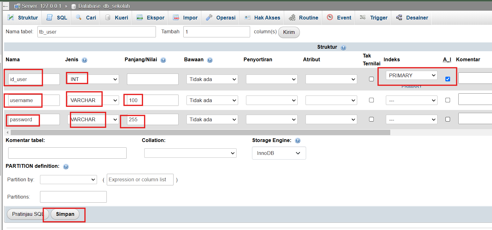
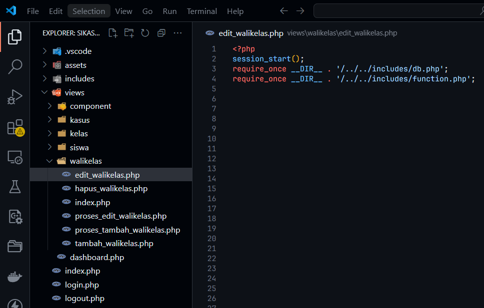
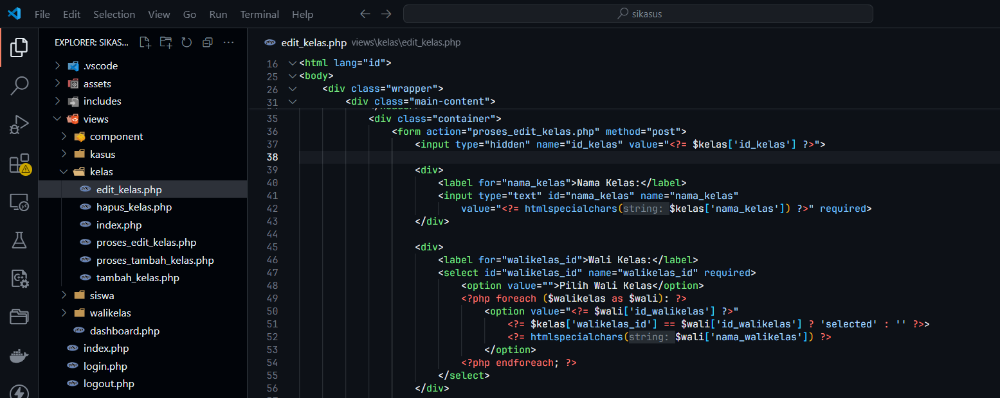
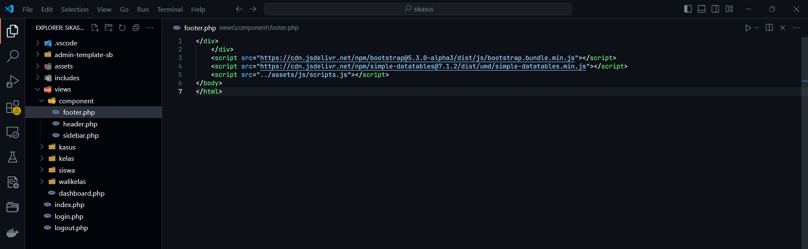

# Manajemen Data Wali Kelas dan Kelas untuk Admin
Tahap ini berfokus pada menambahkan satu role user bernama **Admin** yang memiliki fungsi utama untuk mengelola data kelas dan wali kelas. Sebelumnya, pengelolaan data dilakukan langsung melalui aplikasi database, tetapi sekarang akan dioperasikan melalui antarmuka aplikasi.

### Langkah 1: Membuka phpMyAdmin
1. Masuk ke **phpMyAdmin** melalui browser Anda.

2. Pilih database yang digunakan untuk aplikasi, yaitu **db_sekolah**.
   
### Langkah 2: Membuat Tabel User
1. Pada database yang sudah dipilih, klik tab **Structure**, lalu pilih **New** untuk membuat tabel baru.

2. Beri nama tabel **tb_user** pada kolom **Table Name**, dan tentukan jumlah kolom sebanyak **3**.

3. Klik tombol **Buat** untuk melanjutkan.
### Langkah 3: Menentukan Struktur Tabel

Isi kolom tabel dengan data berikut:

| Kolom    | Tipe Data | Panjang | Keterangan                                |
| -------- | --------- | ------- | ----------------------------------------- |
| id_user  | INT       | 11      | Kunci utama (Primary Key), Auto Increment |
| username | VARCHAR   | 50      | Nama pengguna                             |
| password | VARCHAR   | 255     | Kata sandi (akan dienkripsi)              |

Setelah semua kolom diisi, lakukan langkah berikut:

1. Pilih **id** sebagai **Primary Key**.
2. Centang kolom **id** pada opsi **AI (Auto Increment)**.
3. Klik **Save** untuk menyimpan struktur tabel.

---

### Langkah 4: Menambahkan Data Role Admin

1. Pada tabel **user**, klik tab **Tambahkan**.

2. Masukkan data Admin seperti berikut:
- **id_user**: Kosongkan (karena Auto Increment).
- **username**: `admin`.
- **password**: Gunakan password yang telah dienkripsi (misalnya dengan fungsi PHP `password_hash`).

**password_hash**
```
$2y$10$GuQfx9Twr1VvF/dt9tvxBOwphggEinePAxzelRypYawy7TChPQRmG
```


3. Klik **Go** untuk menyimpan data.


---
## Struktur Folder

## Membuat Halaman Menampilkan Data Wali Kelas
**Pertama-tama**, buat file bernama `index.php` di folder `walikelas`. File ini akan menjadi halaman utama untuk menampilkan daftar wali kelas.
```php
<?php
session_start();

// Cek autentikasi
if (!isset($_SESSION['user'])) {
    header("Location: ../../login.php");
    exit;
}
```


**Penjelasan:**
- Fungsi `session_start()` akan memulai sesi PHP.
- `!isset($_SESSION['user'])` akan mengecek apakah pengguna sudah login atau belum nantinya diarahkan ke halaman login (`login.php`) menggunakan **`header`** dan eksekusi dihentikan dengan **`exit;`**.

---

**Selanjutnya**, hubungkan file ke database dengan menambahkan koneksi.
Tambahkan kode berikut di bagian atas file `index.php`:
```php
require_once __DIR__ . '/../../includes/db.php';
```


**Penjelasan :**
- **`require_once`**: Memuat file koneksi database hanya satu kali. Pastikan file `db.php` berisi konfigurasi koneksi database yang benar.

---

**Kemudian**, buat query untuk mengambil data dari tabel `tb_walikelas`.
Tambahkan kode berikut setelah koneksi database:
```php
$walikelas_query = "SELECT id_walikelas, nama_walikelas, nip, jenis_kelamin, alamat, tanggal_dibuat, tanggal_diperbarui FROM tb_walikelas ORDER BY nama_walikelas";
$walikelas_result = mysqli_query($conn, $walikelas_query);

if (!$walikelas_result) {
    die("Kesalahan pada kueri: " . mysqli_error($conn));
}

$user = $_SESSION['user'];
$role = $user['role'];
?>
```


**Penjelasan:**
- **Query SQL**:
    - **`SELECT`**: Mengambil kolom yang diperlukan dari tabel `tb_walikelas`.
    - **`ORDER BY`**: Mengurutkan data berdasarkan nama wali kelas.
- **`mysqli_query`**: Menjalankan query pada koneksi database.
- **Error Handling**: Jika query gagal, fungsi **`die`** menampilkan pesan kesalahan dari **`mysqli_error`**.
---

**Selanjutnya**, tambahkan struktur HTML untuk halaman daftar wali kelas.
Tambahkan kode berikut setelah bagian PHP:
```php
<!DOCTYPE html>
<html lang="id">
<head>
    <meta charset="UTF-8">
    <meta name="viewport" content="width=device-width, initial-scale=1.0">
    <link rel="stylesheet" href="/sikasus/assets/css/styles.css">
    <title>Admin Panel</title>
</head>
<body>
    <div class="wrapper">
        <!-- Sidebar -->
        <?php include($_SERVER['DOCUMENT_ROOT'] . '/sikasus/views/component/sidebar.php'); ?>

        <!-- Main Content -->
        <div class="main-content">
            <header>
                <h1>Daftar Wali Kelas</h1>
            </header>
```


**Penjelasan :**
- **HTML5**: Struktur dasar halaman menggunakan elemen seperti **`<!DOCTYPE html>`** dan **`<html>`**.
- **Sidebar**: Menggunakan **`include`** untuk memuat file sidebar dari direktori `component`.
- **Judul Halaman**: **`<h1>`** digunakan untuk menampilkan judul halaman.

---

**Kemudian**, tambahkan tabel untuk menampilkan data wali kelas.
Tambahkan kode berikut setelah bagian judul:
```php
<div class="container">
    <a href="tambah_walikelas.php" class="button">Tambah Wali Kelas</a>
    <table>
        <thead>
            <tr>
                <th>ID</th>
                <th>Nama</th>
                <th>NIP</th>
                <th>Jenis Kelamin</th>
                <th>Aksi</th>
            </tr>
        </thead>
        <tbody>
            <?php $i = 1;
            while ($walikelas = mysqli_fetch_assoc($walikelas_result)): ?>
                <tr>
                    <td><?= $i++ ?></td>
                    <td><?= $walikelas['nama_walikelas'] ?></td>
                    <td><?= $walikelas['nip'] ?></td>
                    <td><?= $walikelas['jenis_kelamin'] ?></td>
                    <td>
                        <a href="edit_walikelas.php?id=<?= $walikelas['id_walikelas'] ?>" class="button">Edit</a>
                    </td>
                </tr>
            <?php endwhile; ?>
        </tbody>
    </table>
</div>
```


**Penjelasan :**

---

**Terakhir**, tutup struktur HTML dengan tag penutup.
Tambahkan kode berikut di bagian akhir file:
```php
        </div>
    </div>
</body>
</html>
```


**Penjelasan :**
- Pastikan semua elemen HTML telah ditutup dengan benar untuk mencegah error pada browse

---
## Membuat Halaman Tambah Data Wali Kelas

**Pertama**, buat file bernama `tambah_walikelas.php` di folder `walikelas` Anda.
```php
<?php
session_start();
require_once __DIR__ . '/../../includes/db.php';
require_once __DIR__ . '/../../includes/function.php';

$user = $_SESSION['user'];
$role = $user['role'];
?>
```


**Penjelasan:**
- **`session_start()`**: Memulai sesi untuk mendapatkan data pengguna yang sedang login.
- **`require_once`**: Memuat file koneksi database (`db.php`) dan file fungsi umum (`function.php`).
- **`$_SESSION['user']`**: Mengambil informasi pengguna dari sesi login, misalnya data peran (role) pengguna.

**Selanjutnya**, tambahkan struktur HTML untuk halaman tambah data.
```html
<!DOCTYPE html>
<html lang="id">
<head>
    <meta charset="UTF-8">
    <meta name="viewport" content="width=device-width, initial-scale=1.0">
    <title>Tambah Wali Kelas</title>
    <link rel="stylesheet" href="/sikasus/assets/css/styles.css">
</head>
<body>
    <div class="wrapper">
        <!-- Sidebar -->
        <?php include($_SERVER['DOCUMENT_ROOT'] . '/sikasus/views/component/sidebar.php'); ?>

        <!-- Main Content -->
        <div class="main-content">
            <header>
                <h1>Tambah Wali Kelas</h1>
            </header>
```


**Penjelasan :**
- **HTML5**: Kerangka dasar halaman, termasuk elemen seperti **`<!DOCTYPE html>`** dan **`<html>`**.
- **`include`**: Memuat file sidebar yang digunakan sebagai navigasi.
- **Judul Halaman**: **`<h1>`** menampilkan judul "Tambah Wali Kelas".

---

**Kemudian**, tambahkan form untuk input data wali kelas.
```html
<div class="container">
    <form action="proses_tambah_walikelas.php" method="post">
        <div>
            <label for="nama_walikelas">Nama Wali Kelas:</label>
            <input type="text" id="nama_walikelas" name="nama_walikelas" required>
        </div>

        <div>
            <label for="nip">NIP:</label>
            <input type="text" id="nip" name="nip">
        </div>

        <div>
            <label for="jenis_kelamin">Jenis Kelamin:</label>
            <select id="jenis_kelamin" name="jenis_kelamin" required>
                <option value="">Pilih Jenis Kelamin</option>
                <option value="Laki-laki">Laki-laki</option>
                <option value="Perempuan">Perempuan</option>
            </select>
        </div>

        <div>
            <label for="alamat">Alamat:</label>
            <textarea id="alamat" name="alamat"></textarea>
        </div>

        <button type="submit">Simpan</button>
        <a href="index.php" class="button">Kembali</a>
    </form>
</div>
```


**Penjelasan Kode:**
- **`<form>`**:
    - **`action="proses_tambah_walikelas.php"`**: Menentukan file yang akan memproses data form.
    - **`method="post"`**: Mengirim data menggunakan metode POST.
- **Input Data**:
    - **Nama Wali Kelas**: Input teks yang wajib diisi (**`required`**).
    - **NIP**: Input teks untuk Nomor Induk Pegawai (opsional).
    - **Jenis Kelamin**: Dropdown dengan pilihan "Laki-laki" dan "Perempuan".
    - **Alamat**: Textarea untuk mengisi alamat wali kelas.
- **Tombol**:
    - **Simpan**: Mengirim data form.
    - **Kembali**: Mengarahkan kembali ke halaman daftar wali kelas.

---

**Berikutnya**, tutup struktur HTML dengan tag penutup.
```html
        </div>
    </div>
</body>
</html>
```

---

**Selanjutnya**, buat file bernama `proses_tambah_walikelas.php`. File ini digunakan untuk memproses data yang dikirim dari form
```php
<?php
require_once __DIR__ . '/../../includes/db.php';
require_once __DIR__ . '/../../includes/function.php';
```


**Penjelasan :**
- **`require_once`**: Memuat file koneksi database dan fungsi umum.

---

**Selanjutnya**, tangkap data dari form dan simpan ke database.
Tambahkan kode berikut di file `proses_tambah_walikelas.php`:
```php
if ($_SERVER['REQUEST_METHOD'] === 'POST') {
    $nama_walikelas = $_POST['nama_walikelas'];
    $nip = $_POST['nip'] ?: null;
    $jenis_kelamin = $_POST['jenis_kelamin'];
    $alamat = $_POST['alamat'] ?: null;

    $query = "INSERT INTO tb_walikelas (nama_walikelas, nip, jenis_kelamin, alamat) VALUES (?, ?, ?, ?)";
    $stmt = $conn->prepare($query);
    $stmt->bind_param("ssss", $nama_walikelas, $nip, $jenis_kelamin, $alamat);

    if ($stmt->execute()) {
        header("Location: index.php");
    } else {
        header("Location: tambah_walikelas.php");
    }
}
```


**Penjelasan :**
- **`$_SERVER['REQUEST_METHOD']`**: Mengecek apakah metode yang digunakan adalah POST.
- **Data Form**:
    - **`$_POST`**: Mengambil nilai input dari form.
    - **Ternary (`?:`)**: Mengatur nilai default `null` jika input kosong (contoh: NIP, Alamat).
- **Query SQL**:
    - **`INSERT INTO`**: Menambahkan data baru ke tabel `tb_walikelas`.
    - **`bind_param`**: Menghindari SQL Injection dengan mengganti placeholder (**?**) menggunakan data input.
- **Redirect**:
    - Jika berhasil, pengguna diarahkan ke halaman daftar wali kelas.
    - Jika gagal, pengguna kembali ke halaman form.

---

## Membuat Halaman Edit Data Wali Kelas

Pertama-tama, buatlah file bernama `edit_walikelas.php` di dalam folder yang sesuai, misalnya `views/walikelas`. File ini bertanggung jawab untuk menampilkan form edit data wali kelas.

**Selanjutnya**, masukkan kode berikut di bagian awal file:

```php
<?php
session_start();
require_once __DIR__ . '/../../includes/db.php';
require_once __DIR__ . '/../../includes/function.php';

```



**Penjelasan :**
- `session_start()`: Memulai sesi untuk mengakses data seperti informasi pengguna yang sedang login.
- `require_once`: Menyertakan file **db.php** untuk koneksi database dan **function.php** untuk menggunakan fungsi tambahan yang diperlukan.

---
 
**Setelah itu**, tambahkan kode berikut untuk mengambil data user dan wali kelas:

```php
$user = $_SESSION['user']; // Mendapatkan data user dari sesi
$role = $user['role'];     // Menyimpan role user untuk keperluan validasi

// Ambil ID wali kelas dari URL menggunakan metode GET
$id_walikelas = $_GET['id'];

// Ambil data wali kelas berdasarkan ID dari database
$walikelas = fetchData($conn, "SELECT * FROM tb_walikelas WHERE id_walikelas = $id_walikelas")[0];
```


**Penjelasan Kode:**
- **`$_SESSION['user']`**: Mengambil data user yang tersimpan di sesi untuk memastikan hanya user tertentu yang memiliki akses.
- **`$_GET['id']`**: Mendapatkan ID wali kelas dari URL, yang akan digunakan untuk mengambil data dari database.
- **`fetchData`**: Fungsi untuk menjalankan query SQL dan mengambil hasilnya sebagai array.

---

**Berikutnya**, tambahkan kode HTML untuk struktur dasar halaman:

```html
<!DOCTYPE html>
<html lang="id">
<head>
    <meta charset="UTF-8">
    <meta name="viewport" content="width=device-width, initial-scale=1.0">
    <title>Edit Wali Kelas</title>
    <link rel="stylesheet" href="/sikasus/assets/css/styles.css"> <!-- Menghubungkan ke file CSS -->
</head>
<body>
    <div class="wrapper">
```


**Penjelasan :**
- **`<meta charset="UTF-8">`**: Menentukan encoding karakter untuk mendukung huruf dan simbol Bahasa Indonesia.
- **`<meta name="viewport">`**: Membuat halaman responsif di berbagai perangkat.
- **`<link rel="stylesheet">`**: Menghubungkan file CSS untuk mempercantik tampilan.

---

Kemudian, tambahkan sidebar dan header dengan kode berikut:

```php
        <!-- Sidebar -->
        <?php include($_SERVER['DOCUMENT_ROOT'] . '/sikasus/views/component/sidebar.php'); ?> <!-- Sidebar navigasi -->

        <!-- Main Content -->
        <div class="main-content">
            <header>
                <h1>Edit Wali Kelas</h1>
            </header>
```


**Penjelasan :**
- **`include()`**: Menyertakan file **sidebar.php** agar struktur halaman konsisten.
- **`<header>`**: Menampilkan judul halaman sebagai header utama.

---

**Setelah itu**, buat form untuk mengedit data wali kelas:

```php
            <div class="container">
                <form action="proses_edit_walikelas.php" method="post">
                    <input type="hidden" name="id_walikelas" value="<?= $walikelas['id_walikelas'] ?>">

                    <div>
                        <label for="nama_walikelas">Nama Wali Kelas:</label>
                        <input type="text" id="nama_walikelas" name="nama_walikelas" value="<?= htmlspecialchars($walikelas['nama_walikelas']) ?>" required>
                    </div>

                    <div>
                        <label for="nip">NIP:</label>
                        <input type="text" id="nip" name="nip" value="<?= htmlspecialchars($walikelas['nip']) ?>">
                    </div>

                    <div>
                        <label for="jenis_kelamin">Jenis Kelamin:</label>
                        <select id="jenis_kelamin" name="jenis_kelamin" required>
                            <option value="Laki-laki" <?= $walikelas['jenis_kelamin'] === 'Laki-laki' ? 'selected' : '' ?>>Laki-laki</option>
                            <option value="Perempuan" <?= $walikelas['jenis_kelamin'] === 'Perempuan' ? 'selected' : '' ?>>Perempuan</option>
                        </select>
                    </div>

                    <div>
                        <label for="alamat">Alamat:</label>
                        <textarea id="alamat" name="alamat"><?= htmlspecialchars($walikelas['alamat']) ?></textarea>
                    </div>

                    <button type="submit">Update</button>
                    <a href="index.php" class="button">Kembali</a>
                </form>
            </div>
        </div>
```


**Penjelasan :**
- **`<form>`**: Mengarahkan data ke file `proses_edit_walikelas.php` untuk diproses menggunakan metode POST.
- **`<input type="hidden">`**: Menyimpan ID wali kelas untuk diproses tanpa terlihat.
- **Field Form**: Memiliki input untuk nama, NIP, jenis kelamin, dan alamat.

---

Terakhir, tutup elemen HTML dengan:

```html
    </div>
</body>
</html>
```

---

**Selanjutnya**, buat file bernama `proses_edit_walikelas.php`. File ini digunakan untuk memproses data yang dikirim dari form
```php
<?php
require_once __DIR__ . '/../../includes/db.php';
require_once __DIR__ . '/../../includes/function.php';
```


**Penjelasan :**
- **`require_once __DIR__ . '/../../includes/db.php';`**: Menyertakan file koneksi database agar kita dapat mengakses database.
- **`require_once __DIR__ . '/../../includes/function.php';`**: Menyertakan file fungsi tambahan untuk membantu memproses data, seperti fungsi untuk validasi atau manipulasi data.

---

**Kemudian**, tambahkan logika untuk memastikan bahwa file ini hanya memproses data jika metode permintaan adalah **POST**:
```php
if ($_SERVER['REQUEST_METHOD'] === 'POST') {
```


**Penjelasan :**
- **`$_SERVER['REQUEST_METHOD']`**: Memeriksa metode HTTP yang digunakan. Dalam kasus ini, hanya data yang dikirimkan melalui POST yang akan diproses.

---

**Setelah itu**, tambahkan kode untuk mengambil data dari formulir:

```php
    $id_walikelas = $_POST['id_walikelas'];
    $nama_walikelas = $_POST['nama_walikelas'];
    $nip = $_POST['nip']; // Gunakan nilai null jika NIP tidak diisi
    $jenis_kelamin = $_POST['jenis_kelamin'];
    $alamat = $_POST['alamat'];
```


**Penjelasan :**
- **`$_POST['field']`**: Mengambil nilai dari input formulir berdasarkan nama field.

---

Setelah data diambil, buat query SQL untuk mengupdate data di database:
```php
$query = "UPDATE tb_walikelas 
		  SET nama_walikelas = ?, nip = ?, jenis_kelamin = ?, alamat = ? 
		  WHERE id_walikelas = ?";
```


**Penjelasan :**
- **`UPDATE tb_walikelas`**: Query SQL untuk memperbarui data di tabel `tb_walikelas`.
- **`SET`**: Menentukan kolom mana saja yang akan diperbarui, dengan menggunakan parameter placeholder `?` untuk keamanan.

---
**Selanjutnya**, gunakan metode `prepare` untuk melindungi data dari serangan SQL Injection:
```php
    $stmt = $conn->prepare($query);
    $stmt->bind_param("ssssi", $nama_walikelas, $nip, $jenis_kelamin, $alamat, $id_walikelas);
```


**Penjelasan :**
- **`$conn->prepare($query)`**: Mempersiapkan query agar lebih aman dari SQL Injection.
- **`bind_param`**: Menghubungkan parameter di query dengan variabel yang akan dikirimkan:
    - `"ssssi"`: Menunjukkan tipe data untuk parameter (`s` = string, `i` = integer).
    - Variabel: **`$nama_walikelas`**, **`$nip`**, **`$jenis_kelamin`**, **`$alamat`**, dan **`$id_walikelas`** dihubungkan ke query.

---

Setelah query siap, eksekusi query dan arahkan pengguna berdasarkan hasilnya:
```php
    if ($stmt->execute()) {
        header("Location: index.php");
    } else {
        header("Location: edit_walikelas.php");
    }
```


**Penjelasan :**

- **`$stmt->execute()`**: Menjalankan query update di database.
- **`header("Location: ...")`**: Mengarahkan pengguna:
    - Jika berhasil, diarahkan ke halaman **`index.php`** untuk melihat daftar data.
    - Jika gagal, kembali ke halaman **`edit_walikelas.php`** untuk mencoba lagi.

---


Akhirnya, tambahkan penutup PHP di akhir file:

```php
} ?>
```

**Penjelasan :**

- **Penutup Blok If**: Menutup kondisi **if ($_SERVER['REQUEST_METHOD'] === 'POST')**.
- Penutup PHP memastikan kode berikutnya tidak akan dieksekusi jika tidak diperlukan.

## Membuat Halaman Hapus Data Wali Kelas

Pertama-tama, buatlah sebuah file bernama `hapus_walikelas.php` di folder `views/walikelas`. File ini akan digunakan untuk menjalankan logika penghapusan data wali kelas.  
Setelah file dibuat, tambahkan baris berikut:

```php
<?php
session_start();

require_once __DIR__ . '/../../includes/db.php';
require_once __DIR__ . '/../../includes/function.php';
```


**Penjelasan:**
- **`require_once`** digunakan untuk mengimpor file:
    - **`db.php`**: Untuk koneksi ke database.
    - **`function.php`**: Berisi fungsi tambahan yang bisa dipakai ulang di berbagai tempat aplikasi.

---

Di langkah ini, kita memvalidasi parameter ID yang dikirim melalui URL. Ini adalah langkah penting untuk memastikan bahwa ID yang diberikan valid sebelum melanjutkan ke proses penghapusan.

```php
// Validasi parameter ID
if (!isset($_GET['id']) || !is_numeric($_GET['id'])) {
    jsAlert('ID walikelas tidak ditemukan.', 'index.php');
    exit();
}
```


**Penjelasan :**
- `isset($_GET['id'])` memeriksa apakah parameter **id** tersedia di URL. Jika parameter **id** tidak ada, maka akan ada pesan kesalahan.
- `is_numeric($_GET['id'])` memastikan bahwa nilai **id** yang dikirim adalah angka. Jika tidak, maka pengguna akan diberi peringatan dan proses dihentikan dengan `exit()`.

---

Setelah validasi, kita menyimpan nilai ID yang valid ke dalam variabel `$id_walikelas`, yang kemudian akan digunakan dalam query penghapusan.

```php
$id_walikelas = intval($_GET['id']);
```


**Penjelasan :**
- `intval($_GET['id'])` mengkonversi nilai **id** yang diterima melalui URL menjadi tipe data integer. Ini penting untuk mencegah potensi serangan SQL Injection dengan memastikan hanya nilai numerik yang digunakan dalam query.

---

Setelah ID disiapkan, kita membuat query SQL untuk menghapus data walikelas yang sesuai dengan ID tersebut dari database.

```php
// Query untuk menghapus walikelas
$delete_query = "DELETE FROM tb_walikelas WHERE id_walikelas = $id_walikelas";
```


**Penjelasan :**
- Query SQL ini akan menghapus data dari tabel `tb_walikelas` dimana kolom `id_walikelas` cocok dengan ID yang diterima.
- `$id_walikelas` adalah ID yang valid dan sudah dikonversi menjadi integer, sehingga query ini aman untuk dieksekusi.

---

Setelah query siap, kita jalankan query tersebut menggunakan `mysqli_query()` untuk menghapus data walikelas yang sesuai.

```php
// Eksekusi query dan redirect dengan notifikasi
if (mysqli_query($conn, $delete_query)) {
    jsAlert('walikelas berhasil dihapus.', 'index.php');
} else {
    jsAlert('Kesalahan saat menghapus walikelas.', 'index.php');
}
exit();
```


**Penjelasan :**
- `mysqli_query($conn, $delete_query)` menjalankan query yang sudah dibuat sebelumnya. Jika query berhasil, maka akan muncul pesan bahwa **walikelas berhasil dihapus** dan pengguna akan diarahkan kembali ke halaman **index.php**.
- Jika terjadi kesalahan dalam eksekusi query, maka muncul pesan kesalahan dan pengguna tetap diarahkan kembali ke **index.php**.
- `exit()` digunakan untuk menghentikan skrip lebih lanjut agar tidak ada proses yang terjadi setelah pengalihan halaman.

---

Untuk menampilkan pesan kepada pengguna, kita menggunakan fungsi **jsAlert** yang dipanggil dengan parameter pesan dan halaman tujuan.

```php
function jsAlert($message, $redirect) {
    echo "<script>alert('$message'); window.location.href='$redirect';</script>";
}
```

**Penjelasan :**
- Fungsi **jsAlert()** digunakan untuk menampilkan pesan peringatan melalui dialog JavaScript.
- `alert('$message')` menampilkan pesan yang diterima dalam bentuk pop-up.
- `window.location.href='$redirect'` mengarahkan pengguna ke halaman yang ditentukan setelah menutup pesan.

---
## Struktur Folder

## Membuat Halaman untuk Menampilkan Data Kelas

**Pertama-tama**, buat file `index.php` di folder `views/kelas` jika belum ada. File ini akan digunakan untuk menampilkan daftar kelas dari database.

**Selanjutnya**, tambahkan baris berikut di awal file:

```php
<?php
session_start();

// Cek autentikasi
if (!isset($_SESSION['user'])) {
    header("Location: ../../login.php");
    exit;
}
```


**Penjelasan:**
- **`session_start()`**: Memulai session PHP untuk melacak data pengguna yang telah login.
- **`if (!isset($_SESSION['user']))`**: Mengecek apakah pengguna sudah login atau belum.
- **`header("Location: ../../login.php");`**: Jika belum login, pengguna akan diarahkan ke halaman login.
- **`exit;`**: Menghentikan eksekusi kode jika pengguna belum login.

---

**Selanjutnya**, tambahkan kode berikut untuk mengimpor koneksi database dan fungsi tambahan.

```php
require_once __DIR__ . '/../../includes/db.php';
require_once __DIR__ . '/../../includes/function.php';
```


**Penjelasan:**
- **`require_once`** memastikan file hanya dimuat satu kali, mencegah error duplikasi.
- **`db.php`**: Berisi konfigurasi koneksi ke database.
- **`function.php`**: Berisi fungsi seperti `fetchData()` untuk mempermudah pengambilan data dari database.

---

Kemudian, tambahkan kode berikut untuk mengambil data kelas dari tabel `tb_kelas` menggunakan query SQL.

```php
$kelas_query = "SELECT k.id_kelas, k.nama_kelas, w.nama_walikelas FROM tb_kelas k 
                LEFT JOIN tb_walikelas w ON k.walikelas_id = w.id_walikelas 
                ORDER BY k.nama_kelas";
$kelas_result = fetchData($conn, $kelas_query);
```


**Penjelasan:**
- **Query SQL**:
    - **`SELECT k.id_kelas, k.nama_kelas, w.nama_walikelas`**: Memilih kolom yang akan ditampilkan (ID kelas, nama kelas, nama wali kelas).
    - **`LEFT JOIN`**: Menggabungkan tabel `tb_kelas` dengan tabel `tb_walikelas` untuk mendapatkan nama wali kelas berdasarkan `walikelas_id`.
    - **`ORDER BY k.nama_kelas`**: Mengurutkan data berdasarkan nama kelas secara alfabetis.
- **`fetchData($conn, $kelas_query)`**: Memanggil fungsi dari `function.php` untuk mengeksekusi query dan mengambil hasilnya.

---

Berikutnya, tambahkan kode berikut untuk mengambil informasi pengguna yang sedang login:

```php
$user = $_SESSION['user'];
$role = $user['role']; // role: 'admin', 'walikelas', atau 'siswa'
```


**Penjelasan:**
- **`$_SESSION['user']`**: Berisi informasi pengguna yang login.
- **`$role`**: Menyimpan peran pengguna yang akan digunakan untuk menentukan akses atau tampilan halaman.

---

Lalu, Buatlah struktur dasar halaman menggunakan HTML.

```html
<!DOCTYPE html>
<html lang="id">

<head>
    <meta charset="UTF-8">
    <meta name="viewport" content="width=device-width, initial-scale=1.0">
    <title>Admin Panel</title>
    <link rel="stylesheet" href="/sikasus/assets/css/styles.css">
</head>

<body>
    <div class="wrapper">
        <!-- Sidebar -->
        <?php include($_SERVER['DOCUMENT_ROOT'] . '/sikasus/views/component/sidebar.php'); ?>
```


**Penjelasan:**
- **`<meta>`**: Menentukan encoding karakter dan skala tampilan untuk memastikan responsivitas.
- **`<link>`**: Menghubungkan file CSS untuk memberikan gaya pada halaman.
- **`include()`**: Memasukkan sidebar dari file `views/component/sidebar.php`.

---

Selanjutnya, tambahkan tabel untuk menampilkan data kelas yang diambil dari database.

```php
<div class="main-content">
    <header>
        <h1>Daftar Kelas</h1>
    </header>
    <div class="container">
        <a href="tambah_kelas.php" class="button">Tambah Kelas</a>
        <table>
            <thead>
                <tr>
                    <th>ID</th>
                    <th>Nama Kelas</th>
                    <th>ID Wali Kelas</th>
                    <th>Aksi</th>
                </tr>
            </thead>
            <tbody>
                <?php
                foreach ($kelas_result as $number => $kelas): ?>
                    <tr>
                        <td><?= $number += 1 ?></td>
                        <td><?= htmlspecialchars($kelas['nama_kelas']) ?></td>
                        <td><?= htmlspecialchars($kelas['nama_walikelas']) ?></td>
                        <td>
                            <a href="edit_kelas.php?id=<?= $kelas['id_kelas'] ?>" class="button">Edit</a>
                            <a href="hapus_kelas.php?id=<?= $kelas['id_kelas'] ?>" class="button"
                                onclick="return confirm('Apakah Anda yakin ingin menghapus kelas ini?');">Hapus</a>
                        </td>
                    </tr>
                <?php endforeach; ?>
            </tbody>
        </table>
    </div>
</div>
```


**Penjelasan:**
- **`<table>`**: Membuat tabel untuk menampilkan data.
- **PHP Loop**:
    - **`foreach ($kelas_result as $number => $kelas)`**: Mengiterasi data kelas dari database.
    - **`htmlspecialchars()`**: Mencegah serangan XSS dengan menghindari eksekusi karakter HTML khusus.
- **Tombol Edit & Hapus**:
    - **`edit_kelas.php?id=<?= $kelas['id_kelas'] ?>`**: Mengarahkan ke halaman edit dengan ID kelas.
    - **`hapus_kelas.php?id=<?= $kelas['id_kelas'] ?>`**: Mengarahkan ke halaman hapus dengan konfirmasi terlebih dahulu.

---

Terakhir, tutup semua elemen HTML seperti berikut:

```html
    </div>
</body>
</html>
```

**Penjelasan:**  
- Menutup semua elemen HTML agar struktur file tetap valid dan halaman dapat ditampilkan dengan benar.

---
## Membuat Halaman Tambah Data Kelas

Pertama, tambahkan kode berikut untuk memulai session dan menyertakan file pendukung:

```php
    session_start();
    require_once __DIR__ . '/../../includes/db.php';
    require_once __DIR__ . '/../../includes/function.php';
```


 **Penjelasan:**
- `session_start()` digunakan untuk memulai sesi, agar data pengguna dapat diakses.
- `require_once` digunakan untuk menyertakan file `db.php` (untuk koneksi database) dan `function.php` (untuk fungsi tambahan).

---
Selanjutnya, ambil data wali kelas dari database untuk ditampilkan di dropdown. Tambahkan kode berikut:

```php
$user = $_SESSION['user'];
$role = $user['role'];

$walikelas_data = fetchData($conn, "SELECT id_walikelas, nama_walikelas FROM tb_walikelas");
```


**Penjelasan:**
- Fungsi `fetchData()` akan menjalankan query untuk mengambil `id_walikelas` dan `nama_walikelas` dari tabel `tb_walikelas` dan menyimpannya dalam variabel `$walikelas_data`.

---
 
 Kemudian, buat struktur dasar halaman HTML, seperti berikut:

```html
<!DOCTYPE html>
<html lang="id">
<head>
	<meta charset="UTF-8">
	<meta name="viewport" content="width=device-width, initial-scale=1.0">
	<title>Tambah Kelas</title>
	<link rel="stylesheet" href="/sikasus/assets/css/styles.css">
</head>
<body>
```


**Penjelasan:**
- `<meta charset="UTF-8">` memastikan halaman menggunakan encoding UTF-8.
- `<meta name="viewport">` membuat halaman responsif pada perangkat mobile.
- `<link rel="stylesheet">` digunakan untuk menyertakan file CSS yang berfungsi untuk mempercantik tampilan.

---

Setelah itu, tambahkan kode untuk menyertakan sidebar di halaman:

```php
    <div class="wrapper">
        <?php include($_SERVER['DOCUMENT_ROOT'] . '/sikasus/views/component/sidebar.php'); ?>
```


**Penjelasan:**
- Bagian ini menyertakan file `sidebar.php` yang berisi menu navigasi di halaman.

---

Kemudian, buat form untuk input data kelas, seperti berikut:
    
```html
<div class="main-content">
	<header>
		<h1>Tambah Kelas</h1>
	</header>
	<div class="container">
		<form action="proses_tambah_kelas.php" method="post">
			<div>
				<label for="nama_kelas">Nama Kelas:</label>
				<input type="text" id="nama_kelas" name="nama_kelas" required>
			</div>

			<div>
				<label for="walikelas_id">Wali Kelas:</label>
				<select id="walikelas_id" name="walikelas_id">
					<option value="">Pilih Wali Kelas</option>
					<?php foreach ($walikelas_data as $walikelas): ?>
						<option value="<?= $walikelas['id_walikelas'] ?>">
							<?= htmlspecialchars($walikelas['nama_walikelas']) ?>
						</option>
					<?php endforeach; ?>
				</select>
			</div>

			<button type="submit">Simpan</button>
			<a href="index.php" class="button">Kembali</a>
		</form>
	</div>
</div>
```


**Penjelasan:**
- `<form>` ini memiliki aksi untuk mengirim data ke `proses_tambah_kelas.php`.
- Input untuk `nama_kelas` menggunakan tag `<input>` dengan atribut `required` agar input ini wajib diisi.
- Dropdown `walikelas_id` diisi dengan data dari `$walikelas_data` yang sudah diambil sebelumnya.

---

Setelah itu, tambahkan kode penutup HTML berikut:

```html
	</div>
</body>
</html>
```

**Penjelasan:**
- Menutup tag `<div>`, `<body>`, dan `<html>` untuk mengakhiri struktur halaman.

---

Terakhir, buat file `proses_tambah_kelas.php` untuk memproses data yang dikirim dari form:

```php
require_once __DIR__ . '/../../includes/db.php';
require_once __DIR__ . '/../../includes/function.php';

if ($_SERVER['REQUEST_METHOD'] === 'POST') {
	$nama_kelas = $_POST['nama_kelas'];
	$walikelas_id = $_POST['walikelas_id'] ?: null;

	$query = "INSERT INTO tb_kelas (nama_kelas, walikelas_id) VALUES (?, ?)";
	$stmt = $conn->prepare($query);
	$stmt->bind_param("si", $nama_kelas, $walikelas_id);

	if ($stmt->execute()) {
		header("Location: index.php");
	} else {
		header("Location: tambah_kelas.php");
	}
}
```


**Penjelasan:**
- `$_POST` digunakan untuk mengambil data yang dikirim dari form.
- Query `INSERT INTO tb_kelas` digunakan untuk menyimpan data kelas ke dalam tabel.
- Jika proses berhasil, pengguna diarahkan kembali ke halaman utama. Jika gagal, pengguna diarahkan kembali ke halaman tambah kelas.

---

## Membuat Halaman Edit Data Kelas

**Pertama**, mulai dengan memulai sesi dan menyertakan file pendukung. Tambahkan kode berikut di bagian atas file `edit_kelas.php`:

```php
session_start();
require_once __DIR__ . '/../../includes/db.php';
require_once __DIR__ . '/../../includes/function.php';
```


**Penjelasan:**
- `session_start()` digunakan untuk memulai sesi pengguna, agar data yang disimpan di sesi dapat digunakan di seluruh aplikasi.
- `require_once` digunakan untuk menyertakan file `db.php` (untuk koneksi database) dan `function.php` (untuk fungsi tambahan seperti mengambil data).

---


**Selanjutnya**, ambil data kelas yang akan diedit dan data wali kelas untuk dropdown. Tambahkan kode berikut:

```php
$user = $_SESSION['user'];
$role = $user['role'];

$id_kelas = $_GET['id'];
$kelas = fetchData($conn, "SELECT * FROM tb_kelas WHERE id_kelas = $id_kelas")[0];
$walikelas = fetchData($conn, "SELECT id_walikelas, nama_walikelas FROM tb_walikelas");
```


**Penjelasan:**
- Data pengguna yang saat ini login diambil melalui `$_SESSION['user']`, termasuk `role` mereka.
- `$_GET['id']` digunakan untuk mendapatkan ID kelas yang akan diedit dari URL.
- Fungsi `fetchData()` digunakan untuk mengambil data kelas berdasarkan `id_kelas` dan data wali kelas dari tabel `tb_walikelas` untuk dropdown.

---

**Kemudian**, buat struktur dasar HTML untuk halaman edit kelas, berikut dengan form input untuk mengubah nama kelas dan memilih wali kelas. Berikut adalah struktur HTML untuk bagian ini:

```html
<!DOCTYPE html>
<html lang="id">

<head>
	<meta charset="UTF-8">
	<meta name="viewport" content="width=device-width, initial-scale=1.0">
	<title>Edit Kelas</title>
	<link rel="stylesheet" href="/sikasus/assets/css/styles.css">
</head>

<body>
	<div class="wrapper">
		<!-- Sidebar -->
		<?php include($_SERVER['DOCUMENT_ROOT'] . '/sikasus/views/component/sidebar.php'); ?>

		<!-- Main Content -->
		<div class="main-content">
			<header>
				<h1>Edit Kelas</h1>
			</header>
			<div class="container">
				<form action="proses_edit_kelas.php" method="post">
					<input type="hidden" name="id_kelas" value="<?= $kelas['id_kelas'] ?>">
```

**Penjelasan :**
- Struktur HTML mulai dengan `<!DOCTYPE html>` dan beberapa tag dasar seperti `<meta>` untuk pengaturan encoding dan viewport.
- Bagian `<form>` digunakan untuk mengirim data ke file `proses_edit_kelas.php` menggunakan metode POST. `input type="hidden"` digunakan untuk menyimpan `id_kelas` yang tidak akan terlihat oleh pengguna tetapi diperlukan untuk proses update di database.

---

**Selanjutnya**, tambahkan form input untuk mengubah nama kelas. Tambahkan kode berikut di dalam form:

```html
<div>
	<label for="nama_kelas">Nama Kelas:</label>
	<input type="text" id="nama_kelas" name="nama_kelas" value="<?= htmlspecialchars($kelas['nama_kelas']) ?>" required>
</div>
    ```

**Penjelasan:**
- `input` ini memungkinkan pengguna untuk mengubah nama kelas. Nilai default untuk `input` diambil dari data kelas yang sudah ada menggunakan PHP `<?= htmlspecialchars($kelas['nama_kelas']) ?>`.
- Atribut `required` memastikan pengguna tidak bisa mengirimkan form tanpa mengisi nama kelas.

---

Berikutnya, buat dropdown untuk memilih wali kelas yang baru. Tambahkan kode berikut:

```html
<div>
	<label for="walikelas_id">Wali Kelas:</label>
	<select id="walikelas_id" name="walikelas_id" required>
		<option value="">Pilih Wali Kelas</option>
		<?php foreach ($walikelas as $wali): ?>
			<option value="<?= $wali['id_walikelas'] ?>"
				<?= $kelas['walikelas_id'] == $wali['id_walikelas'] ? 'selected' : '' ?>>
				<?= htmlspecialchars($wali['nama_walikelas']) ?>
			</option>
		<?php endforeach; ?>
	</select>
</div>
```



**Penjelasan:**
- Dropdown ini menampilkan semua wali kelas yang ada. `foreach` digunakan untuk menampilkan opsi bagi setiap wali kelas.
- `<?= $kelas['walikelas_id'] == $wali['id_walikelas'] ? 'selected' : '' ?>` digunakan untuk memilih wali kelas yang sudah ditetapkan pada kelas saat ini.

---

Setelah itu, tambahkan tombol untuk mengirimkan perubahan dan link untuk kembali ke halaman utama. Tambahkan kode berikut:

```html
<button type="submit">Update</button>
<a href="index.php" class="button">Kembali</a>
```


**Penjelasan:**
- Tombol `submit` mengirimkan form untuk menyimpan perubahan.
- Link `Kembali` mengarahkan pengguna kembali ke halaman utama daftar kelas tanpa melakukan perubahan.

---

Terakhir, tutup tag HTML dan div di akhir file. Tambahkan kode berikut:

```html
	</div>
</body>
</html>
```

**Penjelasan:**
- Tag penutup `</div>`, `</body>`, dan `</html>` digunakan untuk mengakhiri struktur halaman.

---

Terakhir, buat file `proses_edit_kelas.php` yang akan memproses data yang dikirim melalui form dan memperbarui data kelas di database. Berikut kode untuk file ini:

```php
require_once __DIR__ . '/../../includes/db.php';
require_once __DIR__ . '/../../includes/function.php';

if ($_SERVER['REQUEST_METHOD'] === 'POST') {
	$id_kelas = $_POST['id_kelas'];
	$nama_kelas = $_POST['nama_kelas'];
	$walikelas_id = $_POST['walikelas_id'] ?: null;

	$query = "UPDATE tb_kelas SET nama_kelas = ?, walikelas_id = ? WHERE id_kelas = ?";
	$stmt = $conn->prepare($query);
	$stmt->bind_param("sii", $nama_kelas, $walikelas_id, $id_kelas);

	if ($stmt->execute()) {
		header("Location: index.php");
	} else {
		header("Location: edit_kelas.php");
	}
}
```


**Penjelasan:**
- Pada bagian ini, data yang diterima melalui POST diproses dan digunakan untuk memperbarui data kelas di database.
- Query `UPDATE` digunakan untuk memperbarui nama kelas dan wali kelas sesuai dengan data yang dikirim.
- Jika proses berhasil, pengguna akan diarahkan kembali ke halaman utama (`index.php`). Jika gagal, pengguna diarahkan kembali ke halaman `edit_kelas.php` untuk mencoba lagi.

---

## Membuat Halaman Hapus Data Kelas

**Pertama**, mulai dengan memulai sesi dan menyertakan file-file yang diperlukan untuk menghubungkan ke database dan fungsi tambahan. Tambahkan kode berikut di bagian atas file `hapus_kelas.php`:

```php
session_start();
require_once __DIR__ . '/../../includes/db.php';
require_once __DIR__ . '/../../includes/function.php';
```


**Penjelasan:**
- `session_start()` digunakan untuk memulai sesi, memungkinkan kita untuk mengakses data yang disimpan dalam sesi, seperti status login pengguna.
- `require_once` digunakan untuk menyertakan file **db.php**, yang mengatur koneksi ke database, dan **function.php**, yang berisi fungsi-fungsi tambahan, misalnya **jsAlert()** yang digunakan untuk menampilkan pesan.

---

**Selanjutnya**, kita perlu memeriksa apakah parameter `id` ada di URL dan valid. Gunakan kode berikut untuk memvalidasi parameter ID:

```php
if (!isset($_GET['id']) || !is_numeric($_GET['id'])) {
    jsAlert('ID kelas tidak ditemukan.', 'index.php');
    exit();
}
```


**Penjelasan:**
- **isset($_GET['id'])** memeriksa apakah parameter `id` ada di URL.
- **is_numeric($_GET['id'])** memastikan bahwa ID yang diterima adalah angka yang valid.
- Jika salah satu dari dua kondisi ini gagal, maka fungsi **jsAlert()** digunakan untuk memberikan pesan kesalahan dan mengarahkan pengguna kembali ke **index.php**.

---

**Kemudian**, setelah memastikan bahwa parameter `id` valid, kita mengonversi nilai tersebut menjadi integer menggunakan **intval()** untuk keamanan.

```php
$id_kelas = intval($_GET['id']);
```


**Penjelasan:**
- **intval()** mengubah nilai `id` yang diterima menjadi integer. Ini memastikan bahwa kita bekerja dengan nilai yang benar dan mencegah potensi serangan SQL Injection.

---

**Setelah itu**, kita menyusun query SQL untuk menghapus data kelas berdasarkan ID yang diterima. Tambahkan kode berikut untuk mendefinisikan query penghapusan:

```php
$delete_query = "DELETE FROM tb_kelas WHERE id = $id_kelas";
```


**Penjelasan:**
- `DELETE FROM tb_kelas WHERE id = $id_kelas` adalah perintah SQL untuk menghapus data kelas yang ID-nya sama dengan `$id_kelas`.
- Pastikan query ini hanya dieksekusi setelah memvalidasi ID untuk mencegah kesalahan penghapusan data.

---

**Selanjutnya**, jalankan query SQL tersebut dan beri notifikasi kepada pengguna mengenai hasilnya. Gunakan kode berikut untuk menjalankan query dan memberikan feedback:

```php
if (mysqli_query($conn, $delete_query)) {
    jsAlert('kelas berhasil dihapus.', 'index.php');
} else {
    jsAlert('Kesalahan saat menghapus kelas.', 'index.php');
}
exit();
```


**Penjelasan:**
- **mysqli_query($conn, $delete_query)** menjalankan query yang telah disiapkan untuk menghapus data.
- Jika query berhasil, maka fungsi **jsAlert()** menampilkan pesan bahwa kelas telah berhasil dihapus dan mengarahkan pengguna kembali ke **index.php**.
- Jika ada kesalahan dalam query, pesan kesalahan akan ditampilkan dan pengguna tetap diarahkan ke halaman **index.php**.

---

**Terakhir**, gunakan **exit()** untuk menghentikan eksekusi skrip setelah penghapusan selesai, agar tidak ada proses lain yang dijalankan setelahnya.

```php
exit();
```

**Penjelasan:**
- **exit()** memastikan bahwa skrip PHP berhenti setelah penghapusan selesai, yang mencegah skrip lainnya dijalankan secara tidak sengaja setelah operasi penghapusan.

---

## Kesimpulan
Pada tahap ini, diperkenalkan **role Admin** yang memiliki wewenang untuk memasukkan data kelas dan wali kelas. Sebelumnya, data tersebut hanya dapat dioperasikan secara langsung melalui aplikasi database, namun dengan adanya fitur ini, Admin dapat dengan mudah mengelola data kelas dan wali kelas melalui antarmuka aplikasi.
# Menerapkan Framework Bootstrap

### Mengunduh dan Menyertakan Bootstrap

**Pertama**, kita perlu menggunakan Bootstrap untuk mempercantik tampilan website. Bootstrap adalah framework CSS yang menyediakan desain responsif, komponen, dan fungsionalitas yang sudah jadi. Anda tidak perlu menulis CSS dari nol.

Untuk mulai menggunakan Bootstrap, Anda tidak perlu mengunduh file secara manual. Anda cukup menggunakan **CDN** (Content Delivery Network) yang memungkinkan Anda menyertakan Bootstrap langsung dari server lain.

1. **Kunjungi website resmi Bootstrap**:
    - Masuk ke [https://getbootstrap.com](https://getbootstrap.com/).
2. **Mendapatkan link untuk Bootstrap**:
    - Di halaman utama Bootstrap, Anda akan melihat bagian **"Getting started"**. Di sana terdapat **CDN links** untuk Bootstrap versi terbaru.
    - Anda bisa menyalin dua link berikut ini untuk **CSS** dan **JavaScript**:

```html
<!-- Link untuk Bootstrap CSS -->
 <link href="https://cdn.jsdelivr.net/npm/bootstrap@5.3.3/dist/css/bootstrap.min.css" rel="stylesheet" integrity="sha384-QWTKZyjpPEjISv5WaRU9OFeRpok6YctnYmDr5pNlyT2bRjXh0JMhjY6hW+ALEwIH" crossorigin="anonymous">

<!-- Link untuk Bootstrap JS dan dependensinya (jQuery dan Popper.js) -->
<script src="https://cdn.jsdelivr.net/npm/bootstrap@5.3.3/dist/js/bootstrap.bundle.min.js" integrity="sha384-YvpcrYf0tY3lHB60NNkmXc5s9fDVZLESaAA55NDzOxhy9GkcIdslK1eN7N6jIeHz" crossorigin="anonymous"></script>
```

**Penjelasan:**
- **CSS**: Link pertama adalah untuk mendownload dan menyertakan file CSS Bootstrap yang bertugas untuk styling.
- **JavaScript**: Link kedua untuk file JavaScript yang memberikan fungsionalitas dinamis (misalnya untuk dropdowns, modals, dll).
- **jQuery dan Popper.js**: Ini adalah dependensi yang diperlukan untuk fungsionalitas Bootstrap seperti menu dropdown atau modals.

---
## Kustomisasi pada tampilan homepage
Untuk memulai, tambahkan link stylesheet Bootstrap di bagian `<head>` agar dapat menggunakan fitur dan class dari framework ini.

```html
<link href="https://cdn.jsdelivr.net/npm/bootstrap@5.3.3/dist/css/bootstrap.min.css" rel="stylesheet" integrity="sha384-QWTKZyjpPEjISv5WaRU9OFeRpok6YctnYmDr5pNlyT2bRjXh0JMhjY6hW+ALEwIH" crossorigin="anonymous">
```


**Penjelasan:**
- Link ini akan memuat stylesheet Bootstrap versi 5.3.3 dari CDN.
- Properti `integrity` dan `crossorigin` ditambahkan untuk meningkatkan keamanan.

---

**Selanjutnya**, atur struktur HTML dan layout utama tambahkan elemen `<body>` dengan class `bg-light` dan sebuah container untuk membungkus konten utama.

```html
<body class="bg-light">
    <div class="container py-5">
```


**Penjelasan:**
- Class `bg-light` memberikan warna latar belakang terang.
- Class `container` digunakan untuk memusatkan konten secara horizontal.
- Selain itu, class `py-5` menambahkan padding vertikal pada container.

---

**Kemudian**, Buat Header dengan Class Bootstrap

```html
<div class="text-center mb-4">
    <h1 class="display-6 text-primary">Sistem Informasi Kasus Siswa</h1>
    <p class="text-secondary">Masukkan NISN dan Tanggal Lahir untuk memeriksa data kasus</p>
</div>
```


**Penjelasan:**
- `text-center` memusatkan teks secara horizontal.
- Selain itu, `mb-4` memberikan margin bawah agar elemen berikutnya tidak terlalu dekat.
- Untuk gaya teks, gunakan `display-6` untuk heading besar dan `text-primary` atau `text-secondary` untuk warna teks utama dan deskripsi.

---

**Lalu**, tambahkan form input dengan bootstrap. Gunakan class seperti `form-control` untuk mengatur tampilan form input agar terlihat lebih profesional.

```html
<form method="POST" class="p-4 border rounded w-50 mx-auto shadow-sm">
    <div class="mb-3">
        <label for="nisn" class="form-label">NISN</label>
        <input type="text" id="nisn" name="nisn" class="form-control" placeholder="Masukkan NISN"
            value="<?= htmlspecialchars($_POST['nisn'] ?? '') ?>" required>
    </div>
    <div class="mb-3">
        <label for="tanggal_lahir" class="form-label">Tanggal Lahir</label>
        <input type="date" id="tanggal_lahir" name="tanggal_lahir" class="form-control"
            value="<?= htmlspecialchars($_POST['tanggal_lahir'] ?? '') ?>" required>
    </div>
    <button type="submit" class="btn btn-primary w-100">Cari Data</button>
</form>
```


**Penjelasan:**
- Class `form-control` memastikan elemen input terlihat konsisten.
- Selain itu, `btn btn-primary` memberikan gaya tombol berwarna biru.
- Class `w-50 mx-auto` memastikan form berukuran setengah layar dan berada di tengah halaman.

---

**Selanjutnya**, tampilkan pesan kesalahan jika ada. Tambahkan kondisi untuk menampilkan pesan jika terjadi error dalam proses input data.

```html
<?php if ($error): ?>
    <div class="alert alert-danger mt-4">
        <?= htmlspecialchars($error) ?>
    </div>
<?php endif; ?>
```


**Penjelasan:**
- `alert alert-danger` digunakan untuk menampilkan kotak dengan latar merah.
- Sementara itu, class `mt-4` memberikan margin atas agar kotak pesan tidak terlalu dekat dengan elemen sebelumnya.

---

**Kemudian**, tampilkan pesan sukses Jika diperlukan. Tambahkan bagian untuk menampilkan pesan sukses jika data ditemukan.

```html
<?php if ($success_message): ?>
    <div class="alert alert-success mt-4">
        <?= htmlspecialchars($success_message) ?>
    </div>
<?php endif; ?>
```


**Penjelasan:**
- `alert alert-success` memberikan kotak hijau untuk menandakan pesan berhasil.

---

**Lalu**, Tampilkan Data Kasus dengan Card Bootstrap

```html
<?php if ($hasil): ?>
    <div class="card mt-4">
        <div class="card-header bg-primary text-white">
            Informasi Kasus Siswa
        </div>
        <div class="card-body">
            <p><strong>NISN:</strong> <?= htmlspecialchars($hasil[0]['nisn']) ?></p>
            <p><strong>Nama Lengkap:</strong> <?= htmlspecialchars($hasil[0]['nama_lengkap']) ?></p>
            <p><strong>Tanggal Lahir:</strong> <?= date('d F Y', strtotime($hasil[0]['tanggal_lahir'])) ?></p>
            <hr>
            <h5>Daftar Kasus:</h5>
            <ul class="list-group">
                <?php foreach ($hasil as $kasus): ?>
                    <li class="list-group-item">
                        <strong>Kasus:</strong> <?= htmlspecialchars($kasus['deskripsi_kasus']) ?><br>
                        <strong>Tanggal Kejadian:</strong> <?= date('d F Y', strtotime($kasus['tanggal_kasus'])) ?>
                    </li>
                <?php endforeach; ?>
            </ul>
        </div>
    </div>
<?php endif; ?>
  

	<!-- Authentication Buttons -->
	<div class="text-center mt-4">
		<?php if (isset($_SESSION['user'])): ?>
		<a href="logout.php" class="btn btn-outline-secondary">Logout</a>
		<?php else: ?>
		<a href="login.php" class="btn btn-outline-primary">Login</a>
		<?php endif; ?>
	</div>
</div>

```


**Penjelasan:**
- Elemen `card` memberikan gaya modern untuk menampilkan informasi.
- Selain itu, `list-group-item` digunakan untuk menampilkan daftar kasus secara rapi.

---

**Terakhir**, hubungkan script bootstrap. Tambahkan script JavaScript bootstrap di bagian akhir sebelum `</body>` untuk mendukung komponen interaktif.

```html
<script src="https://cdn.jsdelivr.net/npm/bootstrap@5.3.3/dist/js/bootstrap.bundle.min.js" integrity="sha384-YvpcrYf0tY3lHB60NNkmXc5s9fDVZLESaAA55NDzOxhy9GkcIdslK1eN7N6jIeHz" crossorigin="anonymous"></script>
```


**Penjelasan:**
- Script ini diperlukan untuk mengaktifkan fitur interaktif Bootstrap seperti dropdown, modal, dan lainnya.

**Sebelum :**
 
**Sesudah :**

## Kustomisasi pada tampilan login

Langkah pertama adalah membuat struktur dasar HTML untuk halaman login. Struktur ini mencakup elemen-elemen dasar seperti `doctype`, `html`, `head`, dan `body`.

```html
<!DOCTYPE html>
<html lang="id">
<head>
    <meta charset="UTF-8">
    <meta name="viewport" content="width=device-width, initial-scale=1.0">
    <title>Login - Sistem Informasi Kasus Siswa</title>
    <link href="https://cdn.jsdelivr.net/npm/bootstrap@5.3.3/dist/css/bootstrap.min.css" rel="stylesheet" integrity="sha384-QWTKZyjpPEjISv5WaRU9OFeRpok6YctnYmDr5pNlyT2bRjXh0JMhjY6hW+ALEwIH" crossorigin="anonymous">
</head>
```


**Penjelasan :**
- Tag `<!DOCTYPE html>` mendeklarasikan dokumen sebagai HTML5.
- Tag `<html lang="id">` menentukan bahasa utama halaman sebagai Bahasa Indonesia.
- Tag `<meta>` seperti `charset` dan `viewport` digunakan untuk mendukung karakter Unicode dan membuat tampilan responsif.
- Elemen `<title>` memberikan judul halaman yang ditampilkan di tab browser.
- Tag `<link>` menyertakan file CSS Bootstrap untuk mendesain antarmuka dengan cepat.

---

Langkah selanjutnya adalah mendesain bagian `body` dan menambahkan elemen kontainer untuk form login.

```html
<body class="bg-light d-flex align-items-center py-4 vh-100">
    <div class="container">
        <div class="row justify-content-center">
            <div class="col-md-6 col-lg-4">
                <div class="card shadow-sm">
```


**Penjelasan :**
- Kelas `bg-light` memberikan latar belakang warna terang untuk halaman.
- Kelas `d-flex align-items-center` dan `vh-100` membuat konten vertikal sejajar di tengah halaman dengan tinggi penuh layar.
- Tag `<div>` dengan kelas `container`, `row`, dan `col-*` adalah bagian dari grid Bootstrap untuk membuat tata letak responsif.
- `shadow-sm` menambahkan bayangan lembut pada kartu login untuk tampilan menarik.

---

Pada langkah ini, kita menampilkan judul halaman login. Judul akan berbeda tergantung jenis pengguna yang sedang login.

```php
<?php if (isset($titles[$type_login])): ?>
    <h2 class="card-title text-center mb-4"><?= $titles[$type_login]['title'] ?></h2>
```


**Penjelasan :**
- `isset($titles[$type_login])` mengecek apakah judul untuk jenis login tertentu tersedia.
- Variabel `$titles[$type_login]['title']` berisi teks yang akan ditampilkan sebagai judul, misalnya **"Login Siswa"** atau **"Login Admin"**.
- `class="card-title text-center mb-4"` memastikan judul berada di tengah dengan margin bawah untuk tata letak rapi.

---

Langkah ini adalah inti halaman, yaitu membuat formulir login untuk memasukkan nama pengguna dan kata sandi.

```php
<form method="POST" autocomplete="on">
    <input type="hidden" name="type" value="<?= $type_login ?>">
    
    <div class="mb-3">
        <input type="text" name="username" class="form-control" 
            placeholder="<?= $titles[$type_login]['placeholder'] ?>" 
            autofocus required>
    </div>
    
    <div class="mb-3">
        <input type="password" name="password" class="form-control" 
            placeholder="Password" required>
    </div>
```


**Penjelasan :**
- `method="POST"` digunakan untuk mengirimkan data login secara aman.
- `<input type="hidden">` menyimpan jenis pengguna (siswa, walikelas, atau admin) tanpa menampilkannya ke pengguna.
- Input `username` dan `password` memiliki kelas `form-control` untuk tampilan input yang rapi, dengan placeholder untuk membantu pengguna.

---

Bagian ini menangani pesan kesalahan jika proses login mengalami kendala.

```php
<?php if ($error): ?>
    <div class="alert alert-danger mb-3">
        <?= htmlspecialchars($error) ?>
    </div>
<?php endif; ?>
```


**Penjelasan :**
- Variabel `$error` memeriksa apakah ada pesan kesalahan.
- Jika ada, pesan ditampilkan dalam elemen `<div>` dengan kelas `alert alert-danger` untuk menonjolkan pesan dengan warna merah.

---

Setelah pengguna mengisi formulir, mereka dapat menekan tombol untuk login atau kembali ke halaman sebelumnya.

```php
	<div class="d-grid gap-2">
		<button type="submit" class="btn btn-primary">Login</button>
		<a href="login.php" class="btn btn-outline-secondary">Kembali</a>
	</div>
</form>
```


**Penjelasan :**
- Tombol **Login** (`type="submit"`) mengirimkan data formulir ke server.
- Tombol **Kembali** mengarahkan pengguna ke halaman awal login.

---

Jika belum ada jenis login yang dipilih, halaman akan menampilkan tombol untuk memilih antara siswa, walikelas, atau admin.

```php
<?php else: ?>
    <h2 class="card-title text-center mb-4">Silakan Pilih Jenis Login</h2>
    
    <div class="d-grid gap-2">
        <a href="?type=siswa" class="btn btn-outline-primary">Siswa</a>
        <a href="?type=walikelas" class="btn btn-outline-primary">Walikelas</a>
        <a href="?type=admin" class="btn btn-outline-primary">Admin</a>
    </div>
<?php endif; ?>
```


**Penjelasan :**
- `?type=siswa` adalah parameter URL untuk menentukan jenis pengguna.
- Tombol dibuat dengan kelas `btn btn-outline-primary` agar terlihat rapi dan seragam.

---

Langkah terakhir adalah menyertakan file JavaScript Bootstrap agar fitur seperti tombol dan modal berfungsi dengan baik.

```html
<script src="https://cdn.jsdelivr.net/npm/bootstrap@5.3.3/dist/js/bootstrap.bundle.min.js" integrity="sha384-YvpcrYf0tY3lHB60NNkmXc5s9fDVZLESaAA55NDzOxhy9GkcIdslK1eN7N6jIeHz" crossorigin="anonymous"></script>
```


**Penjelasan**
- File JavaScript dari CDN memastikan semua elemen Bootstrap berfungsi dengan benar.

---

**Sebelum :**

**Sesudah :**

## Menggunakan Template Admin Bootstrap

**Pertama**, pilih template admin Bootstrap yang sesuai dengan kebutuhan aplikasi atau proyek Anda. Anda dapat memilih template seperti [AdminLTE](https://adminlte.io/) atau [SB Admin](https://startbootstrap.com/template/sb-admin) yang telah banyak digunakan dan sudah menyediakan berbagai fitur siap pakai.

**ADMIN LTE**

**SB ADMIN**


**Penjelasan**: Template-template ini sudah mencakup berbagai elemen dasar yang diperlukan dalam aplikasi admin, seperti sidebar, header, tabel, dan form, sehingga memudahkan Anda dalam pengembangan.

---

**Selanjutnya**, pada kesempatan kali ini, saya akan menggunakan SB Admin. Untuk menginstal dan mengonfigurasi template admin SB Admin, ikuti langkah-langkah berikut.

**Langkah pertama**, buka halaman resmi [SB Admin](https://startbootstrap.com/template/sb-admin) 


**Kemudian**, pilih `Free Download` untuk mengunduh template. Setelah mengunduh, ekstrak file ZIP yang telah Anda unduh. Anda akan menemukan beberapa file penting, seperti:
- `index.html` (file HTML utama)
- `css/` (folder berisi file CSS)
- `js/` (folder berisi file JavaScript)


3. **Setelah itu**, salin seluruh folder dan file dari template SB Admin ke dalam folder proyek Anda.

4. **Selanjutnya**, mulai menyesuaikan template sesuai kebutuhan proyek. Template SB Admin menyediakan banyak komponen siap pakai, seperti:
- Sidebar yang dapat disesuaikan dengan menambah atau mengurangi menu.
- Halaman dashboard yang sudah memiliki grafik dan tabel.
5. **Langkah berikutnya**, buka file `index.html` pada template admin-sb

6. Lalu, Pisahkan bagian **Sidebar**, **Header** dan **Footer** dari `index.html` menjadi file PHP terpisah agar lebih modular.

**`sidebar.php`**
```html
<div id="layoutSidenav_nav">
    <nav class="sb-sidenav accordion sb-sidenav-dark" id="sidenavAccordion">
        <div class="sb-sidenav-menu">
            <div class="nav">
                <div class="sb-sidenav-menu-heading">Menu Utama</div>
                
                <?php if (isset($role) && $role === 'admin'): ?>
                    <a class="nav-link" href="/sikasus/views/dashboard.php">
                        <div class="sb-nav-link-icon"><i class="fas fa-tachometer-alt"></i></div>
                        Dashboard
                    </a>
                    
                    <div class="sb-sidenav-menu-heading">Manajemen</div>
                    <a class="nav-link collapsed" href="#" data-bs-toggle="collapse" data-bs-target="#collapseManagement" aria-expanded="false" aria-controls="collapseManagement">
                        <div class="sb-nav-link-icon"><i class="fas fa-columns"></i></div>
                        Data Master
                        <div class="sb-sidenav-collapse-arrow"><i class="fas fa-angle-down"></i></div>
                    </a>
                    <div class="collapse" id="collapseManagement" aria-labelledby="headingOne" data-bs-parent="#sidenavAccordion">
                        <nav class="sb-sidenav-menu-nested nav">
                            <a class="nav-link" href="/sikasus/views/walikelas/">Wali Kelas</a>
                            <a class="nav-link" href="/sikasus/views/kelas/">Kelas</a>
                            <a class="nav-link" href="/sikasus/views/siswa/">Siswa</a>
                        </nav>
                    </div>

                    <a class="nav-link" href="/sikasus/views/kasus/">
                        <div class="sb-nav-link-icon"><i class="fas fa-book-open"></i></div>
                        Kasus Siswa
                    </a>

                <?php elseif (isset($role) && $role === 'walikelas'): ?>
                    <a class="nav-link" href="/sikasus/views/dashboard.php">
                        <div class="sb-nav-link-icon"><i class="fas fa-tachometer-alt"></i></div>
                        Dashboard
                    </a>
                    
                    <div class="sb-sidenav-menu-heading">Menu Walikelas</div>
                    <a class="nav-link" href="/sikasus/views/siswa/">
                        <div class="sb-nav-link-icon"><i class="fas fa-user-graduate"></i></div>
                        Siswa
                    </a>
                    <a class="nav-link" href="/sikasus/views/kasus/">
                        <div class="sb-nav-link-icon"><i class="fas fa-book-open"></i></div>
                        Kasus Siswa
                    </a>
                <?php endif; ?>

                <div class="sb-sidenav-menu-heading">Akun</div>
                <a class="nav-link" href="/sikasus/logout.php">
                    <div class="sb-nav-link-icon"><i class="fas fa-sign-out-alt"></i></div>
                    Logout
                </a>
            </div>
        </div>
        <div class="sb-sidenav-footer">
            <div class="small">Logged in as:</div>
            <?= htmlspecialchars($role ?? 'Pengguna') ?>
        </div>
    </nav>
</div>
```


**Penjelasan :**
1. **Menu Utama**:
    - Bagian ini menampilkan menu utama dengan kondisi pengecekan peran (role). Jika peran pengguna adalah `admin`, maka menu untuk mengelola data master (seperti Wali Kelas, Kelas, dan Siswa) akan ditampilkan.
    - **Dashboard** dan **Kasus Siswa** tetap muncul untuk admin.
2. **Role-based Content**:
    - Jika peran pengguna adalah `walikelas`, hanya menu yang relevan dengan Wali Kelas yang akan ditampilkan, yaitu **Dashboard**, **Siswa**, dan **Kasus Siswa**.
3. **Menu Manajemen**:
    - Menu **Data Master** berisi sub-menu seperti Wali Kelas, Kelas, dan Siswa yang dapat dicollapse (ditutup) dan di-expand (dibuka).
4. **Footer Sidenav**:
    - Menampilkan informasi akun pengguna yang sedang login, sesuai dengan peran pengguna (`$role`). Jika tidak ada, akan menampilkan "Pengguna".
5. **Logout**:
    - Tombol logout tersedia di bagian bawah menu, memungkinkan pengguna keluar dari sistem.

---

**`header.php`**
```html
<!DOCTYPE html>
<html lang="en">

<head>
    <meta charset="utf-8" />
    <meta http-equiv="X-UA-Compatible" content="IE=edge" />
    <meta name="viewport" content="width=device-width, initial-scale=1, shrink-to-fit=no" />
    <meta name="description" content="" />
    <meta name="author" content="" />
    <title>Dashboard - SIKASUS</title>
    <link href="https://cdn.jsdelivr.net/npm/simple-datatables@7.1.2/dist/style.min.css" rel="stylesheet" />
    <link href=<?= "/sikasus/admin-template-sb/css/styles.css" ?> rel="stylesheet" />
    <script src="https://use.fontawesome.com/releases/v6.3.0/js/all.js" crossorigin="anonymous"></script>
</head>

<body class="sb-nav-fixed">
    <nav class="sb-topnav navbar navbar-expand navbar-dark bg-dark">
        <!-- Navbar Brand-->
        <a class="navbar-brand ps-3" href="/sikasus/views/dashboard.php">SIKASUS</a>
        <!-- Sidebar Toggle-->
        <button class="btn btn-link btn-sm order-1 order-lg-0 me-4 me-lg-0" id="sidebarToggle" href="#!"><i
                class="fas fa-bars"></i></button>
        <!-- Navbar Search-->
        <form class="d-none d-md-inline-block form-inline ms-auto me-0 me-md-3 my-2 my-md-0">
            <div class="input-group">
                <input class="form-control" type="text" placeholder="Search for..." aria-label="Search for..."
                    aria-describedby="btnNavbarSearch" />
                <button class="btn btn-primary" id="btnNavbarSearch" type="button"><i
                        class="fas fa-search"></i></button>
            </div>
        </form>
        <!-- Navbar-->
        <ul class="navbar-nav ms-auto ms-md-0 me-3 me-lg-4">
            <li class="nav-item dropdown">
                <a class="nav-link dropdown-toggle" id="navbarDropdown" href="#" role="button" data-bs-toggle="dropdown"
                    aria-expanded="false"><i class="fas fa-user fa-fw"></i></a>
                <ul class="dropdown-menu dropdown-menu-end" aria-labelledby="navbarDropdown">
                    <li><a class="dropdown-item" href="#!">Settings</a></li>
                    <li><a class="dropdown-item" href="#!">Activity Log</a></li>
                    <li>
                        <hr class="dropdown-divider" />
                    </li>
                    <li><a class="dropdown-item" href="/sikasus/logout.php">Logout</a></li>
                </ul>
            </li>
        </ul>
    </nav>

    <div id="layoutSidenav">
        <?php include($_SERVER['DOCUMENT_ROOT'] . '/sikasus/views/component/sidebar.php'); ?>
        <div id="layoutSidenav_content">
```


**Penjelasan :**
1. **`<meta>` tags**: Meta tags ini memberikan informasi dasar mengenai dokumen, seperti pengaturan charset, kompatibilitas browser, dan deskripsi halaman.
2. **FontAwesome dan Bootstrap**:
    - **FontAwesome** digunakan untuk menampilkan ikon (seperti ikon user dan pencarian).
    - **Bootstrap** digunakan untuk desain responsif dan elemen-elemen UI lainnya.
3. **Navbar**:
    - Navbar ini mencakup branding (logo) di sebelah kiri yang mengarah ke halaman dashboard, tombol untuk toggle sidebar, dan form pencarian di bagian tengah.
    - Pada bagian kanan navbar terdapat dropdown yang berisi opsi seperti pengaturan, activity log, dan logout.
4. **PHP include**:
    - `<?php include($_SERVER['DOCUMENT_ROOT'] . '/sikasus/views/component/sidebar.php'); ?>` digunakan untuk menyertakan file sidebar dari direktori yang ditentukan.

---
**`footer.php`**
```html
</div>
</div>

<script src="https://cdn.jsdelivr.net/npm/bootstrap@5.3.0-alpha3/dist/js/bootstrap.bundle.min.js"></script>
<script src="https://cdn.jsdelivr.net/npm/simple-datatables@7.1.2/dist/umd/simple-datatables.min.js"></script>
<script src=<?= "/sikasus/admin-template-sb/js/scripts.js" ?>></script>
</body>

</html>
```



Setiap file PHP hanya perlu menyertakan `header.php` dan `footer.php`.

Langkah selanjutnya adalah membuka folder `views` dan membuka file `dashboard.php`. Pada file ini, kita akan mengganti tampilan halaman dashboard dengan template admin yang telah diunduh sebelumnya. Silakan ganti isi file `dashboard.php` dengan kode berikut.

**`dashboard.php`**
```html
<?php include $_SERVER['DOCUMENT_ROOT'] . '/sikasus/views/component/header.php'; ?>
<main>
    <div class="container-fluid px-4">
        <h1 class="mt-4">Dashboard</h1>
        <div class="row">
            <h1>Selamat Datang, <?= $role; ?>!</h1>
            <br>
            <div>Di dashboard ini, Anda dapat mengelola data kasus yang terkait melalui menu
                yang tersedia di sidebar.</div>
            <p>Pastikan Anda menggunakan fitur-fitur dengan bijak. Jika membutuhkan bantuan, silakan hubungi
                administrator melalui menu <em>Bantuan</em>.</p>
        </div>
    </div>
</main>
<?php include $_SERVER['DOCUMENT_ROOT'] . '/sikasus/views/component/footer.php'; ?>
```


**Penjelasan :**
- **`<?php include $_SERVER['DOCUMENT_ROOT'] . '/sikasus/views/component/header.php'; ?>`**  
Baris ini mengimpor file header dari path yang sesuai. `$_SERVER['DOCUMENT_ROOT']` memberi tahu path root dari server.
- **`<main>` dan `</main>`**  
Di dalam tag `<main>`, terdapat konten utama halaman dashboard, yang berisi informasi terkait aplikasi dan sambutan berdasarkan variabel `$role`.
- **`<?= $role; ?>`**  
Ini menampilkan nilai dari variabel `$role`, yang bisa berisi peran pengguna seperti "Admin", "User", dll. Variabel ini harus sudah didefinisikan sebelumnya dalam kode PHP.
- **`<?php include $_SERVER['DOCUMENT_ROOT'] . '/sikasus/views/component/footer.php'; ?>`**  
Baris ini menyertakan file footer, mirip dengan yang dilakukan di bagian header.


## Kesimpulan
Tampilan aplikasi mengalami perbaikan dan modifikasi dengan menggunakan **Bootstrap** untuk membuat antarmuka yang lebih responsif dan menarik. Di bagian homepage dan login, tampilan dikustomisasintuk u menyesuaikan kebutuhan pengguna, sementara setelah login, template Bootstrap yang telah dimodifikasi digunakan untuk memastikan tampilan yang konsisten dan profesional di seluruh aplikasi.