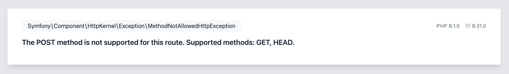
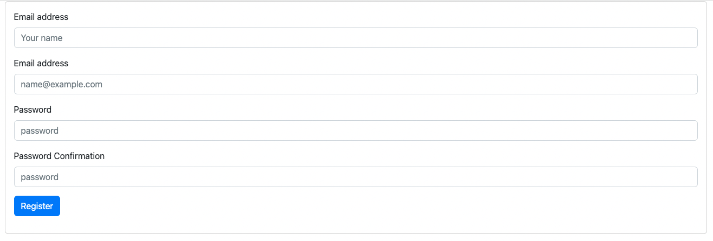
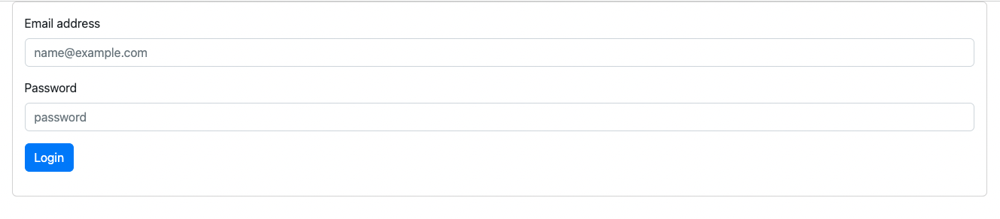

# Menginstal Laravel 11
Langkah pertama instal terlebih dahulu Laravelnya, gunakan perintah ini.

```bash
laravel new auth-manual
```

Jika kalian belum menginstal Laravel Installer, bisa gunakan composer.

```bash
composer create-project laravel/laravel --prefer-dist auth-manual
```

# Konfigurasi Proyek Laravel
Setelah selesai menginstal Laravel, langkah berikutnya adalah mengonfigurasi proyek. Kali ini, kita hanya perlu menyiapkan database. Buatlah database baru, misalnya dengan nama `auth_manual`.

Selanjutnya, sesuaikan pengaturan database tersebut di file `.env`.

```bash
DB_CONNECTION=mysql
DB_HOST=127.0.0.1
DB_PORT=3306
DB_DATABASE=auth_manual
DB_USERNAME=root
DB_PASSWORD=
```

Kemudian jalankan migration nya, agar tabel tabel bawaan Laravel terbuat di dalam database.

```bash
php artisan migrate
```

Harusnya ada beberapa tabel baru di database kita, salah satunya tabel `user` .
# Membuat Fungsi Register
Mari kita mulai dari langkah yang paling sederhana, yaitu membuat fungsi untuk proses pendaftaran (_register_). Langkah pertama, kita perlu membuat sebuah _controller_ bernama `RegisterController.php` menggunakan perintah Artisan.

```bash
php artisan make:controller RegisterController
```

Selanjutnya, tambahkan sebuah metode, misalnya `create()`, di dalam _controller_ tersebut. Metode ini akan bertanggung jawab untuk menampilkan _view_ atau halaman pendaftaran (_register_).

```php
use Illuminate\Http\Request;

class RegisterController extends Controller
{
    public function create()
    {
        return view('auth.register');
    }
    
    // ....
}
```

Setelah itu, daftarkan rute yang sesuai pada file `routes/web.php`. Rute ini akan menghubungkan URL tertentu dengan metode `create()` yang telah dibuat sebelumnya.

**`routes/web.php`**
```php
Route::get('/register', [\App\Http\Controllers\RegisterController::class, 'create'])->name('register');
```

Selanjutnya, untuk memastikan tidak terjadi kesalahan saat halaman diakses, kita perlu membuat sebuah _file_ `.blade.php` sebagai _view_. Berdasarkan metode `create()` yang telah dibuat sebelumnya, _view_ ini harus ditempatkan di dalam direktori `resources/views`. Buat sebuah _folder_ baru bernama `auth`, kemudian tambahkan sebuah _file_ dengan nama `register.blade.php` di dalamnya.

**`resources/views/auth/register.blade.php`**
```html
<!doctype html>
<html lang="en">
<head>
    <meta charset="UTF-8">
    <meta name="viewport"
          content="width=device-width, user-scalable=no, initial-scale=1.0, maximum-scale=1.0, minimum-scale=1.0">
    <meta http-equiv="X-UA-Compatible" content="ie=edge">
    <link href="https://cdn.jsdelivr.net/npm/bootstrap@5.2.1/dist/css/bootstrap.min.css" rel="stylesheet"
          integrity="sha384-iYQeCzEYFbKjA/T2uDLTpkwGzCiq6soy8tYaI1GyVh/UjpbCx/TYkiZhlZB6+fzT" crossorigin="anonymous">
    <title>Register</title>
</head>
<body>
<div class="container-sm">
    <div class="card">
        <div class="card-body">
            <form action="" method="post">
                @csrf
                <div class="mb-3">
                    <label for="name" class="form-label">Name</label>
                    <input type="text" class="form-control @error('name') is-invalid @enderror" id="name"
                           name="name" placeholder="Your name" value="{{ old('name') }}">
                    @error('name')
                    <div class="invalid-feedback">
                        {{ $message }}
                    </div>
                    @enderror
                </div>
                <div class="mb-3">
                    <label for="email" class="form-label">Email address</label>
                    <input type="email" class="form-control @error('email') is-invalid @enderror" id="email"
                           name="email" placeholder="name@example.com" value="{{ old('email') }}">
                    @error('email')
                    <div class="invalid-feedback">
                        {{ $message }}
                    </div>
                    @enderror
                </div>
                <div class="mb-3">
                    <label for="password" class="form-label">Password</label>
                    <input type="password" class="form-control @error('password') is-invalid @enderror" id="password" name="password" placeholder="password">
                    @error('password')
                    <div class="invalid-feedback">
                        {{ $message }}
                    </div>
                    @enderror
                </div>
                <div class="mb-3">
                    <label for="password_confirmation" class="form-label">Password Confirmation</label>
                    <input type="password" class="form-control @error('password_confirmation') is-invalid @enderror" id="password_confirmation" name="password_confirmation"
                           placeholder="password">
                    @error('password_confirmation')
                    <div class="invalid-feedback">
                        {{ $message }}
                    </div>
                    @enderror
                </div>
                <div class="mb-3">
                    <input type="submit" class="btn btn-primary" value="Register">
                </div>
            </form>
        </div>
    </div>
</div>

<script src="https://cdn.jsdelivr.net/npm/bootstrap@5.2.1/dist/js/bootstrap.bundle.min.js"
        integrity="sha384-u1OknCvxWvY5kfmNBILK2hRnQC3Pr17a+RTT6rIHI7NnikvbZlHgTPOOmMi466C8"
        crossorigin="anonymous"></script>
</body>
</html>

```
Berikutnya, jika kita mencoba mengirimkan _form_ yang telah dibuat, kemungkinan akan muncul pesan kesalahan seperti berikut:  



Hal ini terjadi karena kita belum mendefinisikan _route_ untuk metode `POST` pada URL `/register`. Untuk mengatasinya, tambahkan metode `store()` pada `RegisterController`. Metode ini akan menangani permintaan _POST_ dari _form_ pendaftaran.

```php
use App\Models\User;
use Illuminate\Http\Request;
use Illuminate\Support\Facades\Auth;
use Illuminate\Support\Facades\Hash;

class RegisterController extends Controller
{
    // ...
    
    public function store(Request $request)
    {
        $this->validate($request, [
            'email' => ['required','email', 'unique:users,email'],
            'password' => ['required', 'min:8'],
            'password_confirmation' => ['required', 'min:8', 'confirmed']
        ]);

       $user = User::create([
            'name' => $request->name,
            'email' => $request->email,
            'password' => Hash::make($request->password),
        ]);

        if (Auth::attempt(['email' => $user->email, 'password' => $request->password])) {
            $request->session()->regenerate();

            return redirect()->intended('home');
        }
    }
}
```

Setelah metode `store()` dibuat, daftarkan rute yang sesuai pada file `routes/web.php`. Rute ini akan mengarahkan permintaan _POST_ dari _form_ pendaftaran ke metode `store()` di `RegisterController`.

```php
Route::post('/register', [\App\Http\Controllers\RegisterController::class, 'store'])->name('register');
```

Setelah langkah-langkah di atas selesai, Anda dapat mencoba menjalankan proses _register_ melalui URL:

```
http://localhost:8000/register
```



Jika data yang dimasukkan lolos validasi, maka sebuah entri baru akan ditambahkan ke tabel `users`. Setelah itu, pengguna akan diarahkan (_redirect_) ke halaman `/home`. Namun, karena rute untuk halaman ini belum dibuat, akan muncul pesan _not found_.

Untuk menyelesaikannya, kita bisa dengan mudah membuat sebuah _view_ bernama `home.blade.php`. Buat _file_ ini di dalam direktori `resources/views` dan isi dengan konten sederhana seperti berikut:

**`resources/views/home.blade.php`**
```html
<!doctype html>
<html lang="en">
<head>
    <meta charset="UTF-8">
    <meta name="viewport"
          content="width=device-width, user-scalable=no, initial-scale=1.0, maximum-scale=1.0, minimum-scale=1.0">
    <meta http-equiv="X-UA-Compatible" content="ie=edge">
    <link href="https://cdn.jsdelivr.net/npm/bootstrap@5.2.1/dist/css/bootstrap.min.css" rel="stylesheet"
          integrity="sha384-iYQeCzEYFbKjA/T2uDLTpkwGzCiq6soy8tYaI1GyVh/UjpbCx/TYkiZhlZB6+fzT" crossorigin="anonymous">
    <title>Home</title>
</head>
<body>
    <div class="container text-center pt-4">
        Selamat Datang {{ auth()->user()->name }}
    </div>
</body>
</html>
```

Setelah _view_ `home.blade.php` dibuat, langkah selanjutnya adalah mendaftarkan rutenya ke dalam file `routes/web.php`. Tambahkan rute untuk halaman `/home` agar pengguna dapat diarahkan dengan benar setelah proses _register_.

```php
Route::view('/home', 'home')->name('home');
```

Selanjutnya, jika halaman tersebut di-_reload_, akan muncul halaman sederhana yang menyapa _user_ yang sedang terautentikasi. Untuk saat ini, kita biarkan tampilannya tetap sederhana, dan nantinya dapat diperbarui sesuai kebutuhan.

# Membuat Fungsi Login
Setelah berhasil membuat fungsi _register_, langkah berikutnya adalah membuat fungsi _login_ agar pengguna dapat masuk ke dalam sistem. Langkah pertama adalah membuat sebuah _controller_ khusus untuk menangani proses _login_.

Gunakan perintah Artisan berikut untuk membuatnya:

```bash
php artisan make:controller LoginController
```

Setelah berhasil membuat _controller_ `LoginController`, langkah berikutnya adalah menambahkan fungsi untuk menampilkan halaman _login_. Buat sebuah metode, misalnya `showLoginForm()`, di dalam _controller_ tersebut. Fungsi ini akan digunakan untuk menampilkan _view_ halaman _login_.

```php
namespace App\Http\Controllers;

use Illuminate\Http\Request;

class LoginController extends Controller
{
    public function login()
    {
        return view('auth.login');
    }

   // ....
}
```

Jangan lupa untuk membuat _file_ _view_ untuk halaman _login_. Buat file dengan nama `login.blade.php` di dalam direktori `resources/views/auth`. Di dalam _file_ ini, kita akan menambahkan form untuk proses _login_.

**`resources/view/auth/login.blade.php`**
```html
<!doctype html>
<html lang="en">
<head>
    <meta charset="UTF-8">
    <meta name="viewport"
          content="width=device-width, user-scalable=no, initial-scale=1.0, maximum-scale=1.0, minimum-scale=1.0">
    <meta http-equiv="X-UA-Compatible" content="ie=edge">
    <link href="https://cdn.jsdelivr.net/npm/bootstrap@5.2.1/dist/css/bootstrap.min.css" rel="stylesheet"
          integrity="sha384-iYQeCzEYFbKjA/T2uDLTpkwGzCiq6soy8tYaI1GyVh/UjpbCx/TYkiZhlZB6+fzT" crossorigin="anonymous">
    <title>Login</title>
</head>
<body>
<div class="container-sm">
    <div class="card">
        <div class="card-body">
            <form action="{{ route('login') }}" method="post">
                @csrf
                <div class="mb-3">
                    <label for="email" class="form-label">Email address</label>
                    <input type="email" class="form-control @error('email') is-invalid @enderror" id="email"
                           name="email" placeholder="name@example.com" value="{{ old('email') }}">
                    @error('email')
                    <div class="invalid-feedback">
                        {{ $message }}
                    </div>
                    @enderror
                </div>
                <div class="mb-3">
                    <label for="password" class="form-label">Password</label>
                    <input type="password" class="form-control @error('password') is-invalid @enderror" id="password" name="password" placeholder="password">
                    @error('password')
                    <div class="invalid-feedback">
                        {{ $message }}
                    </div>
                    @enderror
                </div>
                <div class="mb-3">
                    <input type="submit" class="btn btn-primary" value="Login">
                </div>
            </form>
        </div>
    </div>
</div>

<script src="https://cdn.jsdelivr.net/npm/bootstrap@5.2.1/dist/js/bootstrap.bundle.min.js"
        integrity="sha384-u1OknCvxWvY5kfmNBILK2hRnQC3Pr17a+RTT6rIHI7NnikvbZlHgTPOOmMi466C8"
        crossorigin="anonymous"></script>
</body>
</html>
```

Setelah membuat _view_ `login.blade.php`, langkah selanjutnya adalah mendaftarkan rute untuk halaman _login_ di dalam file `routes/web.php`.

**`routes/web.php`**
```php
Route::get('/login', [\App\Http\Controllers\LoginController::class, 'login'])->name('login');
```



Setelah menyelesaikan tampilan, langkah selanjutnya adalah membuat fungsi _login_ atau mengautentikasi pengguna agar dapat mengakses aplikasi.

```php
<?php

namespace App\Http\Controllers;

use Illuminate\Http\Request;
use Illuminate\Support\Facades\Auth;

class LoginController extends Controller
{
    // ...

    public function authenticate(Request $request)
    {
        $credentials = $request->validate([
            'email' => ['required', 'string', 'email'],
            'password' => ['required', 'string'],
        ]);

        if (Auth::attempt($credentials)) {
            $request->session()->regenerate();

            return redirect()->intended('home');
        };

        return back()->withErrors([
            'email' => 'The provided credentials do not match our records.',
        ])->onlyInput('email');
    }
}
```

Selalu pastikan untuk mendaftarkan rute yang sesuai di dalam `routes/web.php` agar tidak terjadi kesalahan _not found_.

```php
Route::post('/login', [\App\Http\Controllers\LoginController::class, 'authenicate'])->name('login');
```

# Membuat Fungsi Logout
Baik, berbeda dengan kebanyakan tutorial yang umumnya membuat halaman _login_ setelah halaman _register_ selesai, kali ini kita akan membuat fungsi _logout_ terlebih dahulu secara sederhana, sehingga kita dapat melakukan _logout_ terlebih dahulu sebelum melanjutkan ke pembuatan fungsi _login_. Fungsi ini akan langsung kita buat di dalam `routes/web.php`.

```php
Route::post('/logout', function () {
    auth()->logout();
    request()->session()->invalidate();
    request()->session()->regenerateToken();

    return redirect('/');
})->name('logout');
```

Selanjutnya, kita akan melakukan perubahan pada _file_ tampilan `home.blade.php`.

```html
<div class="container text-center pt-4">
    Selamat Datang {{ auth()->user()->name }}
    <div class="div">
        <form action="{{ route('logout') }}" method="post">
            @csrf
            <input type="submit" class="btn btn-danger" value="Logout">
        </form>
    </div>
</div>
```
Tampilan yang dihasilkan akan terlihat seperti ini. Silakan mencoba untuk menekan tombol tersebut, seharusnya sudah berfungsi dengan baik.
# Menambahkan Middleware
Saat ini, setelah pengguna berhasil terautentikasi, baik melalui proses _register_ maupun _login_, halaman `/register` dan `/login` masih dapat diakses. Hal ini seharusnya tidak diperbolehkan, karena tidak logis jika pengguna yang sudah terautentikasi dapat mendaftarkan akun baru.

Benar, jika sudah terautentikasi (_login_), pengguna tidak seharusnya dapat mendaftar lagi, kecuali setelah melakukan _logout_. Lalu, bagaimana cara membatasi akses tersebut? Tenang, Laravel telah menyediakan _middleware_ yang dapat langsung digunakan. _Middleware_ tersebut bernama `guest`, yang memastikan halaman atau _route_ hanya bisa diakses oleh pengguna yang belum terautentikasi.

Kita dapat menambahkan _middleware_ ini langsung di _routes_, karena menurut saya cara ini sangat efisien dan memudahkan dalam pengaturan _routes_ dan _middleware_.

```php
Route::get('/register', [\App\Http\Controllers\RegisterController::class, 'create'])->name('register')->middleware('guest');

Route::post('/register', [\App\Http\Controllers\RegisterController::class, 'store'])->name('register')->middleware('guest');

Route::get('/login', [\App\Http\Controllers\LoginController::class, 'login'])->name('login')->middleware('guest');

Route::post('/login', [\App\Http\Controllers\LoginController::class, 'authenticate'])->name('login')->middleware('guest');
```

Sekarang, setelah kita membatasi akses ke halaman `/register` dan `/login` hanya untuk pengguna yang belum terautentikasi, kita perlu melakukan hal yang sama untuk halaman `/home`. Halaman ini hanya boleh diakses oleh pengguna yang sudah terautentikasi. Jangan khawatir, Laravel juga menyediakan _middleware_ untuk hal ini. _Middleware_ yang digunakan kali ini adalah `auth`, yang memastikan hanya pengguna yang sudah terautentikasi yang dapat mengakses halaman tersebut. Hal yang sama juga berlaku untuk _route_ `/logout`.

```php
Route::post('/logout', function () {
    auth()->logout();
    request()->session()->invalidate();
    request()->session()->regenerateToken();

    return redirect('/');
})->name('logout')->middleware('auth');
Route::view('/home', 'home')->name('home')->middleware('auth');
```

Dengan konfigurasi seperti ini, fitur autentikasi yang kita bangun sudah dapat memenuhi kebutuhan dasar autentikasi, mencakup proses _register_, _logout_, _login_, serta pengaturan pembatasan akses ke halaman-halaman tertentu berdasarkan status autentikasi pengguna.