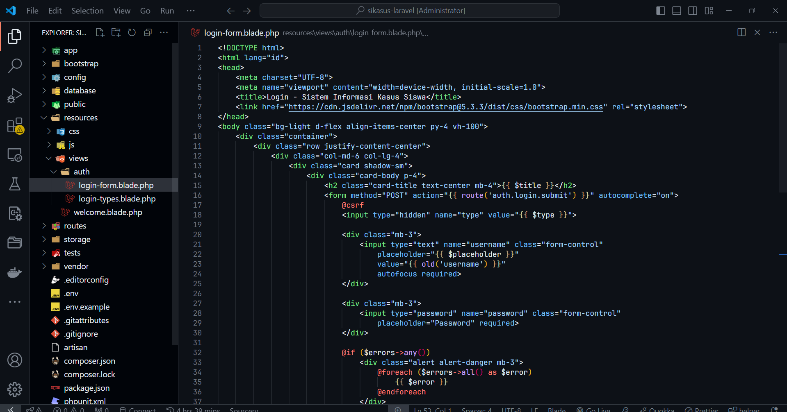
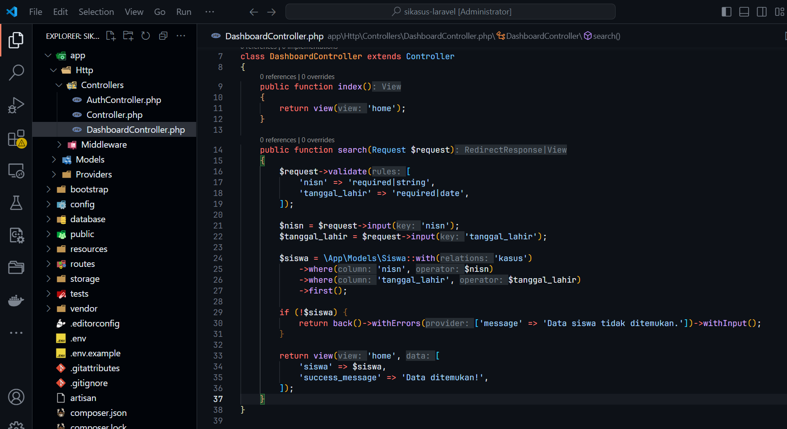
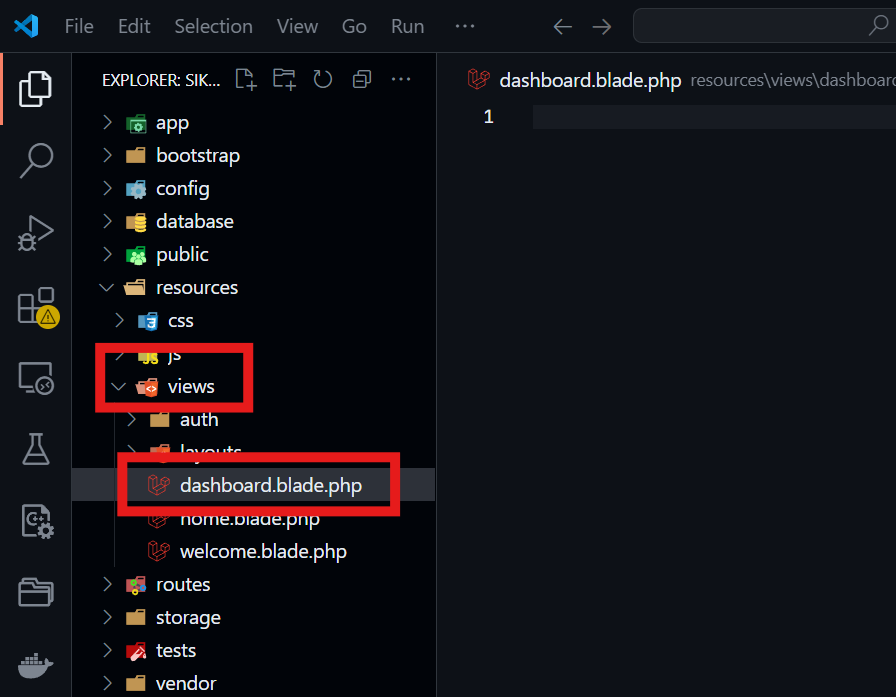
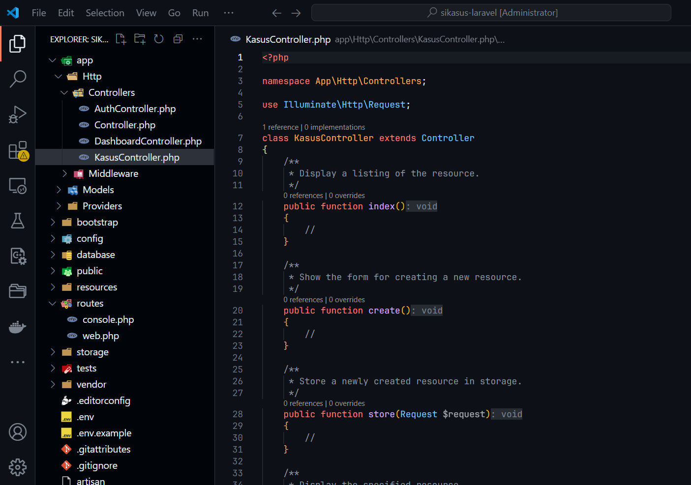
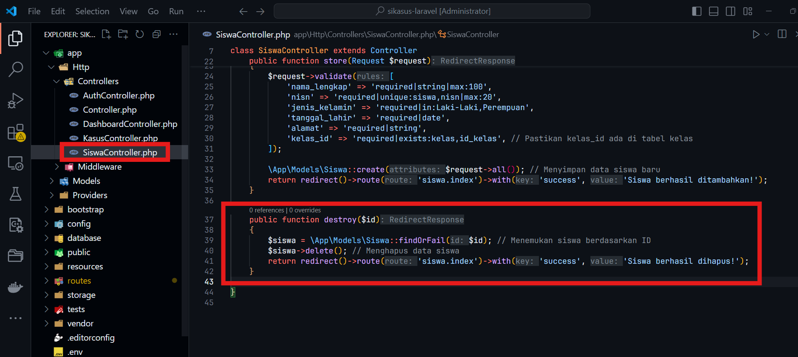

# Menginstal Laravel 11

Langkah pertama adalah memastikan bahwa **Composer** telah terinstal di komputer. **Composer** digunakan untuk mengelola dependensi dalam proyek **Laravel**.

Kemudian, buka terminal atau command prompt, lalu jalankan perintah berikut untuk membuat proyek Laravel baru:

```bash
composer create-project laravel/laravel sikasus-laravel
```


Perintah ini akan membuat folder proyek baru bernama **sikasus-laravel** yang berisi instalasi **Laravel 11**. Tunggu hingga proses instalasi selesai.

Setelah instalasi selesai, pindah ke dalam folder proyek menggunakan perintah berikut:

```bash
cd sikasus-laravel
```


Langkah berikutnya adalah menjalankan server pengembangan bawaan **Laravel** untuk memastikan instalasi berhasil. Jalankan perintah berikut:

```bash
php artisan serve
```


Jika berhasil, Anda akan mendapatkan URL seperti `http://127.0.0.1:8000` yang dapat dibuka di browser untuk melihat tampilan awal proyek **Laravel 11**.


---

# Konfigurasi Proyek Laravel

Langkah selanjutnya adalah mengatur konfigurasi database proyek. Buka file `.env` yang terdapat di dalam folder proyek menggunakan editor teks pilihan Anda.

Cari bagian pengaturan database, kemudian sesuaikan konfigurasi menjadi seperti berikut:

```env
DB_CONNECTION=mysql
DB_HOST=127.0.0.1
DB_PORT=3306
DB_DATABASE=db_laravel_sikasus
DB_USERNAME=root
DB_PASSWORD=
```


Penyesuaian ini memastikan proyek **Laravel** terhubung ke database **MySQL** dengan nama `db_laravel_sikasus`. Pastikan database tersebut sudah dibuat sebelumnya di **phpMyAdmin** atau **MySQL CLI**.

Setelah selesai mengatur file `.env`, simpan perubahan. Kemudian, jalankan perintah berikut untuk menghasilkan kunci aplikasi:


```bash
php artisan key:generate
```


Perintah ini akan membuat kunci enkripsi aplikasi dan menyimpannya di file `.env`. Kunci ini digunakan untuk menjaga keamanan data aplikasi.
# Membuat Model dan Migration

Langkah berikutnya adalah membuat **Model** beserta **Migration** untuk entitas `kasus`, `siswa`, `kelas`, dan `walikelas`. Jalankan perintah berikut di terminal untuk masing-masing entitas:

```bash
php artisan make:model Walikelas -m
php artisan make:model Kelas -m
php artisan make:model Siswa -m
php artisan make:model Kasus -m
```

Perintah di atas akan membuat file **Model** di folder `app/Models` dan file **Migration** di folder `database/migrations`.


---

## Menambahkan Kolom di Dalam Migration

Buka setiap file _migration_ yang telah dibuat di `database/migrations`, lalu tambahkan kolom sesuai kebutuhan:

### 1. Migration `Kasus`
```php
public function up()
{
    Schema::create('kasus', function (Blueprint $table) {
        $table->id('id_kasus');
        $table->foreignId('siswa_id')->constrained('siswa', 'id')->cascadeOnDelete()->cascadeOnUpdate();
        $table->text('deskripsi_kasus');
        $table->date('tanggal_kasus');
        $table->timestamps();
    });
}
```


### 2. Migration `Siswa`
```php
public function up()
{
    Schema::create('siswa', function (Blueprint $table) {
        $table->id();
        $table->string('nama_lengkap', 100);
        $table->string('nisn', 20)->unique();
        $table->enum('jenis_kelamin', ['Laki-Laki', 'Perempuan']);
        $table->date('tanggal_lahir');
        $table->text('alamat');
        $table->foreignId('kelas_id')->constrained('kelas', 'id_kelas')->cascadeOnDelete()->cascadeOnUpdate();
        $table->timestamps();
    });
}
```


### 3. Migration `Kelas`
```php
public function up()
{
    Schema::create('kelas', function (Blueprint $table) {
        $table->id('id_kelas');
        $table->string('nama_kelas', 50);
        $table->foreignId('walikelas_id')->constrained('walikelas','id_walikelas')->unique()->cascadeOnDelete()->cascadeOnUpdate();
        $table->timestamps();
    });
}
```


### 4. Migration `Walikelas`

```php
public function up()
{
    Schema::create('walikelas', function (Blueprint $table) {
        $table->id('id_walikelas');
        $table->string('nama_walikelas', 100);
        $table->string('nip', 20)->unique()->nullable();
        $table->enum('jenis_kelamin', ['Laki-laki', 'Perempuan']);
        $table->text('alamat');
        $table->timestamps();
    });
}
```


---

## Menambahkan Mass Assignment

Untuk setiap **Model**, tambahkan properti `$fillable` agar mendukung **Mass Assignment**. Contoh:

### 1. Model `Kasus`

```php

protected $table = 'kasus';
protected $primaryKey = 'id_kasus';
protected $fillable = ['deskripsi_kasus', 'tanggal_kasus', 'siswa_id'];


public function siswa(){
	return $this->belongsTo(Siswa::class, 'siswa_id', 'id');
}

protected $casts = [
	'tanggal_kasus' => 'date', // Mengubah tanggal_kasus menjadi objek Carbon
];
```


### 2. Model `Siswa`

```php
protected $table = 'siswa';
protected $primaryKey = 'id';
protected $fillable = [
	'nama_lengkap',
	'nisn',
	'jenis_kelamin',
	'tanggal_lahir',
	'alamat',
	'kelas_id'
];

// Relasi dengan kelas
public function kelas() {
	return $this->belongsTo(Kelas::class, 'kelas_id', 'id_kelas');
}

public function kasus() {
	return $this->hasMany(Kasus::class, 'siswa_id'); // Foreign key harus 'siswa_id'
}
```


### 3. Model `Kelas`

```php
protected $table = 'kelas';
protected $primaryKey = 'id_kelas';
protected $fillable = [
	'nama_kelas',
	'walikelas_id',
];

public function walikelas() {
	return $this->belongsTo(Walikelas::class, 'walikelas_id');
}
```


### 4. Model `Walikelas`

```php
protected $table = 'walikelas'; // Pastikan tabel ini sesuai dengan migrasi
protected $primaryKey = 'id_walikelas'; // Pastikan primary key adalah id_walikelas
protected $fillable = [
	'nama_walikelas',
	'nip',
	'jenis_kelamin',
	'alamat',
];
```


---
## Menjalankan Proses Migrate

Setelah semua _migration_ selesai dibuat, jalankan perintah berikut untuk membuat tabel di database:

```bash
php artisan migrate
```

Jika berhasil, tabel `kasus`, `siswa`, `kelas`, dan `walikelas` akan dibuat di database.


---
# Menerapkan Autentikasi

## Membuat Controller `Auth`

Langkah pertama adalah membuat controller untuk mengelola proses autentikasi. Jalankan perintah berikut di terminal:

```bash
php artisan make:controller AuthController
```

Controller ini akan digunakan untuk menampilkan halaman login, memproses login, dan menangani logout. Setelah perintah dijalankan, file baru bernama `AuthController.php` akan dibuat di folder `app/Http/Controllers`.


---

## Menambahkan Fungsi di `AuthController`

Buka file `AuthController.php` yang telah dibuat, lalu tambahkan logika berikut:

```php
private $titles = [
'siswa' => ['title' => 'Login Siswa', 'placeholder' => 'Masukkan NISN'],
'walikelas' => ['title' => 'Login Walikelas', 'placeholder' => 'Masukkan NIP'],
'admin' => ['title' => 'Login Admin', 'placeholder' => 'Masukkan Nama Pengguna']
];
```

Disini kita membuat variabel untuk menentukan jenis jenis login sesuai rolenya.

### Menampilkan Halaman Jenis Login

Langkah pertama adalah menambahkan fungsi `showLoginTypes` di dalam `AuthController`. Fungsi ini bertanggung jawab untuk menampilkan halaman pilihan jenis login (misalnya siswa, wali kelas, atau admin).

```php
public function showLoginTypes()
{
    return view('auth.login-types', ['titles' => $this->titles]);
}
```


**Penjelasan**:  
Fungsi `showLoginTypes` ini mengembalikan tampilan (`view`) dengan nama `auth.login-types`. Di sini, kita juga mengirimkan data `titles` yang berisi jenis-jenis login yang akan ditampilkan di halaman tersebut.

---

### Menampilkan Form Login Berdasarkan Jenis

Langkah berikutnya adalah menambahkan fungsi `showLoginForm` yang akan menampilkan form login sesuai dengan jenis login yang dipilih oleh pengguna.

```php
public function showLoginForm($type)
{
    if (!array_key_exists($type, $this->titles)) {
        abort(404);  // Menangani kasus jika jenis login tidak valid
    }

    return view('auth.login-form', [
        'type' => $type,
        'title' => $this->titles[$type]['title'],
        'placeholder' => $this->titles[$type]['placeholder']
    ]);
}
```


**Penjelasan**:  
Pada fungsi ini, kita memeriksa apakah jenis login yang diminta ada dalam array `$this->titles`. Jika jenis login tidak ditemukan, maka akan ditampilkan halaman 404. Jika valid, fungsi ini akan mengirimkan data untuk digunakan di tampilan `auth.login-form`, termasuk tipe login, judul halaman, dan placeholder untuk input username.

---

### Proses Login

Setelah form login ditampilkan, kita perlu menangani proses login melalui fungsi `login`.

```php
public function login(Request $request)
{
    $request->validate([
        'type' => 'required|in:siswa,walikelas,admin',
        'username' => 'required|string',
        'password' => 'required|string'
    ]);

    $type = $request->type;
    $username = $request->username;
    $password = $request->password;

    $user = $this->authenticateUser($type, $username, $password);

    if ($user) {
        session([
            'user' => $user,
            'role' => $type
        ]);
        
        $request->session()->regenerate();
        return redirect()->intended('dashboard');
    }

    // Menampilkan pesan error jika login gagal
    $usernameLabel = match ($type) {
        'siswa' => 'NISN',
        'walikelas' => 'NIP',
        default => 'Username'
    };

    throw ValidationException::withMessages([
        'username' => ["{$usernameLabel} atau kata sandi salah. Silakan coba lagi."],
    ]);
}

private function authenticateUser($type, $username, $password)
{
$model = match ($type) {
'siswa' => Siswa::class,
'walikelas' => Walikelas::class,
'admin' => User::class,
default => null
};

if (!$model) {
return null;
}

$field = $this->getUsernameField($type);
$user = $model::where($field, $username)->first();

// Verifikasi login berdasarkan tipe
if ($type === 'siswa' && $user && $user->nisn === $password) {
return $user;
}


if ($type === 'walikelas' && $user && $user->nip === $password) {
return $user;
}


if ($type === 'admin' && $user && \Hash::check($password, $user->password)) {
return $user;
}

return null;
}

private function getUsernameField($type)
{
return match ($type) {
'siswa' => 'nisn',
'walikelas' => 'nip',
'admin' => 'username'
};
}
```


**Penjelasan**:  
Di dalam fungsi `login`, kita pertama-tama memvalidasi input dari form. Jika validasi gagal, sistem akan memberikan pesan kesalahan. Setelah itu, fungsi `authenticateUser` akan memeriksa apakah kredensial yang diberikan cocok dengan data yang ada di database. Jika cocok, pengguna akan diarahkan ke halaman dashboard, dan sesi login akan diperbarui. Jika gagal, pesan kesalahan akan ditampilkan.

---

### Proses Logout

Untuk logout, kita akan membuat fungsi `logout` untuk menghapus sesi pengguna dan mengarahkan kembali ke halaman login.

```php
public function logout()
{
    session()->forget('user');
    session()->forget('role');

    auth()->logout();

    return redirect()->route('auth.login.types')->with('success', 'Logout berhasil!');
}
```


**Penjelasan**:  
Fungsi ini bertugas untuk menghapus data sesi pengguna, termasuk data `user` dan `role`. Setelah logout, pengguna akan diarahkan kembali ke halaman pilihan jenis login (`auth.login.types`) dengan pesan sukses yang memberitahukan bahwa proses logout berhasil.

---

### Membuat Routing untuk Autentikasi

Terakhir, kita perlu menambahkan routing di file `routes/web.php` untuk menghubungkan fungsi-fungsi ini dengan URL yang sesuai.

```php
Route::prefix('auth')
    ->name('auth.')
    ->controller(AuthController::class)
    ->group(function () {
        Route::get('/login', 'showLoginTypes')->name('login.types');
        Route::get('/login/{type}', 'showLoginForm')->name('login.form');
        Route::post('/login', 'login')->name('login.submit');
        Route::get('/logout', 'logout')->name('logout');
    });
```


**Penjelasan**:  
Di sini, kita mendefinisikan routing untuk menampilkan halaman jenis login, form login, proses login, dan proses logout. Setiap route menggunakan controller yang sudah dibuat sebelumnya (`AuthController::class`), dengan metode yang sesuai.

---

## Membuat View untuk Menampilkan Halaman Login

### Halaman Pilihan Login

Buat file baru dengan nama `resources/views/auth/login-types.blade.php`. Isi file ini dengan kode berikut:

```html
<!DOCTYPE html>
<html lang="id">
<head>
    <meta charset="UTF-8">
    <meta name="viewport" content="width=device-width, initial-scale=1.0">
    <title>Login - Sistem Informasi Kasus Siswa</title>
    <link href="https://cdn.jsdelivr.net/npm/bootstrap@5.3.3/dist/css/bootstrap.min.css" rel="stylesheet">
</head>
<body class="bg-light d-flex align-items-center py-4 vh-100">
    <div class="container">
        <div class="row justify-content-center">
            <div class="col-md-6 col-lg-4">
                <div class="card shadow-sm">
                    <div class="card-body p-4">
                        <h2 class="card-title text-center mb-4">Silakan Pilih Jenis Login</h2>
                        <div class="d-grid gap-2">
                            <a href="{{ route('auth.login.form', 'siswa') }}" class="btn btn-outline-primary">Siswa</a>
                            <a href="{{ route('auth.login.form', 'walikelas') }}" class="btn btn-outline-primary">Wali Kelas</a>
                            <a href="{{ route('auth.login.form', 'admin') }}" class="btn btn-outline-primary">Admin</a>
                        </div>
                    </div>
                </div>
            </div>
        </div>
    </div>
    <script src="https://cdn.jsdelivr.net/npm/bootstrap@5.3.3/dist/js/bootstrap.bundle.min.js"></script>
</body>
</html>
```


**Penjelasan**:
- Halaman ini memungkinkan pengguna untuk memilih jenis login: Siswa, Wali Kelas, atau Admin.
- Setiap jenis login mengarah ke form login yang sesuai dengan jenis yang dipilih.
- Menggunakan framework Bootstrap untuk styling dan layout halaman.

---

### Membuat Form Login

Buat file baru dengan nama `resources/views/auth/login-form.blade.php` dan isi dengan kode berikut:

```html
<!DOCTYPE html>
<html lang="id">
<head>
    <meta charset="UTF-8">
    <meta name="viewport" content="width=device-width, initial-scale=1.0">
    <title>Login - Sistem Informasi Kasus Siswa</title>
    <link href="https://cdn.jsdelivr.net/npm/bootstrap@5.3.3/dist/css/bootstrap.min.css" rel="stylesheet">
</head>
<body class="bg-light d-flex align-items-center py-4 vh-100">
    <div class="container">
        <div class="row justify-content-center">
            <div class="col-md-6 col-lg-4">
                <div class="card shadow-sm">
                    <div class="card-body p-4">
                        <h2 class="card-title text-center mb-4">{{ $title }}</h2>
                        <form method="POST" action="{{ route('auth.login.submit') }}" autocomplete="on">
                            @csrf
                            <input type="hidden" name="type" value="{{ $type }}">

                            <div class="mb-3">
                                <input type="text" name="username" class="form-control"
                                    placeholder="{{ $placeholder }}"
                                    value="{{ old('username') }}"
                                    autofocus required>
                            </div>

                            <div class="mb-3">
                                <input type="password" name="password" class="form-control"
                                    placeholder="Password" required>
                            </div>

                            @if ($errors->any())
                                <div class="alert alert-danger mb-3">
                                    @foreach ($errors->all() as $error)
                                        {{ $error }}
                                    @endforeach
                                </div>
                            @endif

                            <div class="d-grid gap-2">
                                <button type="submit" class="btn btn-primary">Login</button>
                                <a href="{{ route('auth.login.types') }}" class="btn btn-outline-secondary">Kembali</a>
                            </div>
                        </form>
                    </div>
                </div>
            </div>
        </div>
    </div>
    <script src="https://cdn.jsdelivr.net/npm/bootstrap@5.3.3/dist/js/bootstrap.bundle.min.js"></script>
</body>
</html>
```



**Penjelasan**:

- Halaman ini digunakan untuk form login berdasarkan jenis yang dipilih sebelumnya (Siswa, Wali Kelas, atau Admin).
- Form ini mengirimkan data ke route `auth.login.submit` untuk memproses login.
- Menggunakan Bootstrap untuk styling dan layout form login. Jika terjadi kesalahan saat login, pesan error akan ditampilkan di bawah form input.

---

# Membuat Middleware
###  Membuat Middleware untuk Autentikasi

Langkah pertama adalah membuat middleware yang akan mengecek apakah pengguna sudah login atau belum. Untuk itu, kita akan membuat middleware `CheckAuthenticate`. Jalankan perintah berikut untuk membuat middleware:

```bash
php artisan make:middleware CheckAuthenticate
```


Setelah middleware berhasil dibuat, buka file `app/Http/Middleware/CheckAuthenticate.php`.


kemudian tambahkan kode berikut:

```php
public function handle(Request $request, Closure $next): Response
{
	// Jika pengguna sudah login (session 'role' dan 'user' ada)
	if (session('role') && session('user')) {
		// Cek apakah pengguna sedang mencoba mengakses halaman login
		if ($request->routeIs('auth.login.types')) {
			return redirect()->route('dashboard.home'); // Arahkan ke dashboard atau halaman utama
		}

		return $next($request); // Lanjutkan jika bukan halaman login
	}

	// Jika pengguna belum login, arahkan ke halaman login
	if (!$request->routeIs('auth.login.types')) {
		return redirect()->route('auth.login.types')
			->with('error', 'Anda harus login terlebih dahulu.');
	}

	return $next($request);
}
```


**Penjelasan**:
- Middleware ini memeriksa apakah sesi `role` dan `user` ada, yang menunjukkan bahwa pengguna sudah login.
- Jika pengguna sudah login, mereka dapat melanjutkan ke halaman yang diminta, kecuali halaman login.
- Jika pengguna belum login dan mencoba mengakses halaman selain login, mereka akan diarahkan ke halaman login.

### Membuat Middleware untuk Role

Langkah berikutnya adalah membuat middleware yang akan memeriksa peran pengguna (role) sebelum mengakses halaman tertentu. Jalankan perintah berikut untuk membuat middleware `RoleMiddleware`:

```bash
php artisan make:middleware RoleMiddleware
```


Setelah middleware berhasil dibuat, buka file `app/Http/Middleware/RoleMiddleware.php`, kemudian tambahkan kode berikut:

```php
public function handle(Request $request, Closure $next, ...$roles)
{
	$userRole = session('role');      

	if (!in_array($userRole, $roles)) {
		$redirectRoute = $userRole === 'siswa' ? 'siswa.dashboard' : 'dashboard.home';

		return redirect()->route($redirectRoute)
			->with('error', 'Anda tidak memiliki akses.');
	}

	return $next($request);
}
```


**Penjelasan**:
- Middleware ini memeriksa peran pengguna (`role`) yang disimpan dalam sesi.
- Jika peran pengguna tidak sesuai dengan peran yang diizinkan untuk mengakses halaman tersebut, maka pengguna akan diarahkan ke halaman yang sesuai berdasarkan peran mereka.
- Jika peran cocok, maka pengguna dapat melanjutkan akses ke halaman yang diminta.

### Registrasi Middleware

Setelah membuat middleware, langkah selanjutnya adalah mendaftarkan middleware yang telah dibuat ke dalam aplikasi Laravel. Untuk melakukannya, buka file `bootstrap/app.php` kemudian kita perlu mengonfigurasi alias middleware yang telah dibuat. 


Pada kode middleware ini didaftarkan dalam aplikasi melalui konfigurasi berikut:

```php
use App\Http\Middleware\CheckAuthenticate;
use App\Http\Middleware\RoleMiddleware;

// Mendaftarkan alias middleware di aplikasi
$middleware->alias([
	'auth' => CheckAuthenticate::class, // Alias untuk middleware autentikasi
	'role' => RoleMiddleware::class,     // Alias untuk middleware role
]);
```


### Penjelasan:
- `withMiddleware()` adalah metode untuk mendaftarkan middleware kustom ke aplikasi Laravel.
- Di dalam `withMiddleware()`, Anda mendefinisikan alias untuk masing-masing middleware yang telah Anda buat. Dengan mendefinisikan alias `'auth'` untuk `CheckAuthenticate` dan `'role'` untuk `RoleMiddleware`, Anda akan dapat menggunakan alias ini saat mendaftarkan middleware pada route di file `web.php`.
- Bagian `withRouting()` mengonfigurasi file routing untuk aplikasi Laravel, sementara `withExceptions()` digunakan untuk menambahkan penanganan error jika diperlukan.

# Membuat Blade Layout

Langkah pertama dalam membuat **Blade Layouts** adalah memastikan struktur folder dan file untuk layout sesuai. navigasikan ke folder `resources/views`. Di dalam folder tersebut, buat folder baru bernama `layouts` untuk menyimpan file layout utama.


Selanjutnya, buat subfolder di dalam folder `layouts` bernama `partials` yang akan digunakan untuk menyimpan komponen seperti navbar, sidebar, dan footer.


Kemudian, lanjutkan dengan membuat komponen seperti navbar, sidebar, dan footer. Untuk navbar, buat file baru di folder `partials` dengan nama `navbar.blade.php`.


Tambahkan kode untuk navbar menggunakan struktur HTML dan Bootstrap.

```html
 <nav class="sb-topnav navbar navbar-expand navbar-dark bg-dark">
     <!-- Navbar Brand-->
     <a class="navbar-brand ps-3" href="index.html">SIKASUS</a>
     <!-- Sidebar Toggle-->
     <button class="btn btn-link btn-sm order-1 order-lg-0 me-4 me-lg-0" id="sidebarToggle" href="#!"><i
             class="fas fa-bars"></i></button>
     <!-- Navbar Search-->
     <form class="d-none d-md-inline-block form-inline ms-auto me-0 me-md-3 my-2 my-md-0">
         <div class="input-group">
             <input class="form-control" type="text" placeholder="Search for..." aria-label="Search for..."
                 aria-describedby="btnNavbarSearch" />
             <button class="btn btn-primary" id="btnNavbarSearch" type="button"><i class="fas fa-search"></i></button>
         </div>
     </form>
     <!-- Navbar-->
     <ul class="navbar-nav ms-auto ms-md-0 me-3 me-lg-4">
         <li class="nav-item dropdown">
             <a class="nav-link dropdown-toggle" id="navbarDropdown" href="#" role="button"
                 data-bs-toggle="dropdown" aria-expanded="false"><i class="fas fa-user fa-fw"></i></a>
             <ul class="dropdown-menu dropdown-menu-end" aria-labelledby="navbarDropdown">
                 <li><a class="dropdown-item" href="{{ route('auth.logout') }}">Logout</a></li>
             </ul>
         </li>
     </ul>
 </nav>
```


Langkah berikutnya adalah membuat sidebar. Masih di folder `partials`, buat file baru bernama `sidebar.blade.php`.


Tambahkan kode HTML berikut untuk sidebar navigasi.

```html
<div id="layoutSidenav_nav">
    <nav class="sb-sidenav accordion sb-sidenav-dark" id="sidenavAccordion">
        <div class="sb-sidenav-menu">
            <div class="nav">
                <div class="sb-sidenav-menu-heading">Menu Utama</div>
                @php
                    $role = session('role');
                @endphp
                {{-- Role Admin --}}
                @if (isset($role) && $role === 'admin')
                    <a class="nav-link" href="{{ url('/dashboard') }}">
                        <div class="sb-nav-link-icon"><i class="fas fa-tachometer-alt"></i></div>
                        Dashboard
                    </a>

                    <div class="sb-sidenav-menu-heading">Manajemen</div>
                    <a class="nav-link collapsed" href="#" data-bs-toggle="collapse"
                        data-bs-target="#collapseManagement" aria-expanded="false" aria-controls="collapseManagement">
                        <div class="sb-nav-link-icon"><i class="fas fa-columns"></i></div>
                        Data Master
                        <div class="sb-sidenav-collapse-arrow"><i class="fas fa-angle-down"></i></div>
                    </a>
                    <div class="collapse" id="collapseManagement" aria-labelledby="headingOne"
                        data-bs-parent="#sidenavAccordion">
                        <nav class="sb-sidenav-menu-nested nav">
                            <a class="nav-link" href="{{ url('/walikelas') }}">Wali Kelas</a>
                            <a class="nav-link" href="{{ url('/kelas') }}">Kelas</a>
                            <a class="nav-link" href="{{ url('/siswa') }}">Siswa</a>
                        </nav>
                    </div>

                    <a class="nav-link" href="{{ url('/kasus') }}">
                        <div class="sb-nav-link-icon"><i class="fas fa-book-open"></i></div>
                        Kasus Siswa
                    </a>

                    {{-- Role Wali Kelas --}}
                @elseif (isset($role) && $role === 'walikelas')
                    <a class="nav-link" href="{{ url('/dashboard') }}">
                        <div class="sb-nav-link-icon"><i class="fas fa-tachometer-alt"></i></div>
                        Dashboard
                    </a>

                    <div class="sb-sidenav-menu-heading">Menu Walikelas</div>
                    <a class="nav-link" href="{{ url('/siswa') }}">
                        <div class="sb-nav-link-icon"><i class="fas fa-user-graduate"></i></div>
                        Siswa
                    </a>
                    <a class="nav-link" href="{{ url('/kasus') }}">
                        <div class="sb-nav-link-icon"><i class="fas fa-book-open"></i></div>
                        Kasus Siswa
                    </a>
                @endif

                <div class="sb-sidenav-menu-heading">Akun</div>
                <a class="nav-link" href="{{ route('auth.logout') }}">
                    <div class="sb-nav-link-icon"><i class="fas fa-sign-out-alt"></i></div>
                    Logout
                </a>
            </div>
        </div>
        <div class="sb-sidenav-footer">
            <div class="small">Logged in as:</div>
            {{ $role ?? 'Pengguna' }}
        </div>
    </nav>
</div>

```


Terakhir, tambahkan footer. Buat file baru bernama `footer.blade.php` di folder `partials`


Kemudian, tambahkan kode berikut:

```html
<footer class="py-4 bg-light mt-auto">
    <div class="container-fluid px-4">
        <div class="d-flex align-items-center justify-content-between small">
            <div class="text-muted">Copyright &copy; SIKASUS 2024</div>
            <div>
                <a href="#">Privacy Policy</a>
                &middot;
                <a href="#">Terms & Conditions</a>
            </div>
        </div>
    </div>
</footer>
<script src="https://cdn.jsdelivr.net/npm/bootstrap@5.2.3/dist/js/bootstrap.bundle.min.js" crossorigin="anonymous"></script>
<script src="/admin-template-sb/js/scripts.js"></script>
<script src="https://cdnjs.cloudflare.com/ajax/libs/Chart.js/2.8.0/Chart.min.js" crossorigin="anonymous"></script>
<script src="https://cdn.jsdelivr.net/npm/simple-datatables@7.1.2/dist/umd/simple-datatables.min.js" crossorigin="anonymous"></script>
<script src="/admin-template-sb/js/datatables-simple-demo.js"></script>
```


Setelah struktur folder selesai dibuat, langkah berikutnya adalah membuat file layout utama. Klik kanan pada folder `layouts`, pilih **New File**, lalu beri nama file tersebut `app.blade.php`.


Lalu, Isi file dengan struktur HTML dasar yang mencakup penggunaan `@yield` untuk bagian yang akan diisi oleh konten halaman lain.

```html
<!DOCTYPE html>
<html lang="en">

<head>
    <meta charset="utf-8" />
    <meta http-equiv="X-UA-Compatible" content="IE=edge" />
    <meta name="viewport" content="width=device-width, initial-scale=1, shrink-to-fit=no" />
    <title>
        @yield('title', ucwords(str_replace('-', ' ', Route::currentRouteName())))
    </title>
    <link href="https://cdn.jsdelivr.net/npm/simple-datatables@7.1.2/dist/style.min.css" rel="stylesheet" />
    <link href="/admin-template-sb/css/styles.css" rel="stylesheet" />
    <script src="https://use.fontawesome.com/releases/v6.3.0/js/all.js" crossorigin="anonymous"></script>
</head>

<body class="sb-nav-fixed">
    @include('layouts.partials.navbar')

    <div id="layoutSidenav">
        @include('layouts.partials.sidebar')
        <div id="layoutSidenav_content">
            <main>
                <div class="container-fluid px-4">
                    @yield('content')
                </div>
            </main>
            @include('layouts.partials.footer')
        </div>
    </div>
</body>
</html>
```


# Membuat Tampilan Homepage
Langkah pertama dalam pembuatan tampilan homepage adalah dengan membuat controller yang menangani tampilan tersebut. Untuk itu, jalankan perintah Artisan di terminal untuk membuat controller baru bernama `DashboardController` dengan perintah:

```bash
php artisan make:controller DashboardController
```


Setelah controller berhasil dibuat, buka file `DashboardController.php` yang terletak di folder `app/Http/Controllers`.


Di dalam controller ini, buat fungsi `index` yang akan mengembalikan tampilan homepage dengan kode berikut:

```php
public function index()
{
    return view('home');
}
```


Selanjutnya, tambahkan fungsi `search` yang akan menangani pencarian data berdasarkan `NISN` dan `Tanggal Lahir`. Fungsi ini akan menerima input dari form yang ada di homepage, memvalidasi input tersebut, dan kemudian mencari data siswa yang sesuai dalam database. Berikut adalah kode untuk fungsi `search`:

```php
public function search(Request $request)
{
    $request->validate([
        'nisn' => 'required|string',
        'tanggal_lahir' => 'required|date',
    ]);

    $nisn = $request->input('nisn');
    $tanggal_lahir = $request->input('tanggal_lahir');

    $siswa = \App\Models\Siswa::with('kasus')
        ->where('nisn', $nisn)
        ->where('tanggal_lahir', $tanggal_lahir)
        ->first();

    if (!$siswa) {
        return back()->withErrors(['message' => 'Data siswa tidak ditemukan.'])->withInput();
    }

    return view('home', [
        'siswa' => $siswa,
        'success_message' => 'Data ditemukan!',
    ]);
}
```



Setelah membuat fungsi-fungsi tersebut, langkah berikutnya adalah menambahkan routing untuk menampilkan halaman homepage dan proses pencarian data. Buka file `routes/web.php` dan tambahkan routing untuk menghubungkan URL dengan fungsi yang telah dibuat di controller, seperti ini:

```php
Route::controller(App\Http\Controllers\DashboardController::class)
    ->group(function () {
        Route::get('/', 'index')->name('dashboard');
        Route::post('/', 'search')->name('dashboard.search');
    });
```


Kemudian, buat tampilan homepage menggunakan Blade template di dalam folder `resources/views`. Buat file `home.blade.php` yang akan menampilkan form pencarian dan informasi terkait siswa beserta kasus yang dimilikinya jika ditemukan. 


Kemudian, tambahkan kode berikut untuk file `home.blade.php`:

```html
<!DOCTYPE html>
<html lang="id">
<head>
    <meta charset="UTF-8">
    <meta name="viewport" content="width=device-width, initial-scale=1.0">
    <title>Sistem Informasi Kasus Siswa</title>
    <link href="https://cdn.jsdelivr.net/npm/bootstrap@5.3.3/dist/css/bootstrap.min.css" rel="stylesheet">
</head>
<body class="bg-light">
    <div class="container py-5">
        <div class="text-center mb-4">
            <h1 class="display-6 text-primary">Sistem Informasi Kasus Siswa</h1>
            <p class="text-secondary">Masukkan NISN dan Tanggal Lahir untuk memeriksa data kasus</p>
        </div>

        <form action="{{ route('dashboard.search') }}" method="POST" class="p-4 border rounded w-50 mx-auto shadow-sm">
            @csrf
            <div class="mb-3">
                <label for="nisn" class="form-label">NISN</label>
                <input type="text" id="nisn" name="nisn" class="form-control" placeholder="Masukkan NISN"
                    value="{{ old('nisn') }}" required>
            </div>
            <div class="mb-3">
                <label for="tanggal_lahir" class="form-label">Tanggal Lahir</label>
                <input type="date" id="tanggal_lahir" name="tanggal_lahir" class="form-control"
                    value="{{ old('tanggal_lahir') }}" required>
            </div>
            <button type="submit" class="btn btn-primary w-100">Cari Data</button>
        </form>

        @if ($errors->any())
            <div class="alert alert-danger mt-4">
                {{ $errors->first('message') }}
            </div>
        @endif

        @if (session('success_message'))
            <div class="alert alert-success mt-4">
                {{ session('success_message') }}
            </div>
        @endif

        @if (isset($siswa))
            <div class="card mt-4">
                <div class="card-header bg-primary text-white">
                    Informasi Kasus Siswa
                </div>
                <div class="card-body">
                    <p><strong>NISN:</strong> {{ $siswa->nisn }}</p>
                    <p><strong>Nama Lengkap:</strong> {{ $siswa->nama_lengkap }}</p>
                    <p><strong>Tanggal Lahir:</strong>
                        {{ \Carbon\Carbon::parse($siswa->tanggal_lahir)->format('d F Y') }}</p>

                    @if ($siswa->kasus->isNotEmpty())
                        <hr>
                        <h5>Daftar Kasus:</h5>
                        <ul class="list-group">
                            @foreach ($siswa->kasus as $kasus)
                                <li class="list-group-item">
                                    <strong>Kasus:</strong> {{ $kasus->deskripsi_kasus }}<br>
                                    <strong>Tanggal Kejadian:</strong>
                                    {{ \Carbon\Carbon::parse($kasus->tanggal_kasus)->format('d F Y') }}
                                </li>
                            @endforeach
                        </ul>
                    @else
                        <p class="text-muted">Tidak ada kasus tercatat</p>
                    @endif
                </div>
            </div>
        @endif

        <div class="text-center mt-4">
            @if (session()->has('user'))
                <a href="{{ route('auth.logout') }}" class="btn btn-outline-secondary">Logout</a>
            @else
                <a href="{{ route('auth.login.types') }}" class="btn btn-outline-primary">Login</a>
            @endif
        </div>
    </div>
    <script src="https://cdn.jsdelivr.net/npm/bootstrap@5.3.3/dist/js/bootstrap.bundle.min.js"></script>
</body>
</html>
```


Setelah langkah-langkah di atas selesai, buka browser dan akses halaman `http://localhost:8000`. Di halaman tersebut, coba masukkan `NISN` dan `Tanggal Lahir` untuk mencari data siswa dan melihat daftar kasus yang terkait.


# Membuat Tampilan Dashboard Setelah Login

Untuk memulai pembuatan tampilan dashboard setelah login, langkah pertama adalah menambahkan routing untuk memastikan bahwa hanya pengguna yang sudah login yang dapat mengakses halaman dashboard. Gunakan middleware `auth` untuk memeriksa apakah pengguna sudah terautentikasi, dan `role` untuk memeriksa peran pengguna. Di file `routes/web.php`, tambahkan kode berikut:

```php
Route::middleware('auth')->group(function () {
    Route::view('/dashboard', 'dashboard')
        ->middleware('role:admin,walikelas')
        ->name('dashboard.home');
});
```


Disini hanya pengguna yang memiliki peran `admin` atau `walikelas` yang dapat mengakses halaman dashboard setelah login.

Setelah itu, buat file tampilan dashboard dengan menggunakan Blade template di dalam `resources/views`. Buat file baru bernama `dashboard.blade.php`



Kemudian, isi dengan kode berikut:

```html
@extends('layouts.app')

@section('content')
    <h1 class="mt-4">Dashboard</h1>
    <div class="row">
        <h1>Selamat Datang, {{ ucfirst(session('role')) }}!</h1>
        <br>
        <div>Di dashboard ini, Anda dapat mengelola data kasus yang terkait melalui menu
            yang tersedia di sidebar.</div>
        <p>Pastikan Anda menggunakan fitur-fitur dengan bijak. Jika membutuhkan bantuan, silakan hubungi
            administrator melalui menu <em>Bantuan</em>.</p>
    </div>
@endsection
```


halaman dashboard akan menampilkan ucapan selamat datang berdasarkan peran pengguna, seperti `admin` atau `walikelas`.


# Membuat Fitur `Kasus`

### Menambahkan Routing untuk `Kasus`

Langkah pertama adalah menambahkan routing untuk mengelola data kasus. Hal ini dilakukan dengan menggunakan resource route di `routes/web.php`, yang memungkinkan kita untuk membuat semua operasi CRUD secara otomatis.

Buka file `routes/web.php` dan tambahkan routing berikut:

```php
Route::middleware('auth')->group(function () {
    Route::view('/dashboard', 'dashboard')
        ->middleware('role:admin,walikelas')
        ->name('dashboard.home');

    Route::resource('kasus', \App\Http\Controllers\KasusController::class)->except('show')->middleware('role:admin,walikelas');
});
```


### Membuat Controller `Kasus`

Langkah selanjutnya adalah membuat controller untuk menangani operasi CRUD pada data kasus. Gunakan Artisan untuk membuat controller baru.

Jalankan perintah berikut di terminal:

```bash
php artisan make:controller KasusController -r
```


Kemudian, buka file `KasusController.php` yang terletak di `app/Http/Controllers`, dan tambahkan method-method untuk menangani operasi CRUD seperti `index`, `create`, `store`, `edit`, `update`, dan `destroy`.



### Menampilkan Daftar Kasus (Method `index`)

Dalam method `index`, kita akan mengambil data semua kasus yang ada di database beserta data siswa yang terkait dengan menggunakan `Kasus::with('siswa')`. Data ini kemudian dikirim ke view `kasus.index` untuk ditampilkan.

```php
public function index()
{
    $kasus = \App\Models\Kasus::with('siswa')->orderBy('tanggal_kasus', 'desc')->get();
    return view('kasus.index', compact('kasus'));
}
```


### Membuat View untuk Menampilkan Kasus (View `index`)

Langkah selanjutnya adalah membuat tampilan untuk menampilkan daftar **Kasus**. Buat file `resources/views/kasus/index.blade.php`


Kemudian, masukkan kode untuk menampilkan data kasus:

```html
@extends('layouts.app')

@section('title', 'Daftar Kasus')

@section('content')
    <h1>Daftar Kasus</h1>
    <a href="{{ route('kasus.create') }}" class="my-2 btn btn-primary">Tambah Kasus</a>

    <div class="card mb-4">
        <div class="card-body">
            <table id="datatablesSimple">
                <thead>
                    <tr>
                        <th>#</th>
                        <th>Siswa</th>
                        <th>Kasus</th>
                        <th>Tanggal Kasus</th>
                        <th>Aksi</th>
                    </tr>
                </thead>
                <tfoot>
                    <tr>
                        <th>#</th>
                        <th>Siswa</th>
                        <th>Kasus</th>
                        <th>Tanggal Kasus</th>
                        <th>Aksi</th>
                    </tr>
                </tfoot>
                <tbody>
                    @foreach ($kasus as $item)
                        <tr>
                            <td>{{ $loop->iteration }}</td>
                            <td>{{ $item->siswa->nama_lengkap ?? '' }}</td>
                            <td>{{ $item->deskripsi_kasus }}</td>
                            <td>{{ $item->tanggal_kasus->format('d M Y') }}</td>
                            <td>
                                <a href="{{ route('kasus.edit', $item->id_kasus) }}" class="btn btn-warning btn-sm">Edit</a>
                            </td>
                        </tr>
                    @endforeach
                </tbody>
            </table>
        </div>
    </div>
@endsection
```


### Menambahkan Kasus Baru ke Dalam Database (Method `create` dan `store`)

Untuk menambahkan kasus baru, kita buat method `create` dan `store` di `KasusController`. Method `create` akan menampilkan form untuk menambah kasus baru, sedangkan method `store` akan menyimpan data kasus ke dalam database.

```php
public function create()
{
    $siswa = \App\Models\Siswa::all();
    return view('kasus.create', compact('siswa'));
}

public function store(Request $request)
{
    $validated = $request->validate([
        'deskripsi_kasus' => 'required',
        'tanggal_kasus' => 'required|date',
        'siswa_id' => 'required|exists:siswa,id',
    ]);

    \App\Models\Kasus::create($validated);
    return redirect()->route('kasus.index')->with('success', 'Data kasus berhasil ditambahkan.');
}
```


### Membuat Form untuk Menambah Kasus (View `create`)

Buat file `resources/views/kasus/create.blade.php` untuk menampilkan form tambah kasus.


Kemudian, masukkan kode untuk form tambah kasus :

```html
@extends('layouts.app')

@section('content')
    <div class="container">
        <h1>Tambah Kasus Baru</h1>

        <form action="{{ route('kasus.store') }}" method="POST">
            @csrf
            <div class="form-group">
                <label for="siswa_id">Nama Siswa</label>
                <select name="siswa_id" id="siswa_id" class="form-control" required>
                    <option value="">Pilih Siswa</option>
                    @foreach ($siswa as $siswaItem)
                        <option value="{{ $siswaItem->id }}">{{ $siswaItem->nama_lengkap }}</option>
                    @endforeach
                </select>
            </div>

            <div class="form-group">
                <label for="deskripsi_kasus">Deskripsi Kasus</label>
                <textarea name="deskripsi_kasus" id="deskripsi_kasus" class="form-control" rows="3" required></textarea>
            </div>

            <div class="form-group">
                <label for="tanggal_kasus">Tanggal Kasus</label>
                <input type="date" name="tanggal_kasus" id="tanggal_kasus" class="form-control" required>
            </div>

            <button type="submit" class="btn btn-primary mt-3">Simpan</button>
        </form>
    </div>
@endsection
```


### 7. Edit dan Update Kasus ke Database

Tambahkan method `edit` dan `update` untuk mengedit dan memperbarui data kasus di controller.

```php
public function edit(string $id)
{
    $kasus = \App\Models\Kasus::findOrFail($id);
    $siswa = \App\Models\Siswa::orderBy('nama_lengkap')->all();
    return view('kasus.edit', compact('kasus', 'siswa'));
}

public function update(Request $request, string $id)
{
    $validated = $request->validate([
        'deskripsi_kasus' => 'required',
        'tanggal_kasus' => 'required|date',
        'siswa_id' => 'required|exists:siswa,id'
    ]);

$kasus = \App\Models\Kasus::findOrFail($id);
$kasus->update($validated);
return redirect()->route('kasus.index')->with('success', 'Data kasus berhasil diperbarui.');
}
```


### Membuat View Form Edit Kasus (View `edit`)

Buat form untuk mengedit kasus di `resources/views/kasus/edit.blade.php`.


Kemudian, masukkan kode untuk form edit kasus :

```html
@extends('layouts.app')

@section('content')
    <div class="container">
        <h1>Edit Kasus</h1>

        <form action="{{ route('kasus.update', $kasus->id_kasus) }}" method="POST">
            @csrf
            @method('PUT')
            <div class="form-group">
                <label for="siswa_id">Nama Siswa</label>
                <select name="siswa_id" id="siswa_id" class="form-control" required>
                    @foreach ($siswa as $siswaItem)
                        <option value="{{ $siswaItem->id }}" {{ $siswaItem->id == $kasus->siswa_id ? 'selected' : '' }}>
                            {{ $siswaItem->nama_lengkap }}
                        </option>
                    @endforeach
                </select>
            </div>

            <div class="form-group">
                <label for="deskripsi_kasus">Deskripsi Kasus</label>
                <textarea name="deskripsi_kasus" id="deskripsi_kasus" class="form-control" rows="3" required>{{ $kasus->deskripsi_kasus }}</textarea>
            </div>

            <div class="form-group">
                <label for="tanggal_kasus">Tanggal Kasus</label>
                <input type="date" name="tanggal_kasus" id="tanggal_kasus" class="form-control" value="{{ $kasus->tanggal_kasus->format('Y-m-d') }}" required>
            </div>

            <button type="submit" class="btn btn-warning mt-3">Perbarui</button>
        </form>
    </div>
@endsection
````


### Menambahkan Method Destroy di Controller

Method `destroy` akan menghapus data kasus berdasarkan ID yang dipilih. Kode untuk method ini ada di dalam controller `KasusController`.

```php
public function destroy(string $id)
{
    $kasus = \App\Models\Kasus::findOrFail($id);
    $kasus->delete();
    return redirect()->route('kasus.index')->with('success', 'Data kasus berhasil dihapus.');
}
```


### Menambahkan Tombol Hapus di View

Tombol hapus ditambahkan di view `index.blade.php` agar admin dapat menghapus kasus yang ada.

```html
<form action="{{ route('kasus.destroy', $item->id_kasus) }}" method="POST" style="display:inline-block;">
    @csrf
    @method('DELETE')
    <button type="submit" class="btn btn-danger btn-sm" onclick="return confirm('Yakin ingin menghapus?')">Hapus</button>
</form>
```


# Membuat Fitur `Siswa` 
### Menambahkan Routing untuk `Siswa`

Langkah pertama adalah menambahkan routing yang akan menghubungkan URL dengan method di dalam controller **Siswa**. Untuk itu, buka file `routes/web.php` dan tambahkan routing berikut:

```php
Route::resource('siswa', App\Http\Controllers\SiswaController::class)->except('show')->middleware('role:admin,walikelas');
```


### Membuat Controller `Siswa`

Setelah menambahkan routing, langkah berikutnya adalah membuat controller untuk menangani semua proses terkait data **Siswa**. Jalankan perintah berikut untuk membuat controller `SiswaController`:

```bash
php artisan make:controller SiswaController
```


Buka file `SiswaController.php` yang terletak di folder `app/Http/Controllers`. Di dalam controller ini, kita akan membuat berbagai method untuk menampilkan, menambah, mengedit, dan menghapus data **Siswa**.


### Menampilkan Daftar `Siswa` (Method `index`)

Untuk menampilkan daftar siswa, buat method `index` dalam controller yang mengambil semua data **Siswa** beserta informasi kelasnya dan mengirimnya ke view. Berikut adalah kode untuk fungsi `index`:

```php
public function index()
{
    $siswa = \App\Models\Siswa::with('kelas')->orderBy('nama_lengkap')->get(); // Mengambil semua siswa beserta informasi kelasnya
    return view('siswa.index', compact('siswa')); // Mengirim data siswa ke view
}
```


### Membuat View untuk Menampilkan `Siswa` (View `index`)

Setelah controller dibuat, langkah selanjutnya adalah membuat tampilan untuk menampilkan daftar **Siswa**. Buat file `resources/views/siswa/index.blade.php`


Kemudian, buat kode menampilkan siswa :

```html
@extends('layouts.app')

@section('title', 'Daftar Siswa')

@section('content')
    <h1>Daftar Siswa</h1>
    <a href="{{ route('siswa.create') }}" class="my-2 btn btn-primary">Tambah Siswa</a>

    <div class="card mb-4">
        <div class="card-body">
            <table id="datatablesSimple">
                <thead>
                    <tr>
                        <th>#</th>
                        <th>Nama</th>
                        <th>NISN</th>
                        <th>Jenis Kelamin</th>
                        <th>Tanggal Lahir</th>
                        <th>Alamat</th>
                        <th>Aksi</th>
                    </tr>
                </thead>
                <tfoot>
                    <tr>
                        <th>#</th>
                        <th>Nama</th>
                        <th>NISN</th>
                        <th>Jenis Kelamin</th>
                        <th>Tanggal Lahir</th>
                        <th>Alamat</th>
                        <th>Aksi</th>
                    </tr>
                </tfoot>
                <tbody>
                    @foreach ($siswa as $item)
                        <tr>
                            <td>{{ $loop->iteration }}</td>
                            <td>{{ $item->nama_lengkap }}</td>
                            <td>{{ $item->nisn }}</td>
                            <td>{{ $item->jenis_kelamin }}</td>
                            <td>{{ $item->tanggal_lahir }}</td>
                            <td>{{ $item->alamat }}</td>
                            <td>
                                <a href="{{ route('siswa.edit', $item->id) }}" class="btn btn-warning btn-sm">Edit</a>
                            </td>
                        </tr>
                    @endforeach
                </tbody>
            </table>
        </div>
    </div>
@endsection
```


### Menambahkan `Siswa` Baru ke Dalam Database (Method `create` dan `store`)

Setelah menampilkan daftar siswa, langkah selanjutnya adalah membuat form untuk menambah data **Siswa** baru. Pertama, buat method `create` di controller untuk mengambil data kelas dan mengirimkannya ke form.

```php
public function create()
{
    $kelas = \App\Models\Kelas::all(); // Mengambil semua data kelas untuk dropdown
    return view('siswa.create', compact('kelas')); // Mengirim data kelas ke form create
}
```


Selanjutnya, buat method `store` untuk menangani penyimpanan data **Siswa** yang baru ditambahkan.

```php
public function store(Request $request)
{
    $request->validate([
        'nama_lengkap' => 'required|string|max:100',
        'nisn' => 'required|unique:siswa,nisn|max:20',
        'jenis_kelamin' => 'required|in:Laki-Laki,Perempuan',
        'tanggal_lahir' => 'required|date',
        'alamat' => 'required|string',
        'kelas_id' => 'required|exists:kelas,id_kelas', // Pastikan kelas_id ada di tabel kelas
    ]);

    \App\Models\Siswa::create($request->all()); // Menyimpan data siswa baru
    return redirect()->route('siswa.index')->with('success', 'Siswa berhasil ditambahkan!');
}
```


### Membuat Form untuk Menambah `Siswa` (View `create`)

Pertama, buat file `resources/views/siswa/create.blade.php` untuk menampilkan form pendaftaran **Siswa** baru. 


 Kemudian, membuat kode formulir pendaftaran siswa :

```html
@extends('layouts.app')

@section('content')
    <div class="container">
        <h1>Tambah Siswa Baru</h1>

        <form action="{{ route('siswa.store') }}" method="POST">
            @csrf
            <div class="form-group">
                <label for="nama_lengkap">Nama Lengkap</label>
                <input type="text" name="nama_lengkap" id="nama_lengkap" class="form-control" required>
            </div>

            <div class="form-group">
                <label for="nisn">NISN</label>
                <input type="text" name="nisn" id="nisn" class="form-control" required>
            </div>

            <div class="form-group">
                <label for="jenis_kelamin">Jenis Kelamin</label>
                <select name="jenis_kelamin" id="jenis_kelamin" class="form-control" required>
                    <option value="Laki-Laki">Laki-Laki</option>
                    <option value="Perempuan">Perempuan</option>
                </select>
            </div>

            <div class="form-group">
                <label for="tanggal_lahir">Tanggal Lahir</label>
                <input type="date" name="tanggal_lahir" id="tanggal_lahir" class="form-control" required>
            </div>

            <div class="form-group">
                <label for="alamat">Alamat</label>
                <textarea name="alamat" id="alamat" class="form-control" required></textarea>
            </div>

            <div class="form-group">
                <label for="kelas_id">Kelas</label>
                <select name="kelas_id" id="kelas_id" class="form-control" required>
                    @foreach ($kelas as $k)
                        <option value="{{ $k->id_kelas }}">{{ $k->nama_kelas }}</option>
                    @endforeach
                </select>
            </div>

            <button type="submit" class="btn btn-primary mt-3">Simpan</button>
        </form>
    </div>
@endsection
```


### Menambahkan Method `destroy` di Controller

Untuk menghapus data siswa, kita perlu menambahkan method `destroy` di dalam controller **Siswa**. Method ini akan menangani permintaan untuk menghapus data siswa berdasarkan ID yang diberikan.

Buka file `SiswaController.php`, kemudian tambahkan kode berikut untuk method `destroy`:

```php
public function destroy($id)
{
    $siswa = \App\Models\Siswa::findOrFail($id); // Menemukan siswa berdasarkan ID
    $siswa->delete(); // Menghapus data siswa
    return redirect()->route('siswa.index')->with('success', 'Siswa berhasil dihapus!');
}
```


### Menambahkan Tombol Hapus di View

Setelah menambahkan method `destroy` di controller, langkah selanjutnya adalah menambahkan tombol hapus di view yang menampilkan daftar siswa. Tombol ini akan memanggil action `destroy` di controller dan menghapus siswa yang dipilih.

Buka file `resources/views/siswa/index.blade.php` dan tambahkan form untuk menghapus data siswa, seperti berikut:

```html
<form action="{{ route('siswa.destroy', $item->id) }}" method="POST" style="display:inline-block;">
	@csrf
	@method('DELETE')
	<button type="submit" class="btn btn-danger btn-sm"
		onclick="return confirm('Yakin ingin menghapus?')">Hapus</button>
</form>
```


---
# Membuat Fitur `Walikelas`

### Menambahkan Routing untuk `Walikelas`

Langkah pertama dalam membuat bagian `Kelas` adalah menambahkan routing di file `routes/web.php`. Hal ini memungkinkan kita untuk menghubungkan URL dengan fungsi yang sesuai di dalam controller. Gunakan resource route untuk mengelola semua operasi CRUD di kelas.

Buka file `routes/web.php` dan tambahkan kode berikut:

```php
Route::resource('walikelas', \App\Http\Controllers\WalikelasController::class)->middleware('role:admin');
```


### Membuat Controller `Walikelas`

Selanjutnya, buat controller untuk menangani operasi CRUD terkait `Walikelas`. Gunakan perintah Artisan untuk membuat controller baru:

```bash
php artisan make:controller WalikelasController
```


Setelah controller berhasil dibuat, buka file `WalikelasController.php` di `app/Http/Controllers` dan tambahkan method-method seperti `index` dsb.


### Menampilkan Daftar `Walikelas` (Method `index`)

Di dalam method `index`, kita akan mengambil semua data walikelas yang ada dalam database dan menampilkannya di view `walikelas.index`.

```php
public function index()
{
    $walikelas = \App\Models\Walikelas::all(); // Mengambil semua data walikelas
    return view('walikelas.index', compact('walikelas')); // Mengirim data ke view
}
```


### Membuat View untuk Menampilkan `Walikelas` (View `index`)

Buat view `index.blade.php` di dalam folder `resources/views/walikelas` yang menampilkan daftar wali kelas.


Kemudian, buat kode untuk menampilkan daftar walikelas :

```html
@extends('layouts.app')

@section('title', 'Daftar Walikelas')

@section('content')
    <h1>Daftar Walikelas</h1>
    <a href="{{ route('walikelas.create') }}" class="my-2 btn btn-primary">Tambah Walikelas</a>

    <div class="card mb-4">
        <div class="card-body">
            <table id="datatablesSimple">
                <thead>
                    <tr>
                        <th>#</th>
                        <th>Nama</th>
                        <th>NIP</th>
                        <th>Jenis Kelamin</th>
                        <th>Alamat</th>
                        <th>Aksi</th>
                    </tr>
                </thead>
                <tfoot>
                    <tr>
                        <th>#</th>
                        <th>Nama</th>
                        <th>NIP</th>
                        <th>Jenis Kelamin</th>
                        <th>Alamat</th>
                        <th>Aksi</th>
                    </tr>
                </tfoot>
                <tbody>
                    @foreach ($walikelas as $item)
                        <tr>
                            <td>{{ $loop->iteration }}</td>
                            <td>{{ $item->nama_walikelas }}</td>
                            <td>{{ $item->nip }}</td>
                            <td>{{ $item->jenis_kelamin }}</td>
                            <td>{{ $item->alamat }}</td>
                            <td>
                                <a href="{{ route('walikelas.edit', $item->id_walikelas) }}" class="btn btn-warning btn-sm">Edit</a>
                            </td>
                        </tr>
                    @endforeach
                </tbody>
            </table>
        </div>
    </div>
@endsection
```


### Menambahkan `Walikelas` Baru ke Dalam Database (Method `create` dan `store`)

Selanjutnya, kita akan menambahkan method `create` untuk menampilkan form tambah wali kelas, dan `store` untuk menyimpan data wali kelas baru ke database.

Di dalam `WalikelasController`, tambahkan method `create` untuk menampilkan form tambah wali kelas:

```php
public function create()
{
    return view('walikelas.create');
}
```


Kemudian, tambahkan method `store` untuk menyimpan data wali kelas yang dikirimkan melalui form:

```php
public function store(Request $request)
{
    $validatedData = $request->validate([
        'nama_walikelas' => 'required|string|max:100',
        'nip' => 'nullable|string|max:20|unique:walikelas,nip',
        'jenis_kelamin' => 'required|in:Laki-laki,Perempuan',
        'alamat' => 'nullable|string',
    ]);

    \App\Models\Walikelas::create($validatedData);

    return redirect()->route('walikelas.index')->with('success', 'Wali kelas berhasil ditambahkan.');
}
```


### Membuat Form untuk Menambah `Walikelas` (View `create`)

Buat view untuk form tambah wali kelas. File ini akan berada di `resources/views/walikelas/create.blade.php`.


Kemudian, buat kode untuk form tambah walikelas :

```html
@extends('layouts.app')

@section('content')
    <div class="container">
        <h1>Tambah Wali Kelas Baru</h1>

        <form action="{{ route('walikelas.store') }}" method="POST">
            @csrf
            <div class="form-group">
                <label for="nama_walikelas">Nama Wali Kelas</label>
                <input type="text" name="nama_walikelas" id="nama_walikelas" class="form-control" required>
            </div>

            <div class="form-group">
                <label for="nip">NIP</label>
                <input type="text" name="nip" id="nip" class="form-control" required>
            </div>

            <div class="form-group">
                <label for="jenis_kelamin">Jenis Kelamin</label>
                <select name="jenis_kelamin" id="jenis_kelamin" class="form-control" required>
                    <option value="Laki-laki">Laki-laki</option>
                    <option value="Perempuan">Perempuan</option>
                </select>
            </div>

            <div class="form-group">
                <label for="alamat">Alamat</label>
                <textarea name="alamat" id="alamat" class="form-control" rows="3"></textarea>
            </div>

            <button type="submit" class="btn btn-primary mt-3">Simpan</button>
        </form>
    </div>
@endsection
```


### Edit dan Update `Walikelas` ke Database (Method `edit` dan `update`)

Untuk melakukan edit data wali kelas, kita perlu membuat method `edit` dan `update`. Method `edit` digunakan untuk menampilkan form edit yang sudah terisi dengan data wali kelas, sedangkan method `update` digunakan untuk menyimpan perubahan data ke dalam database.

Tambahkan method `edit` dan `update` pada `WalikelasController`:

```php
public function edit(\App\Models\Walikelas $walikela)
{
    return view('walikelas.edit', compact('walikela'));
}

public function update(Request $request, \App\Models\Walikelas $walikela)
{
    $validatedData = $request->validate([
        'nama_walikelas' => 'required|string|max:100',
        'nip' => 'nullable|string|max:20|unique:walikelas,nip,' . $walikela->id_walikelas . ',id_walikelas',
        'jenis_kelamin' => 'required|in:Laki-laki,Perempuan',
        'alamat' => 'nullable|string',
    ]);

    $walikela->update($validatedData);

    return redirect()->route('walikelas.index')->with('success', 'Data wali kelas berhasil diperbarui.');
}
```


### Membuat View Form Edit `Walikelas` (View `edit`)

Sekarang, buat view untuk form edit wali kelas di `resources/views/walikelas/edit.blade.php`.


Kemudian, membuat kode form edit walikelas :

```html
@extends('layouts.app')

@section('content')
    <div class="container">
        <h1>Edit Data Wali Kelas</h1>

        <form action="{{ route('walikelas.update', $walikela->id_walikelas) }}" method="POST">
            @csrf
            @method('PUT')
            <div class="form-group">
                <label for="nama_walikelas">Nama Wali Kelas</label>
                <input type="text" name="nama_walikelas" id="nama_walikelas" class="form-control" value="{{ $walikela->nama_walikelas }}" required>
            </div>
            <div class="form-group">
                <label for="nip">NIP</label>
                <input type="text" name="nip" id="nip" class="form-control" value="{{ $walikela->nip }}" required>
            </div>

            <div class="form-group">
                <label for="jenis_kelamin">Jenis Kelamin</label>
                <select name="jenis_kelamin" id="jenis_kelamin" class="form-control" required>
                   
	        <div class="form-group">
	            <label for="alamat">Alamat</label>
	            <textarea name="alamat" id="alamat" class="form-control" rows="3">{{ $walikela->alamat }}</textarea>
	        </div>

        <button type="submit" class="btn btn-warning mt-3">Perbarui</button>
    </form>
</div>

@endsection
```


### Menambahkan Method `destroy` di Controller

Untuk menghapus data wali kelas, kita memerlukan method `destroy` di controller. Method ini akan menghapus data wali kelas dari database.

```php
public function destroy(\App\Models\Walikelas $walikela)
{
    $walikela->delete(); // Menghapus data wali kelas
    return redirect()->route('walikelas.index')->with('success', 'Wali kelas berhasil dihapus.'); // Redirect setelah dihapus
}
```


### Menambahkan Tombol Hapus di View

Tombol hapus sudah ditambahkan di view `walikelas.index.blade.php`, namun pastikan form penghapusan sudah menggunakan `method="DELETE"` dan csrf token agar mengirimkan request yang aman.

```html
<form action="{{ route('walikelas.destroy', $item->id_walikelas) }}" method="POST" style="display:inline-block;">
    @csrf
    @method('DELETE')
    <button type="submit" class="btn btn-danger btn-sm" onclick="return confirm('Yakin ingin menghapus?')">Hapus</button>
</form>
```


# Membuat Fitur `Kelas`
### Menambahkan Routing untuk `Kelas`

Langkah pertama dalam membuat bagian `Kelas` adalah menambahkan routing di file `routes/web.php`. Hal ini memungkinkan kita untuk menghubungkan URL dengan fungsi yang sesuai di dalam controller. Gunakan resource route untuk mengelola semua operasi CRUD di kelas.

Tambahkan kode berikut ke dalam file `routes/web.php`:

```php
Route::resource('kelas', \App\Http\Controllers\KelasController::class)->middleware('role:admin');
});
```


### Membuat Controller `Kelas`

Langkah berikutnya adalah membuat controller `Kelas`. Kita akan menggunakan Artisan untuk membuat controller ini, yang akan menangani operasi CRUD untuk data kelas.

Gunakan perintah Artisan berikut:

```bash
php artisan make:controller KelasController
```


Setelah controller dibuat, buka file `KelasController.php` di folder `app/Http/Controllers`


Kemudian, tambahkan method `index` untuk menangani tampilan data kelas.

```php
public function index()
{
    $kelas = \App\Models\Kelas::with('walikelas')->get(); // Mengambil semua data kelas beserta wali kelasnya
    return view('kelas.index', compact('kelas'));
}
```


### Menampilkan Daftar `Kelas` (Method `index`)

Setelah method `index` ditambahkan, method ini akan digunakan untuk menampilkan daftar kelas di dalam view. Untuk itu, pastikan untuk memanggil method `index` di route `kelas.index`. Method ini akan mengambil data kelas dan mengirimkannya ke view `kelas.index`.

```php
public function index()
{
    $kelas = \App\Models\Kelas::with('walikelas')->get(); // Mengambil semua kelas yang terhubung dengan wali kelas
    return view('kelas.index', compact('kelas')); // Mengirim data kelas ke view
}
```


### Membuat View untuk Menampilkan `Kelas` (View `index`)

Selanjutnya, kita buat view `index.blade.php` di folder `resources/views/kelas`. Di sini, kita akan menampilkan daftar kelas yang telah diambil dari database.


Buka folder `resources/views` dan buat folder `kelas`, lalu buat file `index.blade.php` di dalamnya. Berikut adalah tampilan untuk daftar kelas:

```html
@extends('layouts.app')

@section('title', 'Daftar kelas')

@section('content')
    <h1>Daftar kelas</h1>
    <a href="{{ route('kelas.create') }}" class="my-2 btn btn-primary">Tambah kelas</a>

    <div class="card mb-4">
        <div class="card-body">
            <table id="datatablesSimple">
                <thead>
                    <tr>
                        <th>#</th>
                        <th>Nama Kelas</th>
                        <th>Walikelas</th>
                        <th>Aksi</th>
                    </tr>
                </thead>
                <tfoot>
                    <tr>
                        <th>#</th>
                        <th>Nama Kelas</th>
                        <th>Walikelas</th>
                        <th>Aksi</th>
                    </tr>
                </tfoot>
                <tbody>
                    @foreach ($kelas as $item)
                        <tr>
                            <td>{{ $loop->iteration }}</td>
                            <td>{{ $item->nama_kelas }}</td>
                            <td>{{ $item->walikelas->nama_walikelas ?? '' }}</td>
                            <td>
                                <a href="{{ route('kelas.edit', $item->id_kelas) }}" class="btn btn-warning btn-sm">Edit</a>
                            </td>
                        </tr>
                    @endforeach
                </tbody>
            </table>
        </div>
    </div>
@endsection
```


### Menambahkan `Kelas` Baru ke Dalam Database (Method `create` dan `store`)

Setelah menampilkan daftar kelas, selanjutnya adalah membuat fungsi untuk menambahkan kelas baru. Kita akan membuat form untuk menambah data kelas di view `create`. Controller akan menangani penyimpanan data kelas ke dalam database.

Tambahkan method `create` di `KelasController` untuk menampilkan form tambah kelas:

```php
public function create()
{
    $walikelas = \App\Models\Walikelas::all(); // Mengambil semua data wali kelas
    return view('kelas.create', compact('walikelas'));
}
```


Kemudian, tambahkan method `store` untuk menyimpan kelas baru ke dalam database:

```php
public function store(Request $request)
{
    $validatedData = $request->validate([
        'nama_kelas' => 'required|string|max:100',
        'walikelas_id' => 'required|exists:walikelas,id_walikelas',
    ]);

    \App\Models\Kelas::create($validatedData);

    return redirect()->route('kelas.index')->with('success', 'Kelas berhasil ditambahkan.');
}
```


### Membuat Form untuk Menambah `Kelas` (View `create`)

Setelah method `create` dibuat, buat view `create.blade.php` untuk menampilkan form tambah kelas.


Berikut adalah kode untuk `create.blade.php`:

```html
@extends('layouts.app')

@section('content')
    <div class="container">
        <h1>Tambah Kelas Baru</h1>

        <form action="{{ route('kelas.store') }}" method="POST">
            @csrf
            <div class="form-group">
                <label for="nama_kelas">Nama Kelas</label>
                <input type="text" name="nama_kelas" id="nama_kelas" class="form-control" required>
            </div>

            <div class="form-group">
                <label for="walikelas_id">Wali Kelas</label>
                <select name="walikelas_id" id="walikelas_id" class="form-control" required>
                    <option value="">Pilih Wali Kelas</option>
                    @foreach ($walikelas as $walikelasItem)
                        <option value="{{ $walikelasItem->id_walikelas }}">{{ $walikelasItem->nama_walikelas }}</option>
                    @endforeach
                </select>
            </div>

            <button type="submit" class="btn btn-primary mt-3">Simpan</button>
        </form>
    </div>
@endsection
```


### Edit dan Update `Kelas` ke Database

Langkah pertama adalah menambahkan dua method di dalam `KelasController` untuk menangani proses pengeditan dan pembaruan data kelas. Method `edit` digunakan untuk menampilkan form edit, sementara method `update` digunakan untuk memperbarui data kelas yang telah diedit.

Tambahkan method `edit` di dalam `KelasController`:

```php
public function edit(string $id)
{
    $kelas = \App\Models\Kelas::findOrFail($id); // Mencari kelas berdasarkan ID
    $walikelas = \App\Models\Walikelas::all(); // Mengambil semua wali kelas untuk dropdown
    return view('kelas.edit', compact('kelas', 'walikelas')); // Menampilkan form edit dengan data kelas dan wali kelas
}
```


Kemudian, tambahkan method `update` untuk memproses pembaruan data kelas yang telah diedit:

```php
public function update(Request $request, string $id)
{
    // Validasi input dari form edit
    $validatedData = $request->validate([
        'nama_kelas' => 'required|string|max:100',
        'walikelas_id' => 'required|exists:walikelas,id_walikelas',
    ]);

    $kelas = \App\Models\Kelas::findOrFail($id); // Menemukan kelas berdasarkan ID
    $kelas->update($validatedData); // Memperbarui data kelas dengan data yang baru

    return redirect()->route('kelas.index')->with('success', 'Kelas berhasil diperbarui.'); // Redirect ke daftar kelas dengan pesan sukses
}
```


### Membuat View Form Edit `Kelas` (View `edit`)

Selanjutnya, buat tampilan untuk form edit kelas di dalam `resources/views/kelas/edit.blade.php`. View ini akan menampilkan data kelas yang sudah ada dan memungkinkan pengguna untuk memperbarui data kelas.


Buka folder `resources/views/kelas`, dan buat file baru `edit.blade.php`. Berikut adalah contoh kode untuk view `edit`:

```html
@extends('layouts.app')

@section('content')
    <div class="container">
        <h1>Edit Data Kelas</h1>

        <!-- Form Edit Kelas -->
        <form action="{{ route('kelas.update', $kelas->id_kelas) }}" method="POST">
            @csrf
            @method('PUT') <!-- Method PUT digunakan untuk update data -->

            <div class="form-group">
                <label for="nama_kelas">Nama Kelas</label>
                <input type="text" name="nama_kelas" id="nama_kelas" class="form-control" value="{{ $kelas->nama_kelas }}" required>
            </div>

            <div class="form-group">
                <label for="walikelas_id">Wali Kelas</label>
                <select name="walikelas_id" id="walikelas_id" class="form-control" required>
                    <option value="">Pilih Wali Kelas</option>
                    @foreach ($walikelas as $walikelasItem)
                        <option value="{{ $walikelasItem->id_walikelas }}"
                            {{ $kelas->walikelas_id == $walikelasItem->id_walikelas ? 'selected' : '' }}>
                            {{ $walikelasItem->nama_walikelas }}
                        </option>
                    @endforeach
                </select>
            </div>

            <button type="submit" class="btn btn-warning mt-3">Perbarui</button>
        </form>
    </div>
@endsection
```


---
### Menambahkan Method `destroy` di Controller

Setelah berhasil menambahkan dan mengedit kelas, langkah terakhir adalah menambahkan method untuk menghapus kelas. Tambahkan method `destroy` pada controller `KelasController` untuk menangani penghapusan data kelas dari database:

```php
public function destroy(string $id)
{
    $kelas = \App\Models\Kelas::findOrFail($id);
    $kelas->delete();

    return redirect()->route('kelas.index')->with('success', 'Kelas berhasil dihapus.');
}
```


### Menambahkan Tombol Hapus di View

Untuk memungkinkan pengguna menghapus data kelas, tambahkan tombol hapus di view `index.blade.php`. Sudah ada form dengan metode `DELETE` yang akan mengirimkan permintaan untuk menghapus kelas:

```html
<form action="{{ route('kelas.destroy', $item->id_kelas) }}" method="POST" style="display:inline-block;">
    @csrf
    @method('DELETE')
    <button type="submit" class="btn btn-danger btn-sm" onclick="return confirm('Yakin ingin menghapus?')">Hapus</button>
</form>
```


# Membuat Dashboard untuk `Siswa`

### Menambahkan Routing untuk `Siswa

Langkah pertama adalah menambahkan routing yang akan mengarahkan pengguna ke halaman dashboard siswa. Pastikan untuk menambahkan routing di `routes/web.php` yang memungkinkan siswa mengakses halaman dashboard mereka.

Buka file `routes/web.php` dan tambahkan kode berikut:

```php
Route::get('/siswa/dashboard', [\App\Http\Controller\SiswaController::class, 'dashboard'])->name('siswa.dashboard')->middleware('role:siswa');
```


### Membuat Controller `Siswa

Selanjutnya, kita akan menambahkan method `dashboard` di controller `SiswaController`. Method ini akan mengambil data siswa yang sedang login, termasuk kasus-kasus yang terkait, dan menampilkannya di halaman dashboard.

Buka file `SiswaController.php` dan tambahkan kode berikut untuk method `dashboard`:

```php
public function dashboard()
{
    $siswa = \App\Models\Siswa::with(['kasus', 'kelas'])->findOrFail(session('user')['id']); // Menampilkan data siswa dengan relasi kelas
    return view('siswa.dashboard', compact('siswa')); // Mengirim data siswa ke view
}
```


### Membuat View untuk Menampilkan Kasus Siswa (View `dashboard`)

Buat view `dashboard.blade.php` di dalam folder `resources/views/siswa` untuk menampilkan riwayat kasus siswa. 


Kemudian, buat kode untuk halaman dashboard siswa :

```html
@extends('layouts.app')
@section('title', "Riwayat Kasus - $siswa->nama_lengkap ")

@section('content')
    <div class="container mt-4">
        <div class="card">
            <div class="card-header bg-primary text-white">
                <div class="d-flex align-items-center">
                    <div class="fs-2 me-3"></div>
                    <div>
                        <h1 class="card-title mb-1">{{ $siswa->nama_lengkap }}</h1>
                        <p class="card-text">NISN: {{ $siswa->nisn }}</p>
                    </div>
                </div>
            </div>

            <div class="card-body">
                <div class="row mb-3">
                    <div class="col-md-6">
                        <strong>Kelas:</strong>
                        {{ $siswa->kelas ? $siswa->kelas->nama_kelas : 'Belum ditentukan' }}
                    </div>
                    <div class="col-md-6">
                        <strong>Total Kasus:</strong>
                        <span class="badge bg-danger">{{ $siswa->kasus->count() }}</span>
                    </div>
                </div>

                <h2 class="h4 mb-3">Riwayat Kasus</h2>

                @if ($siswa->kasus->count() > 0)
                    <div class="list-group">
                        @foreach ($siswa->kasus as $kasusItem)
                            <div class="list-group-item list-group-item-action">
                                <div class="d-flex w-100 justify-content-between">
                                    <h5 class="mb-1">
                                        {{ \Carbon\Carbon::parse($kasusItem->tanggal_kasus)->translatedFormat('d F Y') }}
                                    </h5>
                                </div>
                                <p class="mb-1">{{ $kasusItem->deskripsi_kasus }}</p>
                            </div>
                        @endforeach
                    </div>
                @else
                    <div class="alert alert-info text-center" role="alert">
                        Tidak Ada Riwayat Kasus
                    </div>
                @endif
            </div>
        </div>
    </div>
@endsection
```


**Penjelasan :**
- **Routing:** Kita menambahkan route dengan menggunakan middleware `role:siswa`, yang memastikan hanya siswa yang dapat mengakses halaman dashboard mereka.
- **Controller `SiswaController`:** Method `dashboard` mengambil data siswa yang sedang login melalui `session('user')['id']`. Data tersebut juga mencakup informasi kasus yang terkait dengan siswa tersebut.
- **View `dashboard.blade.php`:** Di sini kita menampilkan informasi siswa, seperti nama, NISN, kelas, serta riwayat kasus siswa yang terdaftar. Jika tidak ada kasus, pesan pemberitahuan "Tidak Ada Riwayat Kasus" akan ditampilkan.
